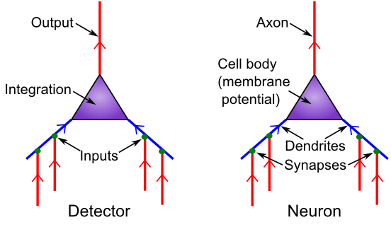
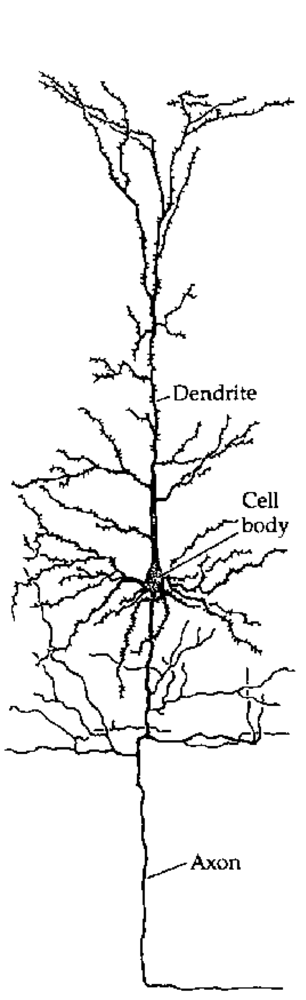
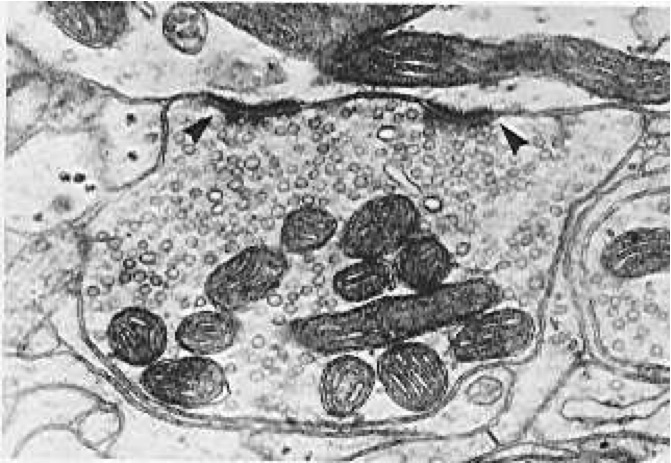
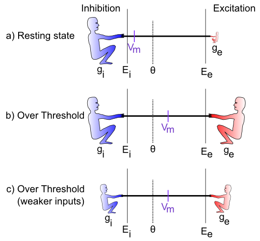
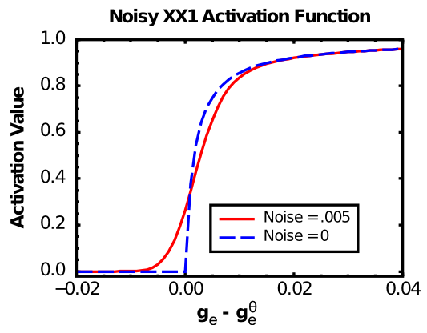

# Part I: The Neuron {#sec:ch-neuron}

One major reason the brain can be so plastic and learn to do so many different things, is that it is made up of a highly-sculptable form of *silly putty*: billions of individual neurons that are densely interconnected with each other, and capable of shaping what they do by changing these patterns of interconnections. The brain is like a massive LEGO set, where each of the individual pieces is quite simple (like a single LEGO piece), and all the power comes from the nearly infinite ways that these simple pieces can be recombined to do different things.

So the good news for you the student is, the neuron is fundamentally *simple*. Lots of people will try to tell you otherwise, but as you'll see as you go through this book, *simple neurons can account for much of what we know about how the brain functions*. So, even though they have a lot of moving parts and you can spend an entire career learning about even just one tiny part of a neuron, we strongly believe that all this complexity is in the service of a very simple overall function.

What is that function? Fundamentally, it is about **detection**. Neurons receive thousands of different input signals from other neurons, looking for specific patterns that are "meaningful" to them. A very simple analogy is with a smoke detector, which samples the air and looks for telltale traces of smoke. When these exceed a specified threshold limit, the alarm goes off. Similarly, the neuron has a **threshold** and only sends an "alarm" signal to other neurons when it detects something significant enough to cross this threshold. The alarm is called an **action potential** or **spike** and it is the fundamental unit of communication between neurons.

Our goal in this chapter is to understand how the neuron receives input signals from other neurons, integrates them into an overall signal strength that is compared against the threshold, and communicates the result to other neurons. We will see how these processes can be characterized mathematically in computer simulations (summarized in Figure 2.1). In the rest of the book, we will see how this simple overall function of the neuron ultimately enables us to perceive the world, to think, to communicate, and to remember.

**Math warning:** This chapter and the Learning Chapter (Chapter 4) are the only two in the entire book with significant amounts of math, because these two chapters develop the core equations that power our neural simulations. We have separated the conceptual from the mathematical content, and those with an aversion to math can get by without understanding all the details. So, don't be put off or overwhelmed by the math here --- just focus on the core conceptual ideas and get what you can out of the math (even if it is not much, you'll be OK)!

![Trace of a simulated neuron spiking action potentials in response to an excitatory input --- the blue **Vm** membrane potential (voltage of the neuron) increases (driven by the excitatory net input, **Ge**) until it reaches threshold (around .5), at which point a purple **Spike** (action potential) is triggered, which then resets the membrane potential back to its starting value (.3) and the process continues. The spike is communicated to other neurons, and the overall rate of spiking (tracked by the green **Act** value) is proportional to the level of excitatory net input (relative to other opposing factors such as inhibition --- the balance of all these factors is reflected in the net current **Inet**, in red). You can produce this graph and manipulate all the relevant parameters in the `neuron` exploration for this chapter.](../figures/fig_neuron_spiking.png){#fig:fig-neuron_spiking width=75% }

## Basic Biology of a Neuron as Detector

{#fig:fig-neuron_as_detect width=50% }

[@fig:fig-neuron_as_detect] shows the correspondence between neural biology and the detection functions they serve. **Synapses** are the connection points between **sending neurons** (the ones firing an alarm and sending a signal) and **receiving neurons** (the ones receiving that signal). Most synapses are on **dendrites,** which are the large branching trees (the word "dendrite" is derived from the Greek "dendros," meaning tree), which is where the neuron integrates all the input signals. Like tributaries flowing into a major river, all these signals flow into the main dendritic trunk and into the **cell body**, where the final integration of the signal takes place. The thresholding takes place at the very start of the output-end of the neuron, called the **axon** (this starting place is called the **axon hillock** --- apparently it looks like a little hill or something). The axon also branches widely and is what forms the other side of the synapses onto other neuron's dendrites, completing the next chain of communication. And onward it goes.

Everything you need to know about the neuron biology to understand the basic detector functionality is that simple: It just receives inputs, integrates them, and decides whether the integrated input is sufficiently strong to trigger an output signal.  However, there are some additional biological properties regarding the nature of these input signals, which we'll see have implications for neural function, including making the integration process better able to deal with large changes in overall input signal strength.

There are at least three major sources of input signals to the neuron:

* **Excitatory inputs** --- these are the "normal", most prevalent type of input from other neurons (roughly 85% of all inputs), which have the effect of exciting the receiving neuron (making it more likely to get over threshold and fire an "alarm"). They are conveyed via a synaptic channel called **AMPA**, which is opened by the neurotransmitter **glutamate**.

* **Inhibitory inputs** --- these are the other 15% of inputs, which have the opposite effect to the excitatory inputs --- they cause the neuron to be *less* likely to fire, and serve to make the integration process much more robust by keeping the excitation in check. There are specialized neurons in the brain called **inhibitory interneurons** that generate this inhibitory input (we'll learn a lot more about these in the *Networks* Chapter (3). This input comes in via **GABA** synaptic channels, driven by the neurotransmitter GABA.

* **Leak inputs** --- these aren't technically inputs, as they are always present and active, but they serve a similar function to the inhibitory inputs, by counteracting the excitation and keeping the neuron in balance overall. Biologically, leak channels are **potassium channels (K)**.

The inhibitory and excitatory inputs come from *different* neurons in the cortex: a given neuron can only send either excitatory or inhibitory outputs to other neurons, not both (although neurons in other brain areas do violate this constraint, neocortical pyramidal neurons appear to obey it). We will see the multiple implications of this constraint throughout the text.

Finally, we introduce the notion of the **net synaptic efficacy** or **weight**, which represents the total impact that a sending neuron activity signal can have on the receiving neuron, via its synaptic connection. *The synaptic weight is one of the most important concepts in the entire field of computational cognitive neuroscience!* We will be exploring it in many different ways as we go along. Biologically, it represents the net ability of the sending neuron's action potential to release **neurotransmitter**, and the ability of that neurotransmitter to open synaptic channels on the postsynaptic side (including the total number of such channels that are available to be opened).  For the excitatory inputs, the weight depends on the amount of glutamate released by the sending neuron into the synapse, and the number and efficacy of AMPA channels on the receiving neuron's side of the synapse (Figure 2.5).

Computationally, the weights determine what a neuron is detecting. A strong weight value indicates that the neuron is very sensitive to that particular input neuron, while a low weight means that that input is relatively unimportant. The entire process of learning (Chapter 4) amounts to changing these synaptic weights as a function of neural activity patterns in the sending and receiving neurons. In short, *everything you know, every cherished memory in your brain, is encoded as a pattern of synaptic weights!*  In Chapter 3, we'll see that this detection process supports *categorization* and also, in linear algebra terms, the *projection* of high-dimensional input spaces along specific *dimensions* or *bases* or *axes* (all synonyms for our purposes).  Thus, this detection process is truly the fundamental engine of neural computation, and can be described in many different ways that all amount to the same essential process we deconstruct here.

### Biology Details

{#fig:fig-cortical_neuron#fig:fig-cortical-neuron width=20% }

[@fig:fig-cortical-neuron] shows a tracing of a typical excitatory neuron in the cortex called a **pyramidal neuron**, which is the primary type that we simulate in our models.  The major elements of dendrites, cell body, and axon as discussed in the main chapter are shown.  Note that the dendrites have small **spines** on them --- these are where the axons from sending neurons synapse, forming connections between neurons.

{#fig:fig-synapse_em width=50% }

![**Figure 2.5:** Schematic of a synapse, showing presynaptic terminal button which releases neurotransmitter (NT) into the synaptic cleft.  The NT binds to postsynaptic receptors, causing ion channels to open (e.g., Sodium or $Na^+$ ions for excitatory AMPA channels), and thus activating the receiving neuron.  Metabotropic receptors such as mGluR do not open to allow ions to flow (as ionotropic ones do), and instead they trigger second-messenger cascades of reactions that can affect learning and other processes in the postsynaptic cell.](../figures/fig_synapse.png){#fig:fig-synapse width=40% }

Figure 2.4 shows a high-resolution image of a synapse, while Figure 2.5 shows a schematic with all of the major elements of the synaptic signaling cascade represented.  The primary behavior of a synapse is for an action potential to trigger release of neurotransmitter (NT) from the **presynaptic terminal button**, and this NT then binds to postsynaptic receptors that open to allow ions to flow, and thus communicating a signal to the postsynaptic neuron.  In the predominant case of **excitatory AMPA-receptor** activation by the NT **glutamate**, the AMPA channels open to allow Sodium ($Na^+$) ions to enter the postsynaptic neuron, which then have the effect of increasing the membrane potential and thus exciting the neuron.  This excitatory input is called an **excitatory postsynaptic potential or EPSP**.

The other major types of postsynaptic receptors are:

* **NMDA**, which is involved in learning and allows Calcium ($Ca^{++}$) ions to flow --- we will discuss these receptors in more detail in Chapter 4 (Learning).
* **mGluR**, which is also involved in learning and also possibly active maintenance of information in working memory --- these receptors do not pass ions, and instead affect complex chemical processes in the postsynaptic cell.

Inhibitory synapses arising from inhibitory interneurons release GABA NT, and the corresponding GABA receptors on the receiving neurons open to allow Chloride ($Cl^-$) ions to flow, producing a net negative or inhibitory effect on the postsynaptic cell (called an **inhibitory postsynaptic potential or IPSP**).

Importantly, the biology shows that synapses in the cortex can either be excitatory or inhibitory, but not both.  This has implications for our computational models as we explore in the *Networks* Chapter.

## Dynamics of Integration: Excitation vs. Inhibition and Leak

{#fig:fig-vm_as_tug_of_war width=75% }

The process of integrating the three different types of input signals (excitation, inhibition, leak) lies at the heart of neural computation. This section provides a conceptual, intuitive understanding of this process, and how it relates to the underlying electrical properties of neurons. Later, we'll see how to translate this process into mathematical equations that can actually be simulated on the computer.

The integration process can be understood in terms of a **tug-of-war** (Figure 2.6). This tug-of-war takes place in the space of **electrical potentials** that exist in the neuron relative to the surrounding extracellular medium in which neurons live (interestingly, this medium, and the insides of neurons and other cells as well, is basically salt water with sodium ($Na^+$), chloride ($Cl^-$) and other ions floating around --- we carry our remote evolutionary environment around within us at all times). The core function of a neuron can be understood entirely in electrical terms: voltages (electrical potentials) and currents (flow of electrically charged ions in and out of the neuron through tiny pores called **ion channels**).

To see how this works, let's just consider excitation versus inhibition (inhibition and leak are effectively the same for our purposes at this time). The key point is that **the integration process reflects the relative strength of excitation versus inhibition** --- if excitation is stronger than inhibition, then the neuron's electrical potential (voltage) increases, perhaps to the point of getting over threshold and firing an output action potential. If inhibition is stronger, then the neuron's electrical potential decreases, and thus moves further away from getting over the threshold for firing.

Before we consider specific cases, let's introduce some obscure terminology that neuroscientists use to label the various actors in our tug-of-war drama (going from left to right in the Figure):

*  $g_i$ --- the **inhibitory conductance** (*g* is the symbol for a conductance, and *i* indicates inhibition) --- this is the total strength of the inhibitory input (i.e., how strong the inhibitory guy is tugging), and plays a major role in determining how strong of an inhibitory current there is. This corresponds biologically to the proportion of inhibitory ion channels that are currently open and allowing inhibitory ions to flow (these are **chloride** or **$Cl^-$** ions in the case of GABA **inhibition**, and **potassium** or **$K^+$** ions in the case of **leak** currents). For electricity buffs, the conductance is the inverse of resistance --- most people find conductance more intuitive than resistance, so we'll stick with it.

* $E_i$ --- the **inhibitory driving potential** --- in the tug-of-war metaphor, this just amounts to where the inhibitory guy happens to be standing relative to the electrical potential scale that operates within the neuron. Typically, this value is around -75mV where **mV** stands for **millivolts** --- one thousandth (1/1,000) of a volt. These are very small electrical potentials for very small neurons.

* $\Theta$ --- the **action potential threshold** --- this is the electrical potential at which the neuron will fire an action potential output to signal other neurons. This is typically around -50mV. This is also called the **firing threshold** or the **spiking threshold**, because neurons are described as "firing a spike" when they get over this threshold.

* $V_m$ --- the **membrane potential** of the neuron (V = voltage or electrical potential, and m = membrane). This is the current electrical potential of the neuron relative to the extracellular space outside the neuron. It is called the membrane potential because it is the cell membrane (thin layer of fat basically) that separates the inside and outside of the neuron, and that is where the electrical potential really happens. An electrical potential or voltage is a relative comparison between the amount of electric charge in one location versus another. It is called a "potential" because when there is a difference, there is the potential to make stuff happen. For example, when there is a big potential difference between the charge in a cloud and that on the ground, it creates the potential for lightning. Just like water, differences in charge always flow "downhill" to try to balance things out. So if you have a lot of charge (water) in one location, it will flow until everything is all level. The cell membrane is effectively a dam against this flow, enabling the charge inside the cell to be different from that outside the cell. The ion channels in this context are like little tunnels in the dam wall that allow things to flow in a controlled manner. And when things flow, the membrane potential changes! In the tug-of-war metaphor, think of the membrane potential as the flag attached to the rope that marks where the balance of tugging is at the current moment.

* $E_e$ --- the **excitatory driving potential** --- this is where the excitatory guy is standing in the electrical potential space (typically around 0 mV).

* $g_e$ --- the **excitatory conductance** --- this is the total strength of the excitatory input, reflecting the proportion of excitatory ion channels that are open (these channels pass **sodium** ($Na^+$) ions --- our deepest thoughts are all just salt water moving around).

{#fig:fig-vm_as_tug_of_war_cases width=%75 }

Figure 2.7 shows specific cases in the tug-of-war scenario. In the first case, the excitatory conductance $g_e$ is very low (indicated by the small size of the excitatory guy), which represents a neuron at rest, not receiving many excitatory input signals from other neurons. In this case, the inhibition/leak pulls much more strongly, and keeps the membrane potential ($Vm$) down near the -70mV territory, which is also called the **resting potential** of the neuron. As such, it is below the action potential threshold $\Theta$, and so the neuron does not output any signals itself. Everyone is just chillin'.

In the next case (b), the excitation is as strong as the inhibition, and this means that it can pull the membrane potential up to about the middle of the range. Because the firing threshold is toward the lower-end of the range, this is enough to get over threshold and fire a spike! The neuron will now communicate its signal to other neurons, and contribute to the overall flow of information in the brain's network.

The last case (c) is particularly interesting, because it illustrates that the integration process is fundamentally **relative** --- what matters is how strong excitation is *relative* to the inhibition. If both are overall weaker, then neurons can still get over firing threshold. Can you think of any real-world example where this might be important? Consider the neurons in your visual system, which can experience huge variation in the overall amount of light coming into them depending on what you're looking at (e.g., compare snowboarding on a bright sunny day versus walking through thick woods after sunset). It turns out that the total amount of light coming into the visual system drives a "background" level of inhibition, in addition to the amount of excitation that visual neurons experience. Thus, when it's bright, neurons get greater amounts of both excitation and inhibition compared to when it is dark. *This enables the neurons to remain in their sensitive range for detecting things* despite large differences in overall input levels.

## Computing Activation Output

The membrane potential $Vm$ is not communicated directly to other neurons --- instead it is subjected to a **threshold** and only the strongest levels of excitation are then communicated, resulting in a much more efficient and compact encoding of information in the brain. In human terms, neurons avoid sharing "TMI" (too much information), and instead communicate only relevant, important information, as if they were following ["Gricean maxims"](https://en.wikipedia.org/wiki/Cooperative_principle).

Actual neurons in the Neocortex compute discrete **spikes** or **action potentials**, which are very brief ( $< 1$ ms) and trigger the release of neurotransmitter that then drives the excitation or inhibition of the neurons they are sending to. After the spike, the membrane potential $Vm$ is reset back to a low value (at or even below the resting potential), and it must then climb back up again to the level of the threshold before another spike can occur. This process results in different *rates of spiking* associated with different levels of excitation --- it is clear from eletrophysiological recordings of neurons all over the neocortex that this **spike rate** information is highly informative about behaviorally and cognitively relevant information. There remains considerable debate about the degree to which more precise differences in spike timing contain additional useful information.

In our computer models, we can simulate discrete spiking behavior directly in a very straightforward way (see below for details). However, we often use a **rate code** approximation instead, where the activation output of the neuron is a *real valued number* between 0-1 that corresponds to the overall rate of neural spiking. We typically think of this rate code as reflecting the net output of a small population of roughly 100 neurons that all respond to similar information --- the neocortex is organized anatomically with **microcolumns** of roughly this number of neurons, where all of the neurons do indeed code for similar information. Use of this rate code activation enables smaller-scale models that converge on a stable interpretation of the input patterns rapidly, with an overall savings in computational time and model complexity. Nevertheless, there are tradeoffs in using these approximations, which we will discuss more in the Networks and other chapters. Getting the rate code to produce a good approximation to discrete spiking behavior has been somewhat challenging in the Leabra framework, and only recently has a truly satisfactory solution been developed, which is now the standard in the [emergent](https://github.com/emer) software.

## Mathematical Formulations

Now you've got an intuitive understanding of how the neuron integrates excitation and inhibition. We can capture this dynamic in a set of mathematical equations that can be used to simulate neurons on the computer. The first set of equations focuses on the effects of inputs to a neuron. The second set focuses on generating outputs from the neuron. We will cover a fair amount of mathematical ground here. Don't worry if you don't follow all of the details. As long as you follow conceptually what the equations are doing, you should be able to build on this understanding when you get your hands on the actual equations themselves and explore how they behave with different inputs and parameters. You will see that despite all the math, the neuron's behavior is indeed simple: the amount of excitatory input determines how excited it gets, in balance with the amount of inhibition and leak. And the resulting output signals behave pretty much as you would expect.

### Computing Inputs

We begin by formalizing the "strength" by which each side of the tug-of-war pulls, and then show how that causes the $Vm$ "flag" to move as a result. This provides explicit equations for the tug-of-war dynamic integration process. Then, we show how to actually compute the conductance factors in this tug-of-war equation as a function of the inputs coming into the neuron, and the synaptic weights (focusing on the excitatory inputs for now). Finally, we provide a summary equation for the tug-of-war which can tell you where the flag will end up in the end, to complement the dynamical equations which show you how it moves over time.

#### Neural Integration

The key idea behind these equations is that each guy in the tug-of-war pulls with a strength that is proportional to both its overall strength (conductance), and how far the "flag" ($Vm$) is away from its position (indicated by the driving potential E). Imagine that the tuggers are planted in their position, and their arms are fully contracted when the $Vm$ flag gets to their position (E), and they can't re-grip the rope, such that they can't pull any more at this point. To put this idea into an equation, we can write the "force" or **current** that the excitatory guy exerts as:
$$ I_e = g_e \left(E_e-V_m\right) $$

The excitatory current is $I_e$ (I is the traditional term for an electrical current, and e again for excitation), and it is the product of the conductance $g_e$ times *how far the membrane potential is away from the excitatory driving potential*. If $V_m = E_e$ then the excitatory guy has "won" the tug of war, and it no longer pulls anymore, and the current goes to zero (regardless of how big the conductance might be --- anything times 0 is 0). Interestingly, this also means that the excitatory guy pulls the strongest when the $Vm$ "flag" is furthest away from it --- i.e., when the neuron is at its resting potential. Thus, it is easiest to excite a neuron when it's well rested.

The same basic equation can be written for the inhibition guy, and also separately for the leak guy (which we can now reintroduce as a basic clone of the inhibition term):
$$ I_i = g_i \left(E_i-V_m\right) $$
leak current:
$$ I_l = g_l \left(E_l-V_m\right) $$
(only the subscripts are different).

Next, we can add together these three different currents to get the **net current**, which represents the net flow of charged ions across the neuron's membrane (through the ion channels):
$$
\begin{aligned}
I_{net} = & I_e + I_i + I_l
 = & g_e \left(E_e-V_m\right) + g_i \left(E_i-V_m\right)\\
   & + g_l \left(E_l-V_m\right)
\end{aligned}
$$

So what good is a net current? Recall that electricity is like water, and it flows to even itself out. When water flows from a place where there is a lot of water to a place where there is less, the result is that there is less water in the first place and more in the second. The same thing happens with our currents: the flow of current changes the membrane potential (height of the water) inside the neuron:
$$ V_m\left(t\right) = V_m\left(t-1\right) + dt_{vm} I_{net} $$

$V_m(t)$ is the current value of $Vm$, which is updated from value on the previous time step $V_m(t-1)$, and the $dt_{vm}$ is a **rate constant** that determines how fast the membrane potential changes --- it mainly reflects the capacitance of the neuron's membrane).

The above two equations are the essence of what we need to be able to simulate a neuron on a computer! It tells us how the membrane potential changes as a function of the inhibitory, leak and excitatory inputs --- given specific numbers for these input conductances, and a starting $Vm$ value, we can then **iteratively** compute the new $Vm$ value according to the above equations, and this will accurately reflect how a real neuron would respond to similar such inputs!

To summarize, here's a single version of the above equations that does everything:
$$
\begin{aligned}
V_m(t) = & V_m(t-1) + dt_{vm} \\
 & \left[ g_e (E_e-V_m) + g_i (E_i-V_m) + g_l (E_l-V_m) \right]
\end{aligned}
$$

For those of you who noticed the issue with the minus sign above, or are curious how all of this relates to **Ohm's law** and the process of diffusion, please see the Chapter Appendix section *Electrophysiology of the Neuron*. If you're happy enough with where we've come, feel free to move along to finding out how we compute these input conductances, and what we then do with the $Vm$ value to drive the output signal of the neuron.

#### Computing Input Conductances

The excitatory and inhibitory input conductances represent the total number of ion channels of each type that are currently open and thus allowing ions to flow. In real neurons, these conductances are typically measured in nanosiemens (nS), which is $10^{-9}$ siemens (a very small number --- neurons are very tiny). Typically, neuroscientists divide these conductances into two components:

* $\bar{g}$ ("g-bar") --- a constant value that determines the **maximum conductance** that would occur if every ion channel were to be open, and:

* $g\left(t\right)$ --- a dynamically changing variable that indicates at the present moment, what fraction of the total number of ion channels are currently open (goes between 0 and 1).

Thus, the total conductances of interest are written as: **excitatory conductance:**
$$ \bar{g}_e g_e(t) $$
and the **inhibitory conductance:**
$$ \bar{g}_i g_i(t) $$
and the **leak conductance:**
$$ \bar{g}_l $$
(note that because leak is a constant, it does not have a dynamically changing value, only the constant g-bar value).

This separation of terms makes it easier to compute the conductance, because all we need to focus on is computing the proportion or fraction of open ion channels of each type. This can be done by computing the average number of ion channels open at each synaptic input to the neuron:
$$ g_e(t) = \frac{1}{n} \sum_i x_i w_i $$
where $x_i$ is the **activity** of a particular sending neuron indexed by the subscript *i*, $w_i$ is the **synaptic weight strength** that connects sending neuron *i* to the receiving neuron, and *n* is the total number of channels of that type (in this case, excitatory) across all synaptic inputs to the cell. As noted above, the synaptic weight determines what patterns the receiving neuron is sensitive to, and is what adapts with learning --- this equation shows how it enters mathematically into computing the total amount of excitatory conductance.

The above equation suggests that the neuron performs a very simple function to determine how much input it is getting: it just adds it all up from all of its different sources (and takes the average to compute a proportion instead of a sum --- so that this proportion is then multiplied by $\bar{g}_e$ to get an actual conductance value). Each input source contributes in proportion to how active the sender is, multiplied by how much the receiving neuron cares about that information --- the synaptic weight value. We also refer to this average total input as the **net input**.

The same equation holds for inhibitory input conductances, which are computed in terms of the activations of inhibitory sending neurons, times the inhibitory weight values.

There are some further complexities about how we integrate inputs from different categories of input sources (i.e., projections from different source brain areas into a given receiving neuron), which we deal with in the Chapter Appendix subsection *Net Input Detail*. But overall, this aspect of the computation is relatively simple and we can now move on to the next step, of comparing the membrane potential to the threshold and generating some output.

#### Equilibrium Membrane Potential

Before finishing up the final step in the detection process (generating an output), we will need to use the concept of the **equilibrium membrane potential**, which is the value of $Vm$ that the neuron will settle into and stay at, *given a fixed set of excitatory and inhibitory input conductances* (if these aren't steady, then the the $Vm$ will likely be constantly changing as they change). This equilibrium value is interesting because it tells us more clearly how the tug-of-war process inside the neuron actually balances out in the end. Also, we will see in the next section that it is useful mathematically.

To compute the equilibrium membrane potential ($V_m^{eq}$), we can use an important mathematical technique: set the change in membrane potential (according to the iterative $Vm$ updating equation from above) to 0, and then solve the equation for the value of $Vm$ under this condition. In other words, if we want to find out what the equilibrium state is, we simply compute what the numbers need to be such that $Vm$ is no longer changing (i.e., its rate of change is 0). Here are the mathematical steps that do this:
$$
\begin{aligned}
V_m(t) = & V_m(t-1) + dt_{vm} \\
 & \left[ g_e (E_e-V_m) + g_i (E_i-V_m) + g_l (E_l-V_m) \right]
\end{aligned}
$$
(the **iterative $Vm$ update equation:**)

This is the part that is driving the changes (time constant omitted as we are looking for equilibrium):
$$ \Delta V_m = g_e \left(E_e-V_m\right) + g_i (E_i-V_m) + g_l (E_l-V_m) $$
which we set to zero to find when it stops changing:
$$ 0 = g_e \left(E_e-V_m\right) + g_i (E_i-V_m) + g_l (E_l-V_m) $$
and then do some algebra to solve for $Vm$:
$$
\begin{aligned}
V_m = & \frac{g_e}{g_e + g_i + g_l} E_e + \\
& \frac{g_i}{g_e + g_i + g_l} E_i + \frac{g_l}{g_e + g_i + g_l} E_l
\end{aligned}
$$
The detailed math is shown in the Chapter Appendix section *Math Derivations*.

In words, this says that the excitatory drive $E_e$ contributes to the overall $Vm$ as a function of the proportion of the excitatory conductance $g_e$ relative to the sum of all the conductances ($g_e + g_i + g_l$). And the same for each of the others (inhibition, leak). This is just what we expect from the tug-of-war picture: if we ignore $g_l$, then the $Vm$ "flag" is positioned as a function of the relative balance between $g_e$ and $g_i$ --- if they are equal, then $g_e / (g_e + g_i)$ is .5 (e.g., just put a "1" in for each of the g's --- 1/2 = .5), which means that the $Vm$ flag is half-way between $E_i$ and $E_e$. So, all this math just to rediscover what we knew already intuitively! (Actually, that is the best way to do math --- if you draw the right picture, it should tell you the answers before you do all the algebra). But we'll see that this math will come in handy next.

Here is a version with the conductance terms explicitly broken out into the "g-bar" constants and the time-varying "g(t)" parts:
$$
\begin{aligned}
V_m = & \frac{\bar{g}_e g_e(t)}{\bar{g}_e g_e(t) + \bar{g}_i g_i(t) + \bar{g}_l} E_e + \\
& \frac{\bar{g}_i g_i(t)}{\bar{g}_e g_e(t) + \bar{g}_i g_i(t) + \bar{g}_l} E_i + \\
& \frac{\bar{g}_l}{\bar{g}_e g_e(t) + \bar{g}_i g_i(t) + \bar{g}_l} E_l
\end{aligned}
$$

For those who really like math, the equilibrium membrane potential equation is shown to be a Bayesian Optimal Detector in the Appendix.

### Generating Outputs

The output of the neuron can be simulated at two different levels: discrete spiking (which is how neurons actually behave biologically), or using a rate code approximation. We cover each in turn, and show how the rate code must be derived to match the behavior of the discrete spiking neuron, when averaged over time (it is important that our approximations are valid in the sense that they match the more detailed biological behavior where possible, even as they provide some simplification).

#### Discrete Spiking

To compute discrete action potential spiking behavior from the neural equations we have so far, we need to determine when the membrane potential gets above the firing threshold, and then emit a spike, and subsequently reset the membrane potential back down to a value, from which it can then climb back up and trigger another spike again, etc. This is actually best expressed as a kind of simple computer program:

``` C
if (Vm > Theta) then: y = 1; Vm = Vm_r; else y = 0
```

where y is the activation output value of the neuron, and $Vm_r$ is the *reset potential* that the membrane potential is reset to after a spike is triggered. Biologically, there are special potassium ($K^+$) channels that bring the membrane potential back down after a spike.

This simplest of spiking models is not *quite* sufficient to account for the detailed spiking behavior of actual cortical neurons. However, a slightly more complex model can account for actual spiking data with great accuracy (as shown by Gerstner and colleagues [@BretteGerstner05], even winning several international competitions!). This model is known as the *Adaptive Exponential* or AdEx model ([Scholarpedia Article on AdEx](http://www.scholarpedia.org/article/Adaptive_exponential_integrate-and-fire_model). We typically use this AdEx model when simulating discrete spiking, although the simpler model described above is also still an option. The critical feature of the AdEx model is that the effective firing threshold adapts over time, as a function of the excitation coming into the cell, and its recent firing history. The net result is a phenomenon called **spike rate adaptation**, where the rate of spiking tends to decrease over time for otherwise static input levels. Otherwise, however, the AdEx model is identical to the one described above.

#### Rate Code Approximation to Spiking

{#fig:fig-adex_vm_vs_hz width=50% }

Even though actual neurons communicate via discrete spiking (action potential) events, it is often useful in our computational models to adopt a somewhat more abstract **rate code approximation**, where the neuron continuously outputs a single graded value (typically normalized between 0-1) that reflects the overall rate of spiking that the neuron should be exhibiting given the level of inputs it is receiving. In other words, we could count up the number of discrete spikes the neuron fires, and divide that by the amount of time we did the counting over, and this would give us an average spiking rate. Instead of having the neuron communicate this rate of spiking distributed in discrete spikes over that period of time, we can have it communicate that rate value instantly, as a graded number. Computationally, this should be more efficient, because it is compressing the amount of time required to communicate a particular spiking rate, and it also tends to reduce the overall level of noise in the network, because instead of switching between spiking and not-spiking, the neuron can continuously output a more steady rate code value.

As noted earlier, the rate code value can be thought of in biological terms as the output of a small population (e.g., 100) of neurons that are generally receiving the same inputs, and giving similar output responses --- averaging the number of spikes at any given point in time over this population of neurons is roughly equivalent to averaging over time from a single spiking neuron. As such, we can consider our simulated rate code computational neurons to correspond to a small population of actual discrete spiking neurons.

To actually compute the rate code output, we need an equation that provides a real-valued number that matches the number of spikes emitted by a spiking neuron with the same level of inputs. Interestingly, you cannot use the membrane potential $Vm$ as the input to this equation --- it does *not* have a one-to-one relationship with spiking rate! That is, when we run our spiking model and measure the actual rate of spiking for different combinations of excitatory and inhibitory input, and then plot that against the equilibrium $Vm$ value that those input values produce (without any spiking taking place), there are multiple spiking rate values for each $Vm$ value --- you cannot predict the correct firing rate value knowing only the $Vm$ (Figure 2.8).

{#fig:fig-neuron_rate_code_approx width=50% }

Instead, it turns out that the excitatory net input $g_e$ enables a good prediction of actual spiking rate, when it is compared to an appropriate threshold value (Figure 2.9). For the membrane potential, we know that $Vm$ is compared to the threshold $\Theta$ to determine when output occurs. What is the appropriate threshold to use for the excitatory net input? We need to somehow convert $\Theta$ into a $g_e^{\Theta}$ value --- a threshold in excitatory input terms. Here, we can leverage the equilibrium membrane potential equation, derived above. We can use this equation to solve for the level of excitatory input conductance that would put the equilibrium membrane potential right at the firing threshold $\Theta$:
$$ \Theta = \frac{g_e^{\Theta} E_e + g_i E_i + g_l E_l}{g_e^{\Theta} + g_i + g_l} $$
solved for $g_e^{\Theta}$:
$$ g_e^{\Theta} = \frac{g_i (E_i - \Theta) + g_l (E_l  - \Theta)}{\Theta - E_e} $$
(see the Chapter Appendix on *Math Derivations* for the algebra to derive this solution).

Now, we can say that our rate coded output activation value will be some function of the difference between the excitatory net input $g_e$ and this threshold value:
$$ y = f(g_e - g_e^{\Theta}) $$
and all we need to do is figure out what this function f() should look like.

There are three important properties that this function should have:

* **threshold** --- it should be 0 (or close to it) when $g_e$ is less than its threshold value (neurons should not respond when below threshold).

* **saturation** --- when $g_e$ gets very strong relative to the threshold, the neuron cannot actually keep firing at increasingly high rates --- there is an upper limit to how fast it can spike (typically around 100-200 Hz or spikes per second). Thus, our rate code function also needs to exhibit this leveling-off or saturation at the high end.

* **smoothness** --- there shouldn't be any abrupt transitions (sharp edges) to the function, so that the neuron's behavior is smooth and continuous.

{#fig:fig-nxx1_fun width=50% }

The **X-over-X-plus-1 (XX1)** function (Figure 2.10, Noise=0 case), also known as the [Michaelis-Mentin kinetics function](http://en.wikipedia.org/wiki/Michaelis–Menten_kinetics) --- wikipedia link) exhibits the first two of these properties:
$$ f_{xx1}(x) = \frac{x}{x+1} $$

where *x* is the *positive* portion of $g_e - g_e^{\Theta}$, with an extra **gain** factor $\gamma$, which just multiplies everything:
$$ x = \gamma [g_e - g_e^{\Theta}]_+ $$

So the full equation is:
$$ y = \frac{\gamma [g_e - g_e^{\Theta}]_+}{\gamma [g_e - g_e^{\Theta}]_+ + 1} $$

Which can also be written as:
$$ y = \frac{1}{\left(1 + \frac{1}{\gamma [g_e - g_e^{\Theta}]_+} \right)} $$

As you can see in Figure 2.10 (Noise=0), the basic XX1 function is not smooth at the point of the threshold. To remedy this problem, we **convolve** the XX1 function with normally-distributed (gaussian) noise, which smooths it out as shown in the Noise=0.005 case in Figure 2.10. Convolving amounts to adding to each point in the function some contribution from its nearby neighbors, weighted by the gaussian (bell-shaped) curve. It is what photo editing programs do when they do "smoothing" or "blurring" on an image. In the software, we use piecewise approximation function that is very quick to compute and closely approximates the noise-convolved version.

Biologically, this convolution process reflects the fact that neurons experience a large amount of noise (random fluctuations in the inputs and membrane potential), so that even if they are slightly below the firing threshold, a random fluctuation can sometimes push it over threshold and generate a spike. Thus, the spiking rate around the threshold is smooth, not sharp as in the plain XX1 function.

For completeness sake, and strictly for the mathematically inclined, here is the equation for the convolution operation:
$$ y^*(x) = \int_{z = -\infty}^{\infty} \frac{1}{\sqrt{2 \pi} \sigma} e^{-z^2/(2 \sigma^2)} y(x-z) dz $$
where $y(x-z)$ is the XX1 function applied to the $x-z$ input instead of just $x$. In practice, a finite kernel of width $3 \sigma$ on either side of $x$ is used in the numerical convolution.

After convolution, the XX1 function (Figure 2.10) approximates the average firing rate of many neuronal models with discrete spiking, including AdEx (Figure 2.9). A mathematical explanation is in the Chapter Appendix section *Frequency-Current Curve*.

#### Restoring Iterative Dynamics in the Activation

There is just one last problem with the equations as written above. They don't evolve over time in a graded fashion. In contrast, the $Vm$ value does evolve in a graded fashion by virtue of being iteratively computed, where it incrementally approaches the equilibrium value over a number of time steps of updating. Instead the activation produced by the above equations goes directly to its equilibrium value very quickly, because it is calculated based on excitatory conductance and does not take into account the sluggishness with which changes in conductance lead to changes in membrane potentials (due to capacitance). As discussed in the *Introduction* Chapter, graded processing is very important, and we can see this very directly in this case, because the above equations do not work very well in many cases because they lack this gradual evolution over time.

To introduce graded iterative dynamics into the activation function, we just use the activation value ($y^*(x)$) from the above equation as a *driving force* to an iterative temporally-extended update equation:
$$ y(t) = y(t-1) + dt_{vm} \left(y^*(x) - y(t-1) \right) $$

This causes the actual final rate code activation output at the current time *t*, y(t) to iteratively approach the driving value given by $y^*(x)$, with the same time constant $dt_{vm}$ that is used in updating the membrane potential. In practice this works extremely well, better than any prior activation function used with Leabra.

### Summary of Neuron Equations and Normalized Parameters

| Parameter      | Bio Val        | Norm Val | | Parameter       | Bio Val         | Norm Val   |
|----------------|----------------|----------|-|-----------------|-----------------|------------|
| Time           | 0.001 sec      | 1 ms     | | Voltage         | 0.1 V or 100mV  | 0..2       |
| Current        | $1x10^{-8}$ A  | 10 nA    | | Conductance     | $1x10^{-9}$ S   | 1 nS       |
| Capacitance    | $1x10^{-12}$ F | 1 pF     | | C (memb cap)    | 281 pF          | Dt = .355  |
| GbarL (leak)   | 10 nS          | 0.1      | | GBarI (inhib)   | 100 nS          | 1          |
| GbarE (excite) | 100 nS         | 1        | | ErevL (leak)    | -70mV           | 0.3        |
| ErevI (inhib)  | -75mV          | 0.25     | | ErevE (excite)  | 0mV             | 1          |
| $\theta$ (Thr) | -50mV          | 0.5      | | SpikeThr        | 20mV            | 1.2        |

Table: **Table 2.1:** The parameters used in our simulations are normalized using the above conversion factors so that the typical values that arise in a simulation fall within the 0..1 normalized range. For example, the membrane potential is represented in the range between 0 and 2 where 0 corresponds to -100mV and 2 corresponds to +100mV and 1 is thus 0mV (and most membrane potential values stay within 0-1 in this scale). The biological values given are the default values for the AdEx model.

Table 2.1 shows the normalized values of the parameters used in our simulations. We use these normalized values instead of the normal biological parameters so that everything fits naturally within a 0..1 range, thereby simplifying many practical aspects of working with the simulations.

The final equations used to update the neuron, in computational order, are shown here, with all variables that change over time indicated as a function of (t):

1. Compute the excitatory input conductance (inhibition would be similar, but we'll discuss this more in the next chapter, so we'll omit it here):
$$ g_e(t) = \frac{1}{n} \sum_i x_i(t) w_i $$

2. Update the membrane potential one time step at a time, as a function of input conductances (separating conductances into dynamic and constant "g-bar" parts):
$$
\begin{aligned}
 V_m(t) = & V_m(t-1) + dt_{vm} \\
& \left[ \bar{g}_e g_e(t) (E_e-V_m) + \bar{g}_i g_i(t) (E_i-V_m) + g_l (E_l-V_m) \right]
\end{aligned}
$$

3a. For discrete spiking, compare membrane potential to threshold and trigger a spike and reset $Vm$ if above threshold:

``` C
if (Vm(t) > Theta) then: y(t) = 1; Vm(t) = Vm_r; else y(t) = 0`
```

3b. For rate code approximation, compute output activation as NXX1 function of $g_e$ and $Vm$:
$$ y^*(x) = f_{nxx1}(g_e^*(t)) \approx \frac{1}{\left(1 + \frac{1}{\gamma [g_e - g_e^{\Theta}]_+} \right)} $$
(convolution with noise not shown)
$$ y(t) = y(t-1) + dt_{vm} \left(y^*(x) - y(t-1) \right) $$
(restoring iterative dynamics based on time constant of membrane potential changes)

## Exploration of the Individual Neuron

To get your hands dirty, run the `neuron` simulation, available in the [CCN Sims](https://github.com/CompCogNeuro/sims).

## Back to the Detector

Now that you can see how the individual neuron integrates a given excitatory signal relative to leak/inhibition, it is important to put this into the larger perspective of the detection process. In this simulation, you'll see how a neuron can pick out a particular input pattern from a set of inputs, and also how it can have different patterns of responding depending on its parameters ("loose" or "strict").

You can run this simulation in the `detect` model in [CCN Sims](https://github.com/CompCogNeuro/sims).

## Appendix

There are a number of optional in-depth topics here in this Chapter Appendix.

* **Neuron Electrophysiology:** more detailed description of the electrophysiology of the neuron, and how the underlying concentration gradients of ions give rise to the electrical integration properties of the neuron.

* **Net Input Detail:** details on how net inputs are computed across multiple different input projections.

* **Math Derivations:** shows how to derive the equilibrium Vm value based on the update equation, and $g_e^{\Theta}$.

* **Frequency-Current Curve:** Derives an explanation for why the XX1 function approximates discrete spiking (courtesy of Sergio Verduzco-Flores).

* **Sodium-Gated Potassium Channels for Adaptation (kNa Adapt):** describes how sodium that comes in during spiking drives membrane potential back down.

* **Bayesian Optimal Detector:** how the equilibrium membrane potential represents a Bayesian optimal way of integrating the different inputs to the neuron.

### Neuron Electrophysiology

This optional section provides a full treatment of the electrophysiology of the neuron --- how differential concentrations of individual ions lead to the electrical dynamics of the neuron.

First, some basic facts of electricity.  Electrons and protons, which together make up atoms (along with neutrons), have electrical charge (the electron is negative, and the proton is positive).  An **ion** is an atom where these positive and negative charges are out of balance, so that it carries a **net charge**.  Because the brain carries its own salt-water ocean around with it, the primary ions of interest are:

* **sodium ($Na^+$)** which has a net positive charge.
* **chloride ($Cl^-$)** which has a net negative charge.
* **potassium ($K^+$)** which has a net positive charge.
* **calcium ($Ca^{++}$)** which has ''two'' net positive charges.

{#fig:fig-electricity width=30% }

As we noted in the main chapter, these ions tend to flow under the influence of an electrical potential (voltage), driven by the basic principle that **opposite charges attract and like charges repel**.  If there is an area with more positive charge than negative charge (i.e., and **electrical potential**), then any negative charges nearby will be drawn into this area (creating an electrical **current**), thus nullifying that imbalance, and restoring everything to a neutral potential. Figure 2.11 shows a simple diagram of this dynamic.  The **conductance** is effectively how wide the opening or path is between the imbalanced charges, which determines how quickly the current can flow.

**Ohm's law** formalizes the situation mathematically:
$$I = G V$$
(i.e., current = conductance times potential).

{#fig:fig-diffusion width=30% }

The other major force at work in the neuron is **diffusion**, which causes individual ions to move around until they are uniformly distributed across space (Figure 2.12).  Interestingly, the diffusion force originates from random movements of the ions driven by heat --- ions are constantly bumping around through space, with a mean velocity proportional to the temperature of the environment they're in.  This constant motion creates the diffusion force as a result of the inevitable increase in **entropy** of a system --- the maximum entropy state is where each ion is uniformly distributed, and this is in effect what the diffusion force represents.  The key difference between the diffusion and electrical force is:

* Diffusion operates individually on each ion, regardless of its charge compared to other ions etc --- each ion is driven by the diffusion force to spread itself uniformly around.  In contrast, electrical forces ignore the identity of the ion, and only care about the net electrical charge.  From electricity's perspective, $Na^+$ and $K^+$ are effectively equivalent.

It is this critical difference between diffusion and electrical forces that causes different ions to have different driving potentials, and thus exert different influences over the neuron.

{#fig:fig-ions width=50% }

Figure 2.13 shows the situation inside and outside the neuron for the major ion types.  The concentration imbalances all stem from a steady **sodium pump** that pumps $Na^+$ ions out of the cell.  This creates an imbalance in electrical charge, such that the inside of the neuron is more negative (missing all those $Na^+$ ions) and the outside is more positive (has an excess of these $Na^+$ ions).  This negative net charge (i.e., **negative resting potential**) of about -70mV pushes the negative $Cl^-$ ions outside the cell as well (equivalently, they are drawn to the positive charge outside the cell), creating a concentration imbalance in chloride as well.  Similarly, the $K^+$ ions are drawn ''into'' the cell by the extra negative charge within, creating an opposite concentration imbalance for the potassium ions.

All of these concentration imbalances create a strong diffusion force, where these ions are trying to distribute themselves more uniformly.  But this diffusion force is counteracted by the electrical force, and when the neuron is at rest, it achieves an **equilibrium** state where the electrical and diffusion forces exactly balance and cancel each other out.   Another name for the diving potential for an ion (i.e., which direction it pulls the cell's membrane potential) is the **equilibrium potential** --- the electrical potential at which the diffusion and electrical forces exactly balance.

As shown in Figure 2.13, the $Cl^-$ and $K^+$ ions have driving potentials that are essentially equivalent to the resting potential, -70mV.  This means that when the cell's membrane potential is at this -70mV, there is no net current across the membrane for these ions --- everything will basically stay put.

Mathematically, we can capture this phenomenon using the same equation we derived from the tug-of-war analogy:
$$ I = G (E-V) $$
Notice that this is just a simple modification of Ohm's law --- the E value (the driving potential) "corrects" Ohm's law to take into account any concentration imbalances and the diffusion forces that they engender.  If there are no concentration imbalances, then E = 0, and you get Ohm's law (modulo a minus sign that we'll deal with later).

If we plug an E value of -70mV into this equation, then we see that the current is 0 when V = -70mV.  This is the definition of an equilibrium state.  No net current.

Now consider the $Na^+$ ion.  Both the negative potential inside the neuron, and the concentration imbalance, drive this ion to want to move into the cell.  Thus, at the resting potential of -70mV, the current for this ion will be quite high if it is allowed to flow into the cell.  Indeed, it will not stop coming into the cell until the membrane potential gets all the way up to +55mV or so.  This equilibrium or driving potential for $Na^+$ is positive, because it would take a significant positive potential to force the $Na^+$ ions back out against their concentration difference.

The bottom line of all this is that synaptic channels that allow $Na^+$ ions to flow will cause $Na^+$ to flow *into* the neuron, and thereby excite the receiving neuron.  In effect, the sodium pump "winds up" the neuron by creating these concentration imbalances, and thus the potential for excitation to come into the cell against a default background of the negative resting potential.

Finally, when excitatory inputs do cause the membrane potential to increase, this has the effect of drawing more $Cl^-$ ions back into the cell, creating an inhibitory pull back to the -70mV resting value, and similarly it pushes $K^+$ ions out of the cell, which also makes the inside of the cell more negative, and has a net inhibitory effect.  The $Cl^-$ ions only flow when inhibitory GABA channels are open, and the $K^+$ ions flow all the time through the always-open leak channels.

### Net Input Detail

Here we describe in full detail how the excitatory conductance $Ge$ or *net input* to the neuron is computed, taking into account differences across different sources of input to a given neuron.  In the main chapter, the core computation is summarized, as an average of the weights times sending activations:
$$ g_e(t) = \frac{1}{n} \sum_i x_i w_i $$
where *n* is the total number of channels, and $x_i$ is the **activity** of a particular sending neuron indexed by the subscript *i*, and $w_i$ is the **synaptic weight strength** that connects sending neuron *i* to the receiving neuron.

The overall goal of the more elaborate net input calculation described here, which is what is actually used in the *emergent* software, is to ensure that inputs from different layers having different overall levels of activity have a similar impact on the receiving neuron in terms of overall magnitude of net input, while also allowing for the strength of these different inputs to be manipulated in ways that continue to work functionally.  For example, a "localist" input layer may have only one unit active out of 100 (1%) whereas a hidden layer may have 25% activity (e.g., 25 out of 100) --- this vast difference in overall activity level would make these layers have very disparate influence on a receiving layer if not otherwise compensated for.  Terminologically, we refer to the set of connections from a given sending layer as a **projection**.

The full equation for the net input is as follows, which contains a double sum, first over the different projections, indexed by the letter *k*, and then within that by the receiving connections for each projection, indexed by the letter *i* (where these are understood to vary according to the outer projection loop):
$$ g_e(t) = \sum_k \left[ s_k \left(\frac{r_k}{\sum_p r_p}\right) \frac{1}{\alpha_k} \frac{1}{n_k} \sum_i \left( x_i w_i \right) \right] $$
The factors in this equation are:

* $s_k$ = absolute scaling parameter (set at the user's discretion) for the projection, represented by `WtScale.Abs` parameter in the LeabraConSpec in *emergent*.

* $r_k$ = relative scaling parameter for the projection, which is always normalized by the sum of the relative parameters for all the other projections, which is what makes it relative --- the total is constant and one can only alter the relative contributions --- represented by `WtScale.Rel` in *emergent*.

* $\alpha_k$ = effective expected activity level for the sending layer, computed as described below, which serves to equalize projections regardless of differences in expected activity levels.

* $n_k$ = number of connections within this projection

The equations for computing the effective expected activity level $\alpha_k$ are based on the integer counts of numbers of expected active inputs on a given projection --- this takes into account both the sending layer expected activation, and the number of connections being received.  For example, consider a projection from a layer having 1% activity (1 out of 100 units active), with only a single incoming connection from that layer.   Even though the odds of this single incoming connection having an active sending unit are 1% on average, *some* receiving unit in the layer is highly likely to be getting that 1 sending unit active.  Thus, we use the "highest expected activity level" on the layer, which is 1, rather than the average expected sending probability, which is 1%.

Specifically, the equations, using pseudo-programming variables with longer names instead of obscure mathematical symbols, are:

* `alpha_k = MIN(%_activity * n_recv_cons + sem_extra, r_max_act_n)`

    + `%_activity` = % expected activity on sending layer
    + `n_recv_cons` = number of receiving connections in projection
    + `sem_extra` = standard error of the mean (SEM) extra buffer, set to 2 by default --- this makes it the highest expected activity level by including effectively 4 SEM's above the mean, where the real SEM depends on `%_activity` and is a maximum of .5 when `%_activity` = .5.
    + `r_max_act_n = MIN(n_recv_cons, %_activity * n_units_in_layer)` = hard upper limit maximum on number of active inputs --- can't be any more than either the number of connections we receive, or the total number of active units in the layer

See the [emer/leabra](https://github.com/emer/leabra) README docs for more detailed information about parameters, monitoring the actual relative net input contributions from different projections, etc.

### Math Derivation

This shows all the algebra to derive the equilibrium membrane potential from the update equation --- it will only be viewable on the PDF version.

iterative Vm update equation:
$$ V_m(t) = V_m(t-1) + dt_{vm} \left[ g_e (E_e-V_m) + g_i (E_i-V_m) + g_l (E_l-V_m) \right] $$
just the change part:
$$ \Delta Vm = g_e \left(E_e-V_m\right) + g_i (E_i-V_m) + g_l (E_l-V_m) $$
set it to zero:
$$ 0 = g_e \left(E_e-V_m\right) + g_i (E_i-V_m) + g_l (E_l-V_m) $$
solve for Vm: (multiply all the g's through)
$$ 0 = g_e E_e - g_e V_m + g_i E_i - g_i V_m + g_l E_l - g_l V_m $$
solve for Vm: (gather Vm terms on other side)
$$ g_e V_m + g_i V_m + g_l V_m = g_e E_e + g_i E_i + g_l E_l $$
solve for Vm: (get only one Vm guy, then divide each side by g's to get..)
$$ V_m (g_e + g_i + g_l ) = g_e E_e + g_i E_i + g_l E_l $$
solution!
$$ V_m = \frac{g_e E_e + g_i E_i + g_l E_l}{g_e + g_i + g_l} $$

Another way of writing this solution, which makes its meaning a bit clearer, is:
$$ V_m = \frac{g_e}{g_e + g_i + g_l} E_e + \frac{g_i}{g_e + g_i + g_l} E_i + \frac{g_l}{g_e + g_i + g_l} E_l $$

In the Adaptive Exponential function, there is an adaptive factor $\omega$ (greek omega) that enters into the membrane update equation, which we can include in our equilibrium calculation:

iterative Vm update equation:
$$ V_m(t) = V_m(t-1) + dt_{vm} \left[ g_e (E_e-V_m) + g_i (E_i-V_m) + g_l (E_l-V_m) - \omega \right] $$
just the change part:
$$ \Delta Vm = g_e \left(E_e-V_m\right) + g_i (E_i-V_m) + g_l (E_l-V_m) - \omega $$
set it to zero:
$$0 = g_e \left(E_e-V_m\right) + g_i (E_i-V_m) + g_l (E_l-V_m) - \omega $$
solve for Vm: (multiply all the g's through)
$$ 0 = g_e E_e - g_e V_m + g_i E_i - g_i V_m + g_l E_l - g_l V_m - \omega $$
solve for Vm: (gather Vm terms on other side)
$$ g_e V_m + g_i V_m + g_l V_m = g_e E_e + g_i E_i + g_l E_l - \omega $$
solve for Vm: (get only one Vm guy, then divide each side by g's to get..)
$$ V_m (g_e + g_i + g_l ) = g_e E_e + g_i E_i + g_l E_l - \omega $$
solution:
$$ V_m = \frac{g_e E_e + g_i E_i + g_l E_l - \omega}{g_e + g_i + g_l} $$

And here is the derivation of the equation for $g_e^{\Theta}$:

equilibrium Vm at threshold:
$$ \Theta = \frac{g_e^{\Theta} E_e + g_i E_i + g_l E_l}{g_e^{\Theta} + g_i + g_l} $$
solve for g_e:
$$ \Theta (g_e^{\Theta} + g_i + g_l) = g_e^{\Theta} E_e + g_i E_i + g_l E_l $$
(multiply both sides by g's), then solve for g_e:
$$ \Theta g_e^{\Theta} = g_e^{\Theta} E_e + g_i E_i + g_l E_l  - \Theta g_i - \Theta g_l$$
(bring non-g_e's back to other side), then solve for g_e:
$$ g_e^{\Theta} \Theta - g_e^{\Theta} E_e  = g_i (E_i - \Theta) + g_l (E_l  - \Theta) $$
(bring other g_e over and consolidate other side, then divide both sides to isolate g_e to get), solution:
$$ g_e^{\Theta} = \frac{g_i (E_i - \Theta) + g_l (E_l  - \Theta)}{\Theta - E_e} $$

In the AdEx function, there is an adaptive factor $\omega$ (greek omega) that enters into the membrane update equation, which we can include in our equilibrium calculation as above:

equilibrium Vm at threshold:
$$ \Theta = \frac{g_e^{\Theta} E_e + g_i E_i + g_l E_l - \omega}{g_e^{\Theta} + g_i + g_l} $$
solve for g_e:
$$ \Theta (g_e^{\Theta} + g_i + g_l) = g_e^{\Theta} E_e + g_i E_i + g_l E_l - \omega $$
(multiply both sides by g's), then solve for g_e:
$$ \Theta g_e^{\Theta} = g_e^{\Theta} E_e + g_i E_i + g_l E_l  - \Theta g_i - \Theta g_l - \omega $$ (bring non-g_e's back to other side), then solve for g_e:
$$ g_e^{\Theta} \Theta - g_e^{\Theta} E_e  = g_i (E_i - \Theta) + g_l (E_l  - \Theta) - \omega $$ (bring other g_e over and consolidate other side, then divide both sides to isolate g_e to get),
solution:
$$ g_e^{\Theta} = \frac{g_i (E_i - \Theta) + g_l (E_l  - \Theta) - \omega}{\Theta - E_e} $$

### Frequency Current Curve

This is written by Sergio Verduzco-Flores:

The smoothed version of the XX1 function has a sigmoidal shape which represents the average firing-rate of a population of discrete spiking neurons given one constant excitatory stimulus and some noise. To a certain extent, it can also represent the average firing-rate of a single spiking neuron receiving a constant input. For simplicity, we will only discuss why the smoothed XX1 function can approximate the firing-rate of a single neuron.

The firing-rate resulting from a constant input is something that can be obtained for any spiking neuronal model using numerical simulations, and in a few cases using math (as shown below). This frequency response can also be measured in real neurons, and is helpful to characterize their behavior. Physiologists can use very sharp glass pipettes to inject electrical current into neurons and measure the resulting frequency of spiking. The function which maps each constant current input to its corresponding steady-state frequency is called the frequency-current curve (or **f-I curve**).

One property of the f-I curve for a large class of neuronal models (and real neurons) is that they have a shape resembling that of the smoothed XX1 function. This implies that the smoothed XX1 function can be used to approximate the firing-rate of neurons in this class. The discussion below is meant to show where the shape of the f-I curve comes from. Since the inputs to the XX1 model are conductances, we will actually analyze the shape of the function $f(g_e)$, which maps the excitatory conductance $g_e$ into a response frequency $f$. The case for the current input is qualitatively similar.

Consider the simplified spiking model discussed before, which emits a spike whenever the the membrane voltage reaches a threshold value. This is known as an "integrate-and-fire" model. In our case the membrane potential obeys this differential equation:
$$ C_m \frac{d V_m}{dt} = g_e (E_e-V_m) + g_i (E_i-V_m) + g_l (E_l-V_m) $$
where $C_m$ is the membrane capacitance.

Excitatory inputs to the neuron will increase the conductance $g_e$, leading to a current $I = g_e(E_e - Vm)$ that increases the membrane potential, and leads to a spike when $V_m > \Theta$.  In the case of a constant input such that $g_e > g_e^\Theta$, the neuron will fire periodically with a frequency $f$. We will now obtain $f(g_e)$.

Rewrite the Vm equation:
$$ C_m \frac{d V_m}{dt} = -(g_e+g_i+g_l)V_m +(g_e E_e + g_i E_i + g_l E_l). $$
$$ \frac{d V_m}{dt} = -AV_m + B $$
where
$$ A=(g_e+g_i+g_l)/C_m, B=(g_e E_e + g_i E_i + g_l E_l)/C_m. $$

This is a first-order linear differential equation, which can be solved using various methods. We will assume that all conductances are constant and solve the differential equation using separation of variables. An additional assumption is that at $V_m(0)=V_r$ with $V_r$ being the reset potential.

Solve the differential equation:
$$ \frac{d V_m}{B-AV_m} = dt, $$
$$ \int_0^t \frac{d V_m}{B-AV_m} = \int_0^t dt . $$

The left-hand integral can be solved using the substitution $Y = AV_m + B$:
$$ \int_0^t \frac{d V_m}{B-AV_m} = -\frac{1}{A} \int_{B-AV_r}^{B-AV_m(t)} \frac{dY}{Y} $$
$$ = ln \left(\frac{B-AV_m(t)}{B-AV_r} \right) = t . $$

Solving the last equation with respect to $V_m(t)$ we obtain:
$$ V_m(t) = \left(V_r - \frac{B}{A} \right)e^{-At} + \frac{B}{A} . $$

Notice that as $t \rightarrow \infty$, $V_m(t) \rightarrow B/A$. Thus, the condition for spiking is $B/A > \Theta$. This is exactly equivalent to $g_e > g_e^\Theta$, and will be assumed in the next step.

Find the time to reach the threshold. Let $T$ be the time required to go from the reset voltage to the spike threshold. From the solution to the differential equation we have:
$$ \Theta = \left(V_r - \frac{B}{A} \right)e^{-AT} + \frac{B}{A} . $$
Solving for $T$ we have:
$$ T = (1/A) ln \left(\frac{Vr - (B/A)}{\Theta - (B/A)} \right) . $$
$$ f = \frac{1}{T} = \frac{A}{ln \left(\frac{Vr - (B/A)}{\Theta - (B/A)} \right)}. $$

It is simple to see that the function $f$ just obtained is asymptotically linear. Notice that the term:
$$ B/A = \frac{(g_e E_e + g_i E_i + g_l E_l)}{(g_e + g_i + g_l)} $$
tends towards the constant $E_e$ as $g_e$ grows. Therefore, the whole denominator in the $f$ function becomes roughly a constant as $g_e$ grows, causing $f$ to be a straight line.

The firing-rate of the integrate-and-fire neuron becomes linear for larger values of the excitatory conductance. This is unlike any real neuron, because for larger values of $g_e$ our model neuron will always respond with larger firing rates, without any limit to how fast it can be. A real neuron, on the other hand, is limited to respond with frequencies always smaller than a maximum frequency. There are three main factors which cause this saturation in the firing rate:

* The neuron's refractory period, which is a brief lapse right after spiking during which the neuron becomes unresponsive.

* The time required for the neuron to produce a spike and return to its reset value after it reaches the threshold voltage.

* The balance of electrical ions inside the cell.

We can easily add a refractory period to our integrate-and-fire model, by requiring that the neuron remains at the reset voltage $V_r$ for $T_r$ milliseconds after spiking. The period $T^*$ of this new model will simply be the period of the old integrate-and-fire model plus the $T_r$ term:
$$ T^* = T + T_r, $$
$$ f^* = \frac{1}{T + T_r}. $$

This now bends the straight line response in the firing rate to become flattened by the introduction of the refractory period. Clearly, no frequency can be larger than $f_{max}^* = 1/T_r$. The qualitative effect of introducing a time to spike and return to the reset value is similar.

The AdEx model does not explicitly introduce a refractory period, but it has two features which flatten its f-I curve and avoid arbitrarily high firing rates. The first feature is a term in the voltage equation which generates the upswing of its action potentials, so that spikes don't happen instantaneously. The second feature is a term which introduces spike frequency adaptation. When a real neuron is stimulated with a constant current injection it often starts by firing quickly, and then gradually reduces its firing rate. This phenomenon is known as **frequency adaptation**.

In the case of the AdEx model it is not possible to obtain $f(g_e)$ analytically as above, but it is possible to use simulations to numerically approximate it. These simulations show that for a certain parameter regime the frequency response is similar to that which can be approximated by the smooth XX1 function (see Figure 2.9).

### Sodium-Gated Potassium Channels for Adaptation (kNa Adapt)

The longer-term adaptation (accomodation / fatigue) dynamics of neural firing in our models are based on sodium (Na) gated potassium (K) currents.  As neurons spike, driving an influx of Na, this activates the K channels, which, like leak channels, pull the membrane potential back down toward rest (or even below).  Multiple different time constants have been identified and this implementation supports 3: M-type (fast), Slick (medium), and Slack (slow) [@Kaczmarek13; @Kohn07; @Sanchez-VivesNowakMcCormick00a; @BendaMalerLongtin10].

The logic is simplest for the spiking case, and can be expressed in conditional program code:
```
	if spike {
		gKNa += Rise * (Max - gKNa)
	} else {
		gKNa -= 1/Tau * gKNa
	}
```

The KNa conductance ($g_{kna}$ in mathematical terminology, `gKNa` in the program) rises to a `Max` value with a `Rise` rate constant, when the neuron spikes, and otherwise it decays back down to zero with another time constant `Tau`.

The equivalent rate-code equation just substitutes the rate-coded activation variable in as a multiplier on the rise term:

```
	gKNa += act * Rise * (Max - gKNa) - (1/Tau * gKNa)
```

The default parameters, which were fit to various empirical firing patterns and also have proven useful in simulations, are:

| Channel Type     | Tau (ms) | Rise  |  Max  |
|------------------|----------|-------|-------|
| Fast (M-type)    | 50       | 0.05  | 0.1   |
| Medium (Slick)   | 200      | 0.02  | 0.1   |
| Slow (Slack)     | 1000     | 0.001 | 1.0   |

### Bayesian Optimal Detector

This optional section shows how the equilibrium membrane potential equation, derived based on the biology of the neuron, can also be understood in terms of Bayesian hypothesis testing [@HintonSejnowski83; @McClelland98]. In this framework, one is comparing different hypotheses in the face of relevant data, which is analogous to how the detector is testing whether the signal it is looking for is present ($h$), or not ($\bar{h}$).  The probability of $h$ given the current input data $d$ (which is written as $P(h|d)$) is a simple ratio function of two other functions of the relationship between the hypotheses and the data (written here as $f(h,d)$ and $f(\bar{h},d)$):
$$ P(h|d) = \frac{f(h,d)}{f(h,d) + f(\bar{h},d)} $$
Thus, the resulting probability is just a function of how strong the support for the detection hypothesis $h$ is over the support for the *null hypothesis* $\bar{h}$.  This ratio function may be familiar to some psychologists as the **Luce choice ratio** used in mathematical psychology models for a number of years.

{#fig:fig-vert_line_detector_probs width=75% }

To have a concrete example to work with, consider a detector that receives inputs from three sources, such that when a vertical line is present (which is what it is trying to detect), all three sources are likely to be activated (Figure 2.14).  The hypothesis $h$ is thus that a vertical line is actually present in the world, and $\bar{h}$ is that it is not. $h$ and $\bar{h}$ are *mutually exclusive* alternatives: their summed probability is always 1. There are three basic probabilities that we are interested in that can be computed directly from the world state table --- you just add up the number of cases where a given situation is true, and divide by the total number of cases (with explicit and complete data, probability computations are just accounting):

* The probability that the hypothesis $h$ is true, or $P(h=1)$ or just $P(h)$ for short = 12/24 or .5.

* The probability of the current input data, e.g., $d=1 1 0$, which is $P(d=1 1 0)$ or $P(d)$ for short = 3/24 (.125) because it occurs 1 time when the hypothesis is false, and 2 times when it is true.

* The *intersection* of the first two, known as the *joint probability* of the hypothesis *and* the data, written $P(h=1, d=1 1 0)$ or $P(h,d)$, which is 2/24 (.083).

The joint probability tells us how often two different states co-occur compared to all other possible states, but we really just want to know how often the hypothesis is true *when we receive the particular input data* we just got.  This is the **conditional probability** of the hypothesis given the data, which is written as $P(h|d)$, and is defined as follows:
$$ P(h | d) = \frac{P(h, d)}{P(d)} $$

So, in our example where we got $d=1 1 0$, we want to know:
$$ P(h=1 | d=1 1 0) = \frac{P(h=1, d=1 1 0)}{P(d=1 1 0)} $$
which is (2/24) / (3/24), or .67 according to our table.  Thus, matching our intuitions, this tells us that having 2 out of 3 inputs active indicates that it is more likely than not that the hypothesis of a vertical line being present is true.  The basic information about how well correlated this input data and the hypothesis are comes from the joint probability in the numerator, but the denominator is critical for *scoping* this information to the appropriate context (cases where the particular input data actually occurred).

The above equation is what we want the detector to solve, and if we had a table like the one in Figure 2.14, then we have just seen that this equation is easy to solve.  However, having such a table is nearly impossible in the real world, and that is the problem that Bayesian math helps to solve, by flipping around the conditional probability the other way, using what is called the **likelihood**:
$$ P(d | h) = \frac{P(h, d)}{P(h)} $$

It is a little bit strange to think about computing the probability of the *data*, which is, after all, just what was given to you by your inputs (or your experiment), based on your hypothesis, which is the thing you aren't so sure about!  However, think of it instead as how likely you would have *predicted* the data based on the assumptions of your hypothesis.  In other words, the likelihood computes how well the data fit with the hypothesis.

Mathematically, the likelihood depends on the same joint probability of the hypothesis and the data, we used before, but it is *scoped* in a different way.  This time, we scope by all the cases where the hypothesis was true, and determine what fraction of this total had the particular input data state:
$$ P(d=1 1 0 | h=1) = \frac{P(h=1, d=1 1 0)}{P(h=1)} $$
which is (2/24) / (12/24) or .167.  Thus, one would expect to receive this data .167 of the time when the hypothesis is true, which tells you how likely it is you would predict getting this data knowing only that the hypothesis is true.

The main advantage of a likelihood function is that we can often compute it directly as a function of the way our hypothesis is specified, without requiring that we actually know the joint probability $P(h,d)$ (i.e., without requiring a table of all possible events and their frequencies).  Assuming that we have a likelihood function that can be computed directly, **Bayes formula** is just a simple bit of algebra that eliminates the need for the joint probability:
$$ P(h, d) = P(d | h) P(h) $$
such that:
$$ P(h|d) = \frac{P(d|h) P(h)}{P(d)} $$
It allows you to write $P(h|d)$, which is called the *posterior* in Bayesian terminology, in terms of the likelihood times the *prior*, which is what $P(h)$ is called.  The prior indicates how likely the hypothesis is to be true without having seen any data at all --- some hypotheses are just more plausible (true more often) than others, and this can be reflected in this term.  Priors are often used to favor *simpler* hypotheses as more likely, but this is not necessary.  In our application here, the prior terms will end up being constants, which can actually be measured (at least approximately) from the underlying biology.

The last barrier to actually using Bayes formula is the denominator $P(d)$, which requires somehow knowing how likely this data is compared to any other.  Conveniently, we can replace $P(d)$ with an expression involving only likelihood and prior terms if we make use of the null hypothesis $\bar{h}$. Because the hypothesis and null hypothesis are mutually exclusive and sum to 1, we can write the probability of the data in terms of the part of it that overlaps with the hypothesis plus the part that overlaps with the null hypothesis:
$$ P(d) = P(h,d) + P(\bar{h},d) $$
In Figure 2.14, this amounts to computing $P(d)$ in the top and bottom halves separately, and then adding these results to get the overall result:
$$ P(d) = P(d|h) P(h) + P(d|\bar{h}) P(\bar{h}) $$
which can then be substituted into Bayes formula, resulting in:
$$ P(h|d) = \frac{P(d|h) P(h)}{P(d|h) P(h) + P(d|\bar{h}) P(\bar{h})} $$

This is now an expression that is strictly in terms of just the likelihoods and priors for the two hypotheses!  Furthermore, it is this is the same equation that we showed at the outset, with $f(h,d) = P(d|h) P(h)$ and $f(\bar{h},d) = P(d|\bar{h}) P(\bar{h})$. It has a very simple $\frac{h}{h+\bar{h}}$ form, which reflects a *balancing* of the likelihood in favor of the hypothesis with that against it.  It is this form that the biological properties of the neuron implement.  You can use the table in Figure 2.14 to verify that this equation gives the same results (.67) as we got using the joint probability directly.

The reason we cannot use something like the table in Figure 2.14 in the real world is that it quickly becomes intractably large due to the huge number of different unique combinations of input states.  For example, if the inputs are binary (which is not actually true for neurons, so it's even worse), the table requires $2^{n+1}$ entries for $n$ inputs, with the extra factor of two (accounting for the +1 in the exponent) reflecting the fact that all possibilities must be considered twice, once under each hypothesis.  This is roughly $1.1 x 10^{301}$ for just 1,000 inputs (and our calculator gives $Inf$ as a result if we plug in a conservative guess of 5,000 inputs for a cortical neuron).

In lieu of the real data, we have to fall back on coming up with plausible ways of directly computing the likelihood terms.  One plausible assumption for a detector is that the likelihood is directly (linearly) proportional to the number of inputs that match what the detector is trying to detect, with a linear factor to specify to what extent each input source is representative of the hypothesis.  These parameters are just our standard weight parameters $w$.  Together with the linear proportionality assumption, this gives a likelihood function that is a normalized linear function of the weighted inputs:
$$ P(d|h) = \frac{1}{z} \sum_i d_i w_i $$
where $d_i$ is the value of one input source $i$ (e.g., $d_i = 1$ if that source detected something, and 0 otherwise), and the normalizing term $\frac{1}{z}$ ensures that the result is a valid probability between 0 and 1.

The fact that we are *defining* probabilities, not *measuring* them, makes these probabilities *subjective*, as compared to frequencies of objectively measurable events in the world.  Nevertheless, the Bayesian math ensures that you're integrating the relevant information in the mathematically correct way, at least.

To proceed, one could define the following likelihood function:
$$ P(d|h) = \frac{1}{12} \sum_i x_i w_i $$
and similarly for the null hypothesis, which is effectively the negation:
$$ P(d|\bar{h}) = \frac{1}{12} \sum_i (1 - x_i) w_i $$
If you plug these into the Bayesian equation, together with the simple assumption that the prior probabilities are equal, $P(h) = P(\bar{h}) = .5$, you get the same results we got from the table.

Finally, we compare the equilibrium membrane potential equation:
$$ V_m = \frac{g_e \bar{g}_e E_e + g_i \bar{g}_i E_i + \bar{g}_l E_l} {g_e \bar{g}_e + g_i \bar{g}_i + \bar{g}_l} $$
ot the Bayesian formula, where the excitatory input plays the role of the likelihood or support for the hypothesis, and the inhibitory input and leak current both play the role of support for null hypotheses.  Because we have considered only one null hypothesis in the preceding analysis (though it is easy to extend it to two), we will just ignore the leak current for the time being, so that the inhibitory input will play the role of the null hypothesis.

Interestingly, the reversal potentials have to be 0's and 1's to fit the numerical values of probabilities, such that excitatory input drives the potential toward 1 (i.e., $E_e = 1$), and that the inhibitory (and leak) currents drive the potential toward 0 (i.e., $E_i = E_l = 0$).
$$ V_m \approx P(h|d)\frac{g_e \bar{g}_e}{g_e \bar{g}_e + g_i \bar{g}_i} $$
$$ V_m \approx \frac{P(d|h) P(h)}{P(d|h) P(h) + P(d|\bar{h}) P(\bar{h})}  $$

The full equation for $V_m$ with the leak current can be interpreted as reflecting the case where there are two different (and independent) null hypotheses, represented by inhibition and leak.  As we will see in more detail in the *Network* Chapter, inhibition dynamically changes as a function of the activation of other units in the network, whereas leak is a constant that sets a basic minimum standard against which the detection hypothesis is compared.  Thus, each of these can be seen as supporting a different kind of null hypothesis.

Taken together, this analysis provides a satisfying computational-level interpretation of the biological activation mechanism, and assures us that the neuron is integrating its information in a way that makes good statistical sense.


