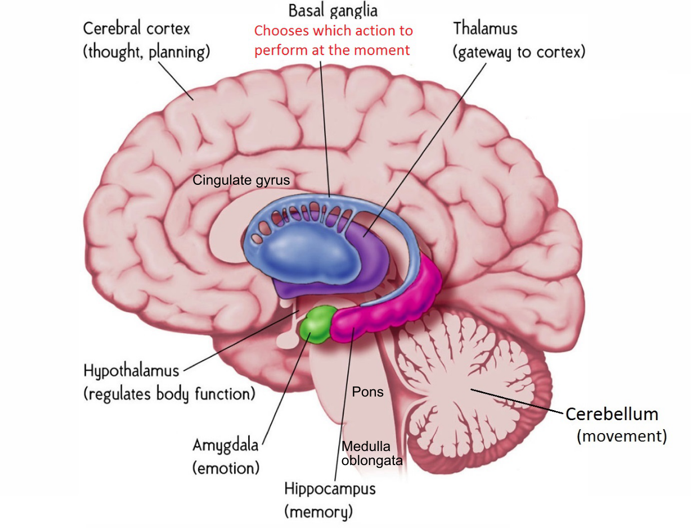
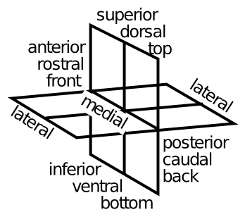
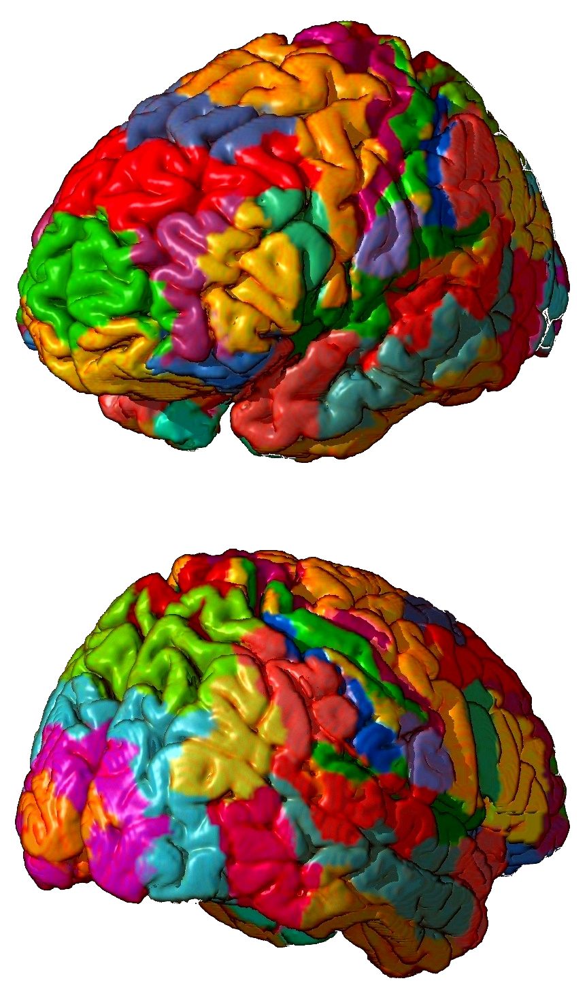
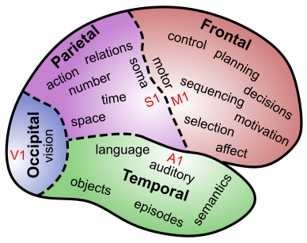
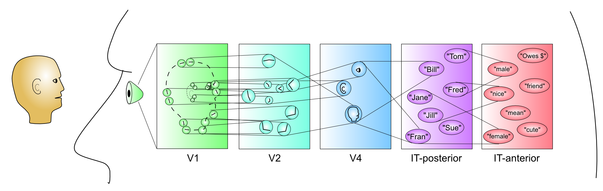
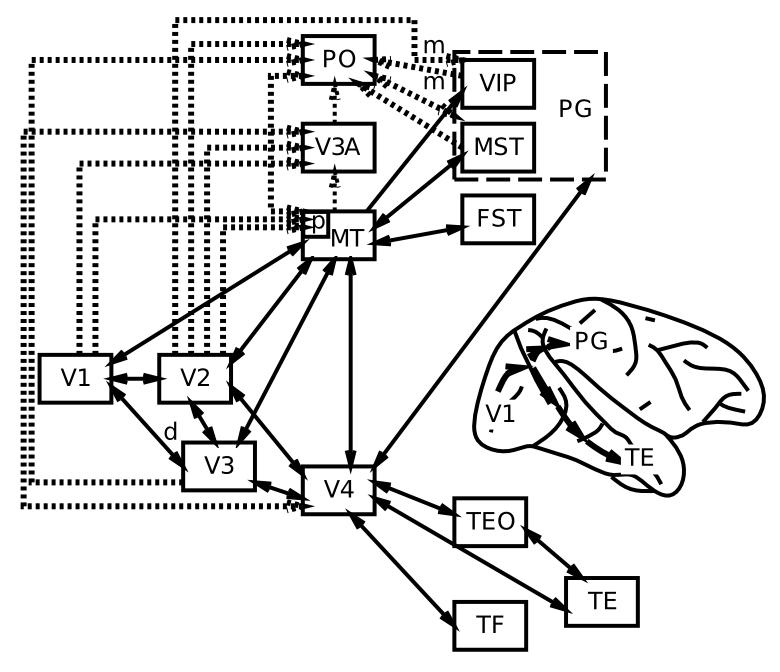
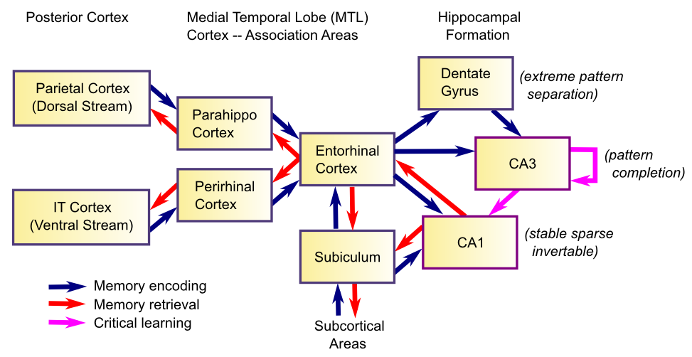
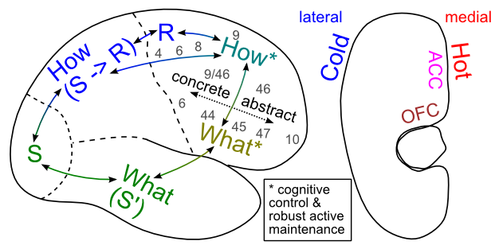

# Part II: Brain Areas {#sec:ch-areas}

In Part I of this book, we have developed a toolkit of basic neural mechanisms, going from the activation dynamics of individual neurons, to networks of neurons, and the learning mechanisms that configure them in both self-organizing and error-driven ways. At this start of Part II, we begin the transition to exploring a wide range of cognitive phenomena. As an important foundational step along this path, this chapter attempts to provide a big picture view of the overall functional organization of the brain, in a relatively non-controversial way that is roughly meant to correspond to what is generally agreed upon in the literature. This should help you understand at a broad level how different brain areas work together to perform different cognitive functions, and situate the more specific models in the subsequent chapters into a larger overall framework.

We proceed in the same sequence as the subsequent chapters, which roughly follows the evolutionary trajectory of the brain itself, starting with basic perceptual and motor systems, and then proceeding to explore different forms of learning and memory (including the role of the hippocampus in episodic memory). Building upon these core capacities, we then examine language and executive function, which build upon and extend the functionality of these basic cognitive systems.

As usual, we begin with a basic foundation in biology: the gross anatomy of the brain.

## Navigating the Functional Anatomy of the Brain

{ width=65% }

Figure 5.1 shows the "gross" (actually quite beautiful and amazing!) anatomy of the brain. The outer portion is the "wrinkled sheet" (upon which our thoughts rest) of the **neocortex**, showing all of the major lobes. This is where most of our complex cognitive function occurs, and what we have been focusing on to this point in the text. The rest of the brain lives inside the neocortex, with some important areas shown in the figure. These are generally referred to as **subcortical** brain areas, and we include some of them in our computational models, including:

* **Hippocampus** --- this brain area is actually an "ancient" form of cortex called "archicortex", and we'll see in the *Memory* Chapter how it plays a critical role in learning new "everyday" memories about events and facts (called *episodic* memories).

* **Amygdala** --- this brain area is important for recognizing emotionally salient stimuli, and alerting the rest of the brain about them. We'll explore it in the *Motor Control and Reinforcement Learning* Chapter, where it plays an important role in reinforcing motor (and cognitive) actions based on reward (and punishment).

* **Cerebellum** --- this massive brain structure contains 1/2 of the neurons in the brain, and plays an important role in motor coordination. It is also active in most cognitive tasks, but understanding exactly what its functional role is in cognition remains somewhat elusive. We'll explore it in the *Motor Control and Reinforcement Learning* Chapter.

* **Thalamus** --- provides the primary pathway for sensory information on its way to the neocortex, and is also likely important for attention, arousal, and other modulatory functions. We'll explore the role of visual thalamus in the *Perception and Attention* Chapter and of motor thalamus in the *Motor Control and Reinforcement Learning* Chapter.

* **Basal Ganglia** --- this is a collection of subcortical areas that plays a critical role in the *Motor Control and Reinforcement Learning* Chapter, and also in *Executive Function* Chapter. It helps to make the final "Go" call on whether (or not) to execute particular actions that the cortex 'proposes', and whether or not to update cognitive plans in the prefrontal cortex. Its policy for making these choices is learned based on their prior history of reinforcement/punishment.

{ width=30% }

Figure 5.2 shows the terminology that anatomists use to talk about different parts of the brain --- it is a good idea to get familiar with these terms --- we'll put them to good use right now.

{ width=50% }

{ width=30% }

{ width=50% }

Figures 5.3 and 5.4 show more detail on the structure of the neocortex, in terms of **Brodmann areas** --- these areas were identified by Korbinian Brodmann on the basis of anatomical differences (principally the differences in thickness of different cortical layers, which we covered in the *Networks* Chapter). We won't refer too much to things at this level of detail, but learning some of these numbers is a good idea for being able to read the primary literature in cognitive neuroscience. Here is a quick overview of the functions of the cortical lobes (Figure 5.5):

*  **Occipital lobe** --- this contains the **primary visual cortex (V1)** (Brodmann's area 17 or BA17), located at the very back tip of the neocortex, and higher-level visual areas that radiate out (forward) from it. Clearly, its main function is in visual processing.

* **Temporal lobe** --- departing from the occipital lobe, the **what** pathway of visual processing dives down into the **inferior temporal cortex (IT)**, where visual objects are recognized. Meanwhile, the superior temporal cortex contains the **primary auditory cortex (A1)**, and associated higher-level auditory and **language-processing** areas. Thus, the temporal lobes (one on each side) are where the visual appearance of objects gets translated into verbal labels (and vice-versa), and also where we learn to read. The most anterior region of the temporal lobes appears to be important for **semantic knowledge** --- all your high-level understanding of things like lawyers and government and all that good stuff you learn in school. The **medial temporal lobe** (MTL) area transitions into the hippocampus, and areas here play an increasingly important role in storing and retrieving memories of life events (**episodic memory**). When you are doing rote memorization without deeper semantic learning, the MTL and hippocampus are hard at work. Eventually, as you learn things more deeply and systematically, they get encoded in the anterior temporal cortex (and other brain areas too). In summary, the temporal lobes contain a huge amount of the stuff that we are consciously aware of --- facts, events, names, faces, objects, words, etc. One broad characterization is that temporal cortex is good at **categorizing** the world in myriad ways.

* **Parietal lobe** --- in contrast to the temporal lobe, the parietal lobe is much murkier and subconscious. It is important for encoding spatial locations (i.e., the **where** pathway, in complement to the IT what pathway), and damage to certain parts of it gives rise to the phenomenon of hemispatial neglect --- people just forget about an entire half of space! But its functionality goes well beyond mere spatial locations. It is important for encoding **numbers, mathematics, abstract relationships**, and many other "smart" things. At a more down-to-earth level, the parietal cortex provides the major pathway where visual information can **guide motor actions**, leading it to be characterized as the **how** pathway. It also contains the **primary somatosensory cortex (S1)**, which is important for guiding and informing motor actions as well. In some parts of the parietal cortex, neurons serve to translate between different **frames of reference**, for example converting spatial locations on the body (from somatosensation) to visual coordinates. And visual information can be encoded in terms of the patterns of activity on the retina (retinotopic coordinates), or head, body, or environment-based reference frames. One broad characterization of parietal cortex is that it is specialized for processing **metrical** information --- things that vary along a continuum, in direct contrast with the discrete, categorical nature of temporal lobe. A similar distinction is popularly discussed in terms of left vs. right sides of the brain, but the evidence for this in terms of temporal vs. parietal is stronger overall.

* **Frontal lobe** --- this starts at the posterior end with the **primary motor cortex (M1)**, and moving forward, there is a hierarchy of higher-levels of motor control, from low level motor control in M1 and supplementary motor areas (SMA), up to higher-level action sequences and contingent behavior encoded in premotor areas (higher motor areas). Beyond this is the **prefrontal cortex (PFC)**, known as the brain's **executive** --- this is where all the high-level shots are called, where your big plans are sorted out and influenced by basic motivations and emotions, to determine what you really should do next. The PFC also has a posterior-anterior organization, with more anterior areas encoding higher-level, longer-term plans and goals. The most anterior area of PFC (the **frontal pole**) seems to be particularly important for the most abstract, challenging forms of cognitive reasoning --- when you're really trying hard to figure out a puzzle, or sort through those tricky questions on the GRE or an IQ test. The medial and ventral regions of the frontal cortex are particularly important for **emotion and motivation** --- for example the **orbital frontal cortex (OFC)** seems to be important for maintaining and manipulating information about how rewarding a given stimulus or possible outcome might be (it receives a strong input from the Amygdala to help it learn and represent this information). The **anterior cingulate cortex (ACC)** is important for encoding the consequences of your actions, including the difficulty, uncertainty, or likelihood of failure associated with prospective actions in the current state (it lights up when you look down that double-black diamond run at the ski area!). Both the OFC and the ACC can influence choices via interactions with other frontal motor plan areas, and also via interactions with the basal ganglia. The **ventromedial PFC (VMPFC)** interacts with a lot of subcortical areas, to control basic bodily functions like heart rate, breathing, and neuromodulatory areas that then influence the brain more broadly (e.g., the ventral tegmental area (VTA) and locus coeruleus (LC), which release **dopamine** and **norepinephrine**, both of which have broad effects all over the cortex, but especially back in frontal cortex). The biggest mystery about the frontal lobe is how to understand how it does all of these amazing things, without using terms like "executive", because we're pretty sure you don't have a little guy in a pinstripe suit sitting in there. It is all just neurons!

## Comparing and Contrasting Major Brain Areas

|               | *Learning Signal* |            |          | *Dynamics* |            |           |
|---------------|-------------------|------------|----------|------------|------------|-----------|
| Area          | Reward            | Error      | Self Org | Separator  | Integrator | Attractor |
|---------------|-------------------|------------|----------|------------|------------|-----------|
| Basal Ganglia | +++               | ---        | ---      | ++         | -          | ---       |
| Cerebellum    | ---               | +++        | ---      | +++        | ---        | ---       |
| Hippocampus   | +                 | +          | +++      | +++        | ---        | +++       |
| Neocortex     | ++                | +++        | ++       | ---        | +++        | +++       |

Table: **Table 5.1** Comparison of learning mechanisms and activity/representational dynamics across four primary areas of the brain. **+++** means that the area definitely has given property, with fewer +'s indicating less confidence in and/or importance of this feature. **---** means that the area definitely does not have the given property, again with fewer -'s indicating lower confidence or importance.

Table 5.1 shows a comparison of four major brain areas according to the learning rules and activation dynamics that they employ. We haven't yet discussed reward-driven learning. We'll do so in the *Motor Control and Reinforcement Learning* Chapter, but for now think of it as learning to predict which pattern of activation will maximize a reward signal (e.g., dopamine level).

The evolutionarily older areas of the basal ganglia, cerebellum, and hippocampus employ a separating form of activation dynamics, meaning that they tend to make even somewhat similar inputs map onto more separated patterns of neural activity within the structure. This is a very conservative, robust strategy akin to memorizing specific answers to specific inputs --- it is likely to work OK, even though it is not very efficient, and does not generalize to new situations very well. Each of these structures can be seen as optimizing a different form of learning within this overall separating dynamic. The basal ganglia are specialized for learning on the basis of reward expectations and outcomes. The cerebellum uses a simple yet effective form of error-driven learning (basically the delta rule as discussed in the *Learning* Chapter). And the hippocampus relies more on hebbian-style self-organizing learning. Thus, the hippocampus is constantly encoding new episodic memories regardless of error or reward (though these can certainly modulate the rate of learning, as indicated by the weaker + signs in the table), while the basal ganglia is learning to select motor actions on the basis of potential reward or lack thereof (and is also a control system for regulating the timing of action selection), while the cerebellum is learning to swiftly perform those motor actions by using error signals generated from differences in the sensory feedback relative to the motor plan. Taken together, these three systems are sufficient to cover the basic needs of an organism to survive and adapt to the environment, at least to some degree.

The hippocampus introduces one critical innovation beyond what is present in the basal ganglia and cerebellum: it has attractor dynamics. Specifically the recurrent connections between CA3 neurons are important for retrieving previously-encoded memories, via pattern completion as we explored in the *Networks* Chapter. The price for this innovation is that the balance between excitation and inhibition must be precisely maintained, to prevent epileptic activity dynamics. Indeed, the hippocampus is the single most prevalent source of epileptic activity, in people at least.

Against this backdrop of evolutionarily older systems, the neocortex represents a few important innovations. In terms of activation dynamics, it builds upon the attractor dynamic innovation from the hippocampus (appropriately so, given that hippocampus represents an ancient "proto" cortex), and adds to this a strong ability to develop representations that integrate across experiences to extract generalities, instead of always keeping everything separate all the time. The cost for this integration ability is that the system can now form the wrong kinds of generalizations, which might lead to bad overall behavior. But the advantages apparently outweigh the risks, by giving the system a strong ability to apply previous learning to novel situations. In terms of learning mechanisms, the neocortex employs a solid blend of all three major forms of learning, integrating the best of all the available learning signals into one system.

## Perception and Attention: What vs. Where

{ width=100% }

{ width=50% }

{ width=50% }

The perceptual system provides an excellent example of the power of hierarchically organized layers of neural detectors, as we discussed in the *Networks* Chapter. Figure 5.6 summarizes this process, with associated cortical areas noted below each stage of processing. Figure 5.7 shows the current best estimate of the actual anatomical connectivity patterns of all of the major visual areas [@MarkovVezoliChameauEtAl14; @FellemanVanEssen91], showing that information really is processed in a hierarchical fashion in the brain (although there are many interconnections outside of a strict hierarchy as well). Figure 5.8 puts these areas into their anatomical locations, showing more clearly the **what vs where** (**ventral vs dorsal**) split in visual processing [@UngerleiderMishkin82]. Here is a quick summary of the flow of information up the **what** side of the visual pathway (pictured on the left side of Figure 5.7):

* **V1** --- primary visual cortex, which encodes the image in terms of oriented edge detectors that respond to edges (transitions in illumination) along different angles of orientation. We will see in the *Perception and Attention* Chapter how these edge detectors develop through self-organizing learning, driven by the reliable statistics of natural images.

* **V2** --- secondary visual cortex, which encodes combinations of edge detectors to develop a vocabulary of intersections and junctions, along with many other basic visual features (e.g., 3D depth selectivity, basic textures, etc), that provide the foundation for detecting more complex shapes. These V2 neurons also encode these features in a broader range of locations, starting a process that ends up with IT neurons being able to recognize an object regardless of where it appears in the visual field (i.e., *invariant* object recognition).

* **V4** --- detects more complex shape features, over an even larger range of locations (and sizes, angles, etc).

* **IT-posterior** (PIT) --- detects entire object shapes, over a wide range of locations, sizes, and angles. For example, there is an area near the fusiform gyrus on the bottom surface of the temporal lobe, called the **fusiform face area (FFA)**, that appears especially responsive to faces. As we saw in the *Networks*  Chapter, however, objects are encoded in distributed representations over a broad range of areas in IT.

* **IT-anterior** (AIT) --- this is where visual information becomes extremely abstract and **semantic** in nature --- as shown in the Figure, it can encode all manner of important information about different people, places and things.

We'll explore a model of invariant object recognition in the *Perception and Attention* Chapter that shows how this deep hierarchy of detectors can develop through learning. The *Language* Chapter builds upon this object recognition process to understand how words are recognized and translated into associated verbal motor outputs during reading, and associated with semantic knowledge as well.

The **where** aspect of visual processing happens in the parietal cortex, including areas such as middle temporal (MT), ventral intraparietal cortex (VIP), lateral intraparietal cortex (LIP), and medial superior temporal (MST), that are important for processing motion, depth, and other spatial features. As noted above, these areas are also critical for translating visual input into appropriate motor output, leading Goodale and Milner to characterize this as the **how** pathway [@GoodaleMilner92]. In the *Perception and Attention* Chapter, we'll see how this dorsal pathway can interact with the ventral what pathway in the context of visual attention, producing the characteristic effects of parietal damage such as hemispatial neglect, for example.  There is also increasing evidence for three distinct parietal-lobe pathways, corresponding to *looking* (lateral intraparietal cortex (LIP) / frontal eye fields (FEF)), *reaching* (VIP / supplementary motor area (SMA)), and *navigating* (medial parietal networks, including posterior cingulate cortex (PCC) and retrosplenial cortex (RSC)) [@KravitzSaleemBakerEtAl11; @RanganathRitchey12].

## Motor Control: Parietal and Motor Cortex Interacting with Basal Ganglia and Cerebellum

Carrying the parietal **how** pathway forward, visual information going along the dorsal pathway through the parietal cortex heads directly into the frontal cortex, where it can drive motor neurons in the primary motor cortex, which can directly drive the muscles to produce overt motor actions. This completes the critical sensory-motor loop that lies at the core of all behavior. Motor control also critically involves many subcortical brain areas, including the basal ganglia and cerebellum. The rough division of labor between these areas is:

* **Neocortex (parietal to frontal)** --- does high-level metrical processing of sensory information, integrating multiple modalities and translating between different reference frames as necessary, to arrive at a **range of possible responses to the current sensory environment.**

* **Basal Ganglia** --- receives both sensory inputs and the potential responses being "considered" in frontal cortex, and can then trigger a **disinhibitory Go** signal that enables the *best* of the possible actions to get over threshold and actually drive behavior [@Mink96; @Frank05]. This process of **action selection** is shaped by **reinforcement learning** --- the basal ganglia are bathed in **dopamine**, which drives learning in response to rewards and punishments, and also influences the speed of the selection process itself [@SuttonBarto98; @MontagueDayanSejnowski96]. Thus, the basal ganglia selects the action that is most likely to result in reward, and least likely to result in punishment. The **amygdala** plays a key role in driving these dopamine signals in response to sensory cues associated with reward and punishment.

* **Cerebellum** --- is richly interconnected with the parietal and motor cortex, and it is capable of using a simple yet powerful form of error-driven learning to acquire high-resolution metrical maps between sensory inputs and motor outputs. Thus, it is critical for generating smooth, coordinated motor movements that properly integrate sensory and motor feedback information to move in an efficient and controlled manner. It also likely serves to teach the parietal and motor cortex what it has learned.

In the *Motor Control and Reinforcement Learning* Chapter, we will see how dopamine signals shape basal ganglia learning and performance in a basic action selection task. Then, we'll explore a fascinating model of cerebellar motor learning in a virtual robot that performs coordinated eye and head movements to fixate objects --- this model shows how the error signals needed for cerebellar learning can arise naturally.

Interestingly, all of these "low level" motor control systems end up being co-opted by "higher level" executive function systems (e.g., the prefrontal cortex), so although some don't think of motor control as a particularly cognitive domain, it actually provides a solid foundation for understanding some of the highest levels of cognitive function!

## Memory: Temporal Cortex and the Hippocampus

When you think of memory, probably things like "what did I have for dinner last night?" and "how can I remember people's names better?" tend to come to mind. These represent just one category of memory, however. Indeed, memory is ubiquitous in neural networks --- every synapse has the capacity for storing memory, and any given "memory" requires the coordinated actions of millions of such synapses to encode and retrieve. There are many taxonomies of memory, but really the only one you need to know is identical to the functional organization of the brain being provided here. Memory is embedded in every brain area, and the nature of that memory is intimately tied up with what that area does. Motor cortex learns motor memories. Parietal cortex learns things like motor skills --- how to hit a baseball (hint: keep your eye on the ball --- parietal cortex needs visual input!).

{ width=75% }

There is one brain area, however, that looms so large in the domain of memory, that we'll spend a while focusing on it. This is the **hippocampus**, which seems to be particularly good at rapidly learning new information, in a way that doesn't interfere too much with previously learned information (Figure 5.9). When you need to remember the name associated with a person you recently met, you're relying on this rapid learning ability of the hippocampus. We'll see that the neural properties of the hippocampal system are ideally suited to producing this rapid learning ability. One key neural property is the use of **extremely sparse representations**, which produce a phenomenon called **pattern separation**, where the neural activity pattern associated with one memory is highly distinct from that associated with other similar memories [@Marr71; @McClellandMcNaughtonOReilly95]. This is what minimizes interference with prior learning --- interference arises as a function of overlap. We'll see how this pattern separation process is complemented by a pattern completion process for recovering memories during retrieval from partial information [@OReillyMcClelland94].

We'll also see how the **learning rate** plays a crucial role in learning. Obviously, to learn rapidly, you need a fast learning rate. But what happens with a slow learning rate? Turns out this enables you to integrate across many different experiences, to produce *wisdom* and *semantic knowledge*. This slower learning rate is characteristic of most of the neocortex (it also enables the basal ganglia to learn probabilities of positive and negative outcomes for each action across a range of experience, rather than just their most recent outcomes) [@McClellandMcNaughtonOReilly95]. Interestingly, even with a slow learning rate, neocortex can exhibit measurable effects of a single trial of learning, in the form of **priming effects** and **familiarity signals** that can drive recognition memory (i.e., your ability to recognize something as familiar, without any more explicit episodic memory). This form of recognition memory seems to depend on **medial temporal lobe (MTL)** areas including **perirhinal cortex**. Another form of one trial behavioral learning involves mechanisms that support active maintenance of memories in an attractor state (working memory in the prefrontal cortex). This form of memory does not require a weight change at all, but can nevertheless rapidly influence behavioral performance from one instance to the next.

## Language: All Together Now

Language taps the coordinated function of many of the brain areas discussed above. Language requires highly sophisticated perceptual abilities, to be able to discriminate different speech sounds and different letters and combinations thereof (just listen and look at an unfamiliar foreign language to experience how amazing your own native language perceptual abilities are, which you take for granted). Likewise, sophisticated motor output abilities are required to produce the sounds and write the letters and words of language. In between, language requires some of the most demanding forms of cognitive processing, to keep track of the grammatical and semantic information streaming past you, often at high speed. This requires sophisticated executive function and working memory abilities, in addition to powerful distributed posterior-cortical semantic representations to integrate all the semantic information.

Our exploration in the *Language* Chapter starts with a small-scale model of reading, that interconnects **orthographic** (writing), **phonological** (speech), and **semantic** representations of individual words, to form a **distributed lexicon** --- there isn't one place where all word information is stored --- instead it is distributed across brain areas that are specialized for processing the relevant perceptual, motor, and semantic information. Interestingly, we can simulate various forms of **acquired dyslexia** (e.g., from stroke or other forms of brain injury) by damaging specific pathways in this model, providing an important way of establishing neural correlates of language function in humans, where invasive experiments are not possible [@PlautShallice93].

We then zoom in on the orthography to phonology pathway to explore issues with **regularities and exceptions** in this spelling-to-sound mapping, which has been the topic of considerable debate [@SeidenbergMcClelland89; @PinkerPrince88; @PlautMcClellandSeidenbergEtAl96]. We show that the object recognition model from the perception chapter has an important blend of features that support both regular and exception mappings, and this model pronounces nonword probe inputs much like people do, demonstrating that it has extracted similar underlying knowledge about the English mapping structure.

Next, we zoom in on the semantics pathway, exploring how a self-organizing network can learn to encode statistical regularities in **word co-occurance**, that give rise to semantic representations that are remarkably effective in capturing the similarity structure of words [@LandauerDumais97]. We train this network on an early draft of the first edition of this text, so you should be familiar with the relevant semantics!

Finally, we tackle the interactions between syntax and semantics in the context of processing the meaning of sentences, using the notion of a **sentence gestalt** representation, that uses coarse-coded distributed representations to encode the overall meaning of the sentence, integrating both syntactic and semantic cues [@StJohnMcClelland90]. This is a distinctly neural approach to syntax, as contrasted with the symbolic, highly structured approaches often employed in linguistic theories.

## Executive Function: Prefrontal Cortex and Basal Ganglia

Finally, we build upon the motor control functions of frontal cortex and basal ganglia to understand how these two areas interact to support high-level executive function.

{ width=60% }

We also build upon the functional divisions of the posterior cortex to understand how the ventral vs. dorsal areas of prefrontal cortex are functionally organized. Figure 5.10 shows an overall schematic for how this occurs. It also illustrates how the lateral surface is more associated with "cold" cognitive function, while the medial surface is more involved in "hot" emotional and motivational processing.

We'll see how the PFC can provide **top-down cognitive control** over processing in the posterior cortex, with the classic example being the Stroop task.

Then we'll explore how PFC and BG can interact to produce a dynamically gated working memory system that allows the system to hold multiple pieces of information 'in mind', and to separately update some pieces of information while continuing to maintain some existing information. The role of the BG in this system builds on the more established role of the BG in motor control, by interacting in very similar circuits with PFC instead of motor cortex. In both cases, the BG provide a gating signal for determining whether or not a given frontal cortical 'action' should be executed or not. It's just that PFC actions are more cognitive than motor cortex, and include things like updating of working memory states, or of goals, plans, etc. Once updated, these PFC representations can then provide that top-down cognitive control mentioned above, and hence can shape action selection in BG-motor circuits, but also influence attention to task-relevant features in sensory cortex. Interestingly, the mechanisms for reinforcing which cognitive actions to execute (including whether or not to update working memory, or to attend to particular features, or to initiate a high level plan) seem to depend on very similar dopaminergic reinforcement learning mechanisms that are so central to motor control. This framework also provides a link between motivation and cognition which is very similar to the well established link between motivation and action.
