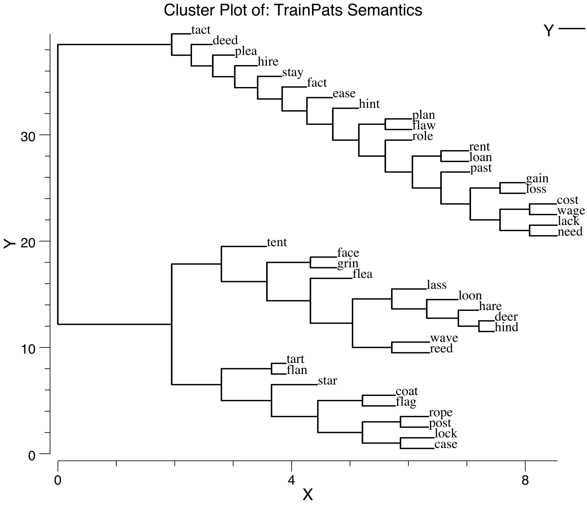
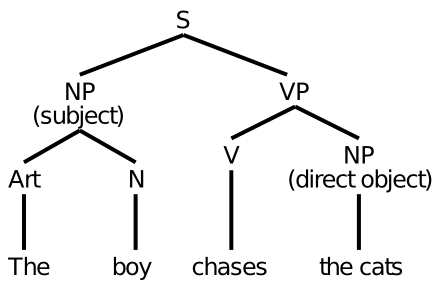

# Language {#sec:ch-lang}

Language involves almost every part of the brain, as covered in other chapters in the text:

* *Perception and attention:* language requires the perception of words from auditory sound waves, and written text. Attention is critical for pulling out individual words on the page, and individual speakers in a crowded room. In this chapter, we see how a version of the object recognition model from the perception chapter can perform written word recognition, in a way that specifically leverages the spatial invariance property of this model.
    
* *Motor control*: Language production obviously requires motor output in the form of speech, writing, etc. Fluent speech depends on an intact cerebellum, and the basal ganglia have been implicated in a number of linguistic phenomena.
    
* *Learning and memory:* early word learning likely depends on episodic memory in the hippocampus, while longer-term memory for word meaning depends on slow integrated learning in the cortex. Memory for recent topics of discourse and reading (which can span months in the case of reading a novel) likely involves the hippocampus and sophisticated semantic representations in temporal cortex.
    
* *Executive Function:* language is a complex mental facility that depends critically on coordination and working memory from the prefrontal cortex (PFC) and basal ganglia --- for example encoding syntactic structures over time, pronoun binding, and other more transient forms of memory.

One could conclude from this that language is not particularly special, and instead represents a natural specialization of *domain general* cognitive mechanisms. Of course, people have specialized articulatory apparatus for producing speech sounds, which are not shared by other primate species, but one could argue that everything on top of this is just language infecting pre-existing cognitive brain structures. Certainly reading and writing is too recent to have any evolutionary adaptations to support it (but it is also the least "natural" aspect of language, requiring explicit schooling, compared to the essentially automatic manner in which people absorb spoken language).

But language is fundamentally different from any other cognitive activity in a number of important ways:

* **Symbols** --- language requires thought to be reduced to a sequence of symbols, transported across space and time, to be reconstructed in the receiver's brain.
    
* **Syntax** --- language obeys complex abstract regularities in the ordering of words and letters/phonemes.

* **Temporal extent and complexity** --- language can unfold over a very long time frame (e.g., Tolstoy's *War and Peace*), with a level of complexity and richness conveyed that far exceeds any naturally occurring experiences that might arise outside of the linguistic environment. If you ever find yourself watching a movie on an airplane without the sound, you'll appreciate that visual imagery represents the lesser half of most movie's content (the interesting ones anyway).

* **Generativity** --- language is "infinite" in the sense that the number of different possible sentences that could be constructed is so large as to be effectively infinite. Language is routinely used to express new ideas. You may find some of those here.
    
* **Culture** --- much of our intelligence is imparted through cultural transmission, conveyed through language. Thus, language shapes cognition in the brain in profound ways.

The "special" nature of language, and its dependence on domain-general mechanisms, represent two poles in the continuum of approaches taken by different researchers. Within this broad span, there is plenty of room for controversy and contradictory opinions. Noam Chomsky famously and influentially theorized that we are all born with an innate universal grammar, with language learning amounting to discovering the specific parameters of that language instance. On the other extreme, connectionist language modelers such as Jay McClelland argue that completely unstructured, generic neural mechanisms (e.g., backpropagation networks) are sufficient for explaining (at least some of) the special things about language.

Our overall approach is clearly based in the domain-general approach, given that the same general-purpose neural mechanisms used to explore a wide range of other cognitive phenomena are brought to bear on language here. However, we also think that certain features of the PFC / basal ganglia system play a special role in symbolic, syntactic processing. At present, these special contributions are only briefly touched upon here, and elaborated just a bit more in the executive function chapter, but future plans call for further elaboration. One hint at these special contributions comes from *mirror neurons* discovered in the frontal cortex of monkeys, in an area thought to be analogous to Broca's area in humans --- these neurons appear to encode the intentions of actions performed by other people (or monkeys), and thus may constitute a critical capacity to understand what other people are trying to communicate.

We start as usual with a biological grounding to language, in terms of particularly important brain areas and the biology of speech. Then we look at the basic perceptual and motor pathways in the context of reading, including an account of how damage to different areas can give rise to distinctive patterns of acquired dyslexia. We explore a large-scale reading model, based on our object recognition model from the perception chapter, that is capable of pronouncing the roughly 3,000 monosyllabic words in English, and generalizing this knowledge to nonwords. Next, we consider the nature of semantic knowledge, and see how a self-organizing model can encode word meaning in terms of the statistics of word co-occurrence, as developed in the Latent Semantic Analysis (LSA) model. Finally, we explore syntax at the level of sentences in the Sentence Gestalt model, where syntactic and semantic information are integrated over time to form a "gestalt" like understanding of sentence meaning.

## Biology of Language

{ width=40% }

The classic "textbook" brain areas for language are **Broca's** and **Wernicke's** areas (Figure 9.1), which have been associated with syntax and semantics, respectively. For example, a person who suffers a stroke or other form of damage to Wernicke's area can produce fluent, syntactically-correct speech, which is essentially devoid of meaning. Here is one example:

> *"You know that smoodle pinkered and that I want to get him round and take care of him like you want before"*

which apparently was intended to mean: "The dog needs to go out so I will take him for a walk."

In contrast, a person with damage to Broca's area has difficulty producing syntactically correct speech output, typically producing single content words with some effort, e.g., "dog....walk".

The more modern term for Broca's aphasia is *expressive aphasia*, indicating a primary deficit in expressing speech. Comprehension is typically intact, although interestingly there can be deficits in understanding more syntactically complex sentences. Wernicke's aphasia is known as *receptive aphasia*, indicating a deficit in comprehension, but also expression of meaning.

Biologically, the locations of the damage associated with these aphasias are consistent with what we know about these areas more generally. The ventral posterior area of frontal cortex known as Broca's area (corresponding to Brodmann's areas 44 and 45) is adjacent to the primary motor area associated with control over the mouth, and thus it represents supplementary motor cortex for vocal output. Even though Broca's patient's can physically move their mouths and other articulatory systems, they cannot perform the complex sequencing of these motor commands that is necessary to produce fluid speech. Interestingly, these higher-order motor control areas also seem to be important for syntactic processing, even for comprehension. This is consistent with the idea that frontal cortex is important for temporally-extended patterning of behavior according to increasingly complex plans as one moves more anterior in frontal cortex.

The location of Wernicke's area in temporal cortex is sensible, given that we know that the temporal lobe represents the semantic meanings of objects and other things.

There are still some controversies about the exact nature of damage required to produce each of these aphasias (and likely a large amount of individual variability across people as well), but the basic distinction between these broad areas remains quite valid.

### The Articulatory Apparatus and Phonology

{ width=40% }

![**Figure 9.3:** Left panel: International Phonological Alphabet (IPA) for vowels, as a function of where the tongue is positioned (front vs. back, organized horizontally in figure), and the shape of the lips (vertical axis in figure) --- these two dimensions define a space of vowel sounds.  Right panel: Version of IPA vowel space with vowel labels used by PMSP and in our simulations --- these are all standard roman letters and thus easier to manipulate in computer programs. Only the subset present in English is used. ](../figures/fig_ipa_chart_vowels_ipa_pmsp.png){ width=75% }

{ width=100% }

The vocal tract in people (Figure 9.2) is capable of producing a wide range of different speech sounds, by controlling the location and manner in which sound waves are blocked or allowed to pass. There are two basic categories of speech sounds: vowels and consonants. Vowels occur with unobstructed airflow (you can sing a vowel sound over an extended period), and differ in the location of the tongue and lips (Figure 9.3). For example, the long "E" vowel sound as in "seen" is produced with the tongue forward and the lips relatively closed. Consonants involve the blockage of airflow, in a variety of locations, and with a variety of different manners (Figure 9.4). The "s" consonant is a "fricative" (friction-like obstruction of the sound) with the tongue placed at the aveloar ridge. It is also unvoiced, which means that the vocal chords are not vibrating for it --- the "z" sound is just like an "s" except it is voiced.

To see a video of the movements of the tongue in vocal output, see this [YouTube link](https://www.youtube.com/watch?v=M2OdAp7MJAI).

We'll take advantage of these phonological features in the output of our detailed reading model --- using these features ensures that the spelling-to-sound correspondences actually capture the real phonological structure of the English language (at least at a fairly abstract level). A more detailed motor model of speech output developed by Frank Guenther, which we hope to include in our models at some point, can be found [here](http://sites.bu.edu/guentherlab/software/).

## Reading and Dyslexia in the Triangle Model

{ width=40% }

The first language model we explore simulates the major pathways involved in reading, according to the so-called *triangle model* (9.5) [@PlautShallice93]. This model provides a basic understanding of the functional roles of visual perception of written words (*orthography*), spoken motor output of word *phonology*, and *semantic* representations of word meaning in between. This set of language pathways is sufficient to simulate the processes involved in reading words aloud, and damage to these pathways can simulate the critical features of different types of acquired dyslexia. Acquired dyslexia, which results from strokes or other brain damage, is distinct from *developmental* dyslexia, which is the more common form that many people associate with the term *dyslexia* (which generically refers to any form of reading impairment).

There are three major forms of acquired dyslexia that can be simulated with the model:

* **Phonological** --- characterized by difficulty reading nonwords (e.g., "nust" or "mave"). This can be produced by damage to the direct pathway between orthography and phonology (there shouldn't be any activation in semantics for nonwords), such that people have difficulty mapping spelling to sound according to learned regularities that can be applied to nonwords. We'll explore this phenomenon in greater detail in the next simulation.
    
* **Deep** --- is a more severe form of phonological dyslexia, with the striking feature that people sometimes make semantic substitutions for words, pronouncing the word "orchestra" as "symphony" for example. There are also *visual* errors, so-named because they seem to reflect a misperception of the word inputs (e.g, reading the word "dog" as "dot"). Interestingly, we'll see how more significant damage to the direct pathway can give rise to this profile --- the semantic errors occur due to everything going through the semantic layer, such that related semantic representations can be activated. In the normal intact brain, the direct pathway provides the relevant constraints to produce the actual written word, but absent this constraint, an entirely different but semantically related word can be output.
    
* **Surface** --- here nonword reading is intact, but access to semantics is impaired (as in Wernicke's aphasia), strongly implicating a lesion in the semantics pathway. Interestingly, pronunciation of exception words (e.g., "yacht") is impaired. This suggests that people typically rely on the semantic pathway to "memorize" how to pronounce odd words like yacht, and the direct pathway is used more for pronouncing regular words.

That these different forms of dyslexia can be reliably observed in different patients, and fit so well with expected patterns of reading deficits according to the triangle model, provides a strong source of support for the validity of the model. It would be even more compelling if the specific foci of damage associated with these different forms of dyslexia make sense anatomically according to the mapping of the triangle model onto brain areas.

### Exploration

{ width=50% }

Run `dyslexia` from [CCN Sims](https://github.com/CompCogNeuro/sims) for the simulation of the triangle model and associated forms of dyslexia. This model allows you to simulate the different forms of acquired dyslexia, in addition to normal reading, using the small corpus of words as shown in Figure 9.6. In the next section, we expand upon the direct pathway and examine nonword reading, which requires a much larger corpus of words to acquire the relevant statistical regularities that support generalization.

## Spelling to Sound Mappings in Word Reading

We now zoom in on the direct pathway between visual word inputs (orthography) and verbal speech output (phonology), using a much larger set of words comprising most of the monosyllabic words in English (nearly 3,000 words). By learning on such a large selection of words, sampled according to their frequency of occurrence in English, the network has a chance to extract the "rules" that govern the mapping between spelling and sound in English (such as they are), and thus be able to successfully pronounce *nonwords*.

English is a particularly difficult language from a pronunciation perspective, as anyone knows who has tried to acquire it as a second language. There are very few (if any) absolute rules. Everything is more of a *partial, context-dependent regularity*, which is also called a *subregularity*. For example, compare the pronunciation of the letter *i* in *mint* and *hint* (short *i* sound) to that in *mind* and *find* (long *I* sound). The final consonant (*t* vs. *d*) determines the pronunciation, and of course there are always exceptions such as *pint* (long *I* sound).

One way to classify how strong a regularity is, is to count how many other letters the pronunciation depends upon. A complete exception like *pint* or *yacht* depends on *all* the letters in the word, while *mint* vs. *mind* depends on one other letter in the word (the final *t* or *d*). There are many silent letter examples, such as the final *e* in many words. A nice subregularity is the letter *m*, which depends on whether there is an *n* next to it, in which case it goes silent, as in *damn*, *column*, or *mnemonic*. Many other consonants can be silent with varying degrees of subregularity, including *b* (*debt*), *d* (*handsome*), *h* (*honest*), *l* (*halve*), *p* (*coup*), *r* (*iron*), *s* (*aisle*), *t* (*castle*), *w* (*sword*), and *z* (*rendezvous*).

Another factor that determines how much context is required to pronounce a given letter is the preponderance of multi-letter groups like *th* (*think*), which have a particular regular pronunciation that differs from the individual letters separately. Other examples of these include: *sch* (*school*), *tch* (*batch*), *gh* (*ghost*), *ght* (*right*), *kn* (*knock*), *ph* (*photo*), *wh* (*what*). One of the most context sensitive set of letters is the *ough* group, as in *though, tough, cough, plough, through, nought*, where the pronunciation varies widely.

So English is a mess. The constructed word *ghoti* is a famous example of how crazy it can get. It is pronounced "fish", where the *gh* is an *f* sound as in *tough*, *o* is an *i* sound as in *women*, and *ti* is a *sh* sound as in *nation*.

For any system to be able to have any chance of producing correct pronunciation of English, it must be capable of taking into account a range of context around a given letter in a word, all the way up to the entire word itself. An influential early approach to simulating spelling to sound in a neural network [@SeidenbergMcClelland89] used a so-called *Wickelfeature* representation (named after Wayne Wickelgren), where the written letters were encoded in pairs of three. For example, the word "think" would be encoded as *thi*, *hin*, and *ink*. This is good for capturing context, but it is a bit rigid, and doesn't allow for the considerable amount of regularity in individual letters themselves (most of the time, an *m* is just an *m*). As a result, this model did not generalize very well to nonwords, where letters showed up in different company than in the real words used in training. A subsequent model by [@PlautMcClellandSeidenbergEtAl96] (hereafter *PMSP*) achieved good nonword generalization by representing input words through a hand-coded combination of individual letter units and useful multi-letter contexts (e.g., a *th* unit).

![**Figure 9.7:** Word reading as a process of spatially invariant object recognition. Words show up in different locations in the input, and the next level up, equivalent to the V4 level in the object recognition model, extracts more complex combinations of letters, while also developing more invariant representations that integrate individual letters or multi-letter features over multiple different locations. The IT level representation then has a fully spatially invariant representation of the word (as a distributed representation integrating over individual letters and letter groups), which then provides a nice mapping to the phonological output.](../figures/fig_reading_model.png){ width=20% }

We take a different approach in our spelling-to-sound model (Figure 9.7), leveraging ideas from the object recognition model that was explored in the *Perception* Chapter. Specifically, we saw that the object recognition model could learn to build up increasingly complex combinations of features, while also developing spatial invariance, over multiple levels of processing in the hierarchy from V1 through IT. In the context of word recognition, these complex features could include combinations of letters, while spatial invariance allows the system to recognize that an *m* in any location is the same as any other *m* (most of the time).

One compelling demonstration of the importance of spatial invariance in reading comes from this example, which made the rounds in email a few years ago:

> I cnduo't bvleiee taht I culod aulaclty uesdtannrd waht I was rdnaieg. Unisg the icndeblire pweor of the hmuan mnid, aocdcrnig to rseecrah at Cmabrigde Uinervtisy, it dseno't mttaer in waht oderr the lterets in a wrod are, the olny irpoamtnt tihng is taht the frsit and lsat ltteer be in the rhgit pclae. The rset can be a taotl mses and you can sitll raed it whoutit a pboerlm. Tihs is bucseae the huamn mnid deos not raed ervey ltteer by istlef, but the wrod as a wlohe. Aaznmig, huh? Yaeh and I awlyas tghhuot slelinpg was ipmorantt! See if yuor fdreins can raed tihs too.

Clearly this is more effortful than properly spelled text, but the ability to read it at all indicates that just extracting individual letters in an invariant manner goes a long way.

To test the performance of this object-recognition based approach, we ran it through a set of different standard sets of nonwords, several of which were also used to test the PMSP model. The results are shown in Table 9.1.

* **Glushko regulars** --- nonwords constructed to match strong regularities, for example *nust*, which is completely regular (e.g., *must*, *bust*, *trust*, etc).
    
* **Glushko exceptions** --- nonwords that have similar English exceptions and conflicting regularities, such as *bint* (could be like *mint*, but also could be like *pint*). We score these items either according to the predominant regularity, or also including close exceptional cases (alt OK in the table).

* **McCann & Besner ctrls** --- these are pseudo-homophones and matched controls, that sound like actual words, but are spelled in a novel way, for example *choyce* (pronounced like *choice*), and the matched control is *phoyce*.

* **Taraban & McClelland** --- has frequency matched regular and exception nonwords, for example *poes* (like high frequency words *goes* or *does*), and *mose*, like lower frequency *pose* or *lose*.

The results indicate that the model does a remarkably good job of capturing the performance of people's performance on these nonword reading sets. This suggests that the model is capable of learning the appropriate regularities and subregularities that are present in the statistics of English pronunciation.

| Nonword Set               | ss Model | PMSP  | People |
|---------------------------|----------|-------|--------|
| Glushko regulars          | 95.3     | 97.7  | 93.8   |
| Glushko exceptions raw    | 79.0     | 72.1  | 78.3   |
| Glushko exceptions alt OK | 97.6     | 100.0 | 95.9   |
| McCann & Besner ctrls     | 85.9     | 85.0  | 88.6   |
| McCann & Besner homoph    | 92.3     | n/a   | 94.3   |
| Taraban & McClelland      | 97.9     | n/a   | 100.0  |

Table: **Table 9.1** Comparison of nonword reading performance for our spelling-to-sound model (ss Model), the PMSP model, and data from people, across a range of different nonword datasets as described in the text. Our model performs comparably to people, after learning on nearly 3,000 English monosyllabic words.

### Exploration

Run `ss` (spelling to sound) in [CCN Sims](https://github.com/CompCogNeuro/sims) to explore the spelling-to-sound model, and test its performance on both word and nonword stimuli.

## Latent Semantics in Word Co-Occurrence

{ width=40% }

Completing our more in-depth tour of the major pathways in the triangle model of reading, we now turn to the issue of semantics. What is the nature of the semantic representations shown at the top of Figure 9.5? An increasing body of data supports the idea shown in Figure 9.8, where the meaning of concrete words is encoded by patterns of activity within domain-specific brain areas that process sensory and motor information [@Allport85]. Thus, semantics is distributed throughout a wide swath of the brain, and it is fundamentally *embodied* and *grounded* in the sensory-motor primitives that we first acquire in life. Thus, the single "semantics" area shown in the triangle model is a major simplification relative to the actual widely distributed nature of semantic meaning in the brain.

However, there is also increasing evidence that the anterior tip or "pole" of the temporal lobe plays a particularly important role in representing semantic information, perhaps most importantly for more abstract words that lack a strong sensory or motor correlate. One theory is that this area acts as a central "hub" for coordinating the otherwise distributed semantic information [@PattersonNestorRogers07].

How do we learn the meanings of these more abstract words in the first place? Unlike the more concrete words shown in Figure 9.8, the meanings of more abstract words cannot be so easily pushed off to sensory and motor areas. One compelling idea here is that words obtain their meaning in part from the company they keep --- the statistics of word co-occurrence across the large volume of verbal input that we are exposed to can actually provide clues as to what different words mean. One successful approach to capturing this idea in a functioning model is called *Latent Semantic Analysis* (LSA) [@LandauerDumais97] --- see [LSA Website](http://lsa.colorado.edu) for full details and access to this model.

LSA works by recording the statistics of how often words co-occur with each other within semantically-relevant chunks of text, typically paragraphs. However, these surface statistics themselves are not sufficient, because for example synonyms of words occur together relatively rarely, compared to how closely related they should be. And in general, there is a lot of variability in word choice and idiosyncrasies of word choices that are reflected in these detailed statistics. The key step that LSA takes in dealing with this problem is to apply a *dimensionality reduction* technique called *Singular Value Decomposition* (SVD), which is closely related to *Principal Components Analysis* (PCA), which in turn is closely related to the Hebbian self-organizing learning that our neural network models perform.

The key result of this SVD/PCA/Hebbian process is to extract the *strongest groupings* or clusters of words that co-occur together, in a way that integrates over many partially-overlapping subsets of word groups. Thus, even though synonyms do not tend to occur with each other, they do co-occur with many of the same other sets of words, and this whole group of words represents a strong statistical grouping that will be pulled out by the dimensionality reduction / Hebbian self-organizing learning process.

This process is exactly the same as what we saw with the V1 receptive field model in the *Perception* Chapter. In that model, Hebbian learning extracted the statistical regularity of oriented edges from a set of natural images. Any given image typically contains a noisy, partial version of an oriented edge, with perhaps several pixels occluded or blurry or otherwise distorted. However, as the self-organizing learning process integrates over many such inputs, these idiosyncrasies wash away, and the strongest statistical groupings of features emerge as oriented edges.

Unlike the V1 model, however, the individual statistical clusters that emerge from the LSA model (including our Hebbian version of it) do not have any clear interpretation equivalent to "oriented edges". As you'll see in the exploration, you can typically make some sense of small subsets of the words, but no obvious overall meaning elements are apparent. But this is not a problem --- what really matters is that the overall distributed pattern of activity across the semantic layer appropriately captures the meanings of words. And indeed this turns out to be the case.

### Exploration

Run the `sem` model from [CCN Sims](https://github.com/CompCogNeuro/sims) for the exploration of semantic learning of word co-occurrences. The model here was trained on an early draft of the first edition of this textbook, and thus has relatively specialized knowledge, hopefully much of which is now shared by you the reader.

## Syntax and Semantics in a Sentence Gestalt

{ width=30% }

Having covered some of the interesting properties of language at the level of individual words, we now take one step higher, to the level of sentences. This step brings us face-to-face with the thorny issue of *syntax*. The traditional approach to syntax assumes that people assemble something akin to those tree-like syntactic structures you learned (or maybe not) in school (Figure 9.9). But given that these things need to be explicitly taught, and don't seem to be the most natural way of thinking for many people, it seems perhaps unlikely that this is how our brains actually process language.

These syntactic structures also assume a capacity for role-filler binding that is actually rather challenging to achieve in neural networks. For example, the assumption is that you somehow "bind" the noun *boy* into a variable slot that is designated to contain the subject of the sentence. And once you move on to the next sentence, this binding is replaced with the next one. This constant binding and unbinding is rather like the rotation of a wheel on a car --- it tends to rip apart anything that might otherwise try to attach to the wheel. One important reason people have legs instead of wheels is that we need to provide those legs with a blood supply, nerves, etc, all of which could not survive the rotation of a wheel. Similarly, our neurons thrive on developing longer-term stable connections via physical synapses, and are not good at this rapid binding and unbinding process. We focus on these issues in greater depth in the *Executive Function*  Chapter.

An alternative way of thinking about sentence processing that is based more directly on neural network principles is captured in the **Sentence Gestalt** model of [@StJohnMcClelland90]. The key idea is that both syntax and semantics merge into an evolving distributed representation that captures the overall gestalt meaning of a sentence, without requiring all the precise syntactic bindings assumed in the traditional approach. We don't explicitly bind *boy* to subject, but rather encode the larger meaning of the overall sentence, which implies that the boy is the subject (or more precisely, the *agent*), because he is doing the chasing.

One advantage of this way of thinking is that it more naturally deals with all the ambiguity surrounding the process of parsing syntax, where the specific semantics of the collection of words can dramatically alter the syntactic interpretation. A classic demonstration of this ambiguity is the sentence:

> *Time flies like an arrow.*

which may not seem very ambiguous, until you consider alternatives, such as:

> *Fruit flies like a banana.*

The word *flies* can be either a verb or noun depending on the semantic context. Further reflection reveals several more ambiguous interpretations of the first sentence, which are fun to have take hold over your brain as you re-read the sentence. Another example from [@Rohde02] is:

> *The slippers were found by the nosy dog.*

> *The slippers were found by the sleeping dog.*

just a single subtle word change recasts the entire meaning of the sentence, from one where the dog is the agent to one where it plays a more peripheral role.

If you don't bother with the syntactic parse in the first place, and just try to capture the meaning of the sentence, then none of this ambiguity really matters. The meaning of a sentence is generally much less ambiguous than the syntactic parse --- getting the syntax exactly right requires making a lot of fine-grained distinctions that people may not actually bother with. But the meaning does depend on the exact combination of words, so there is a lot of emergent meaning in a sentence --- here's another example from [@Rohde02] where the two sentences are syntactically identical but have very different meaning:

> *We finally put the baby to sleep.*

> *We finally put the dog to sleep.*

The notion of a semantically-oriented gestalt representation of a sentence seems appealing, but until an implemented model actually shows that such a thing actually works, it is all just a nice story. The St. John & McClelland (1990) model does demonstrate that a distributed representation formed incrementally as words are processed in a sentence can then be used to answer various comprehension questions about that sentence. However, it does so using a very small space of language, and it is not clear how well it generalizes to new words, or scales to a more realistically complex language. A more sophisticated model by [@Rohde02] that adopts a similar overall strategy does provide some promise for positive answers to these challenges. The training of the the Rohde model uses structured semantic representations in the form of slot-filler propositions about the thematic roles of various elements of the sentence. These include the roles: agent, experiencer, goal, instrument, patient, source, theme, beneficiary, companion, location, author, possession, subtype, property, if, because, while, and although. This thematic role binding approach is widely used in the natural language processing field for encoding semantics, but it moves away from the notion of an unstructured gestalt representation of semantic meaning. The sentence gestalt model uses a much simpler form of this thematic role training, which seems less controversial in this respect.

### The Sentence Gestalt Model

The sentence gestalt (SG) model is trained on a very small toy world, consisting of the following elements:

* People: *busdriver* (adult male), *teacher*, (adult female), *schoolgirl*, *pitcher* (boy). *adult, child, someone* also used.

* Actions: *eat, drink, stir, spread, kiss, give, hit, throw, drive, rise*.

* Objects: *spot* (the dog), *steak, soup, ice cream, crackers, jelly, iced tea, kool aid, spoon, knife, finger, rose, bat* (animal), *bat* (baseball), *ball* (sphere), *ball* (party), *bus, pitcher, fur*.
    
* Locations: *kitchen, living room, shed, park*.

The semantic roles used to probe the network during training are: *agent, action, patient, instrument, co-agent, co-patient, location, adverb, recipient.*

The main syntactic variable is the presence of active vs. passive construction, and clauses that further specify events. Also, as you can see, several of the words are ambiguous so that context must be used to disambiguate.

The model is trained on randomly-generated sentences according to a semantic and syntactic grammar that specifies which words tend to co-occur etc. It is then tested on a set of key test sentences to probe its behavior in various ways:

* Active semantic: *The schoolgirl stirred the kool-aid with a spoon.* (kool-aid can only be the patient, not the agent of this sentence)

* Active syntactic: *The busdriver gave the rose to the teacher.* (teacher could be either patient or agent --- word order syntax determines it).
    
* Passive semantic: *The jelly was spread by the busdriver with the knife.* (jelly can't be agent, so must be patient)

* Passive syntactic: *The teacher was kissed by the busdriver.* vs. *The busdriver kissed the teacher.* (either teacher or busdriver could be agent, syntax alone determines which it is).
    
* Word ambiguity: *The busdriver threw the ball in the park.*, *The teacher threw the ball in the living room.* (ball is ambiguous, but semantically, busdriver throws balls in park, while teacher throws balls in living room)

* Concept instantiation: *The teacher kissed someone.* (male). (teacher always kisses a male --- has model picked up on this?)

* Role elaboration: *The schoolgirl ate crackers.* (with finger); *The schoolgirl ate.* (soup) (these are predominant cases)

* Online update: *The child ate soup with daintiness.* vs. *The pitcher ate soup with daintiness.* (schoolgirl usually eats soup, so ambiguous *child* is resolved as schoolgirl in first case after seeing soup, but specific input of *pitcher* in second case prevents this updating).

* Conflict: *The adult drank iced-tea in the kitchen.* (living-room) (iced-tea is always had in the living room).

![**Figure 9.10:** The sentence gestalt model, implemented in the DeepLeabra framework that does predictive learning with deep layer (D suffix) temporal context representations, that function like the context layer in a standard SRN (simple recurrent network). A single word at a time is presented in the input, which is encoded into the gestalt layer. The gestalt deep context layer (`GestaltD`) effectively maintains a copy of the gestalt from the previous time step, enabling integration of information across words in the sentence. This gestalt is probed by querying the semantic role, with training based on the ability to produce the correct filler output.](../figures/fig_sg_net_deepleabra.png){ width=50% }

The model structure (Figure 9.10) has single word inputs (using localist single-unit representations of words) projecting up through an encoding hidden layer to the gestalt layer, which is where the distributed representation of sentence meaning develops. The memory for prior words and meaning interpretations of the sentence is encoded via a context layer, which effectively retains a copy of the gestalt layer activation state from the previous word input.  Historically, this context layer is known as a **simple recurrent network (SRN)**, and it is widely used in neural network models of temporally extended tasks [@Elman90; @Jordan89; @CleeremansMcClelland91].  In this model, we are using a biologically-based version of the SRN, based on the thalamocortical connections between the Pulvinar nucleus of the thalamus and the deep layers of the cortex [@OReillyWyatteRohrlich17], which is implemented in the *DeepLeabra* version of Leabra.  The network training comes from repeated probing of the network for the various semantic roles enumerated above (e.g., *agent* vs. *patient*).  A role input unit is activated, and then the network is trained to activate the appropriate response in the filler output layer.  In addition, as in other DeepLeabra models (and other SRN models), the encoder layer attempts to predict the next input, and learns from errors in these predictions.

{ width=60% }

{ width=50% }

Figure 9.11 shows a cluster plot of the gestalt layer representations of the different nouns, indicating that the network does develop sensible semantic similarity structure for these words. Probing further, Figure 9.12 shows the cluster plot for a range of related sentences, indicating a sensible verb-centric semantic organization --- sentences sharing the same verb are all clustered together, and then agents within that form a second level of organization.

### Exploration

Run the `sg` model from [CCN Sims](https://github.com/CompCogNeuro/sims) to explore the sentence gestalt model.

## Next Steps in Language Modeling of Sentences and Beyond

The primary function of language is to communicate. It is fundamentally about semantics. And semantics represents a major barrier to further progress in language modeling. The sentence gestalt model has very simplistic semantics, and the more advanced version of it developed by [@Rohde02] introduces more complex semantics, at the cost of injecting externally more of what the model should be developing on its own. Thus, the fundamental challenge for models of sentence-level or higher-level language is to develop a more naturalistic way of training the corresponding semantics. In an ideal case, a virtual humanoid robot would be wandering around a rich simulated naturalistic environment, and receiving and producing language in order to understand and survive in this environment. This would mimic the way in which people acquire and use language, and would undoubtedly provide considerable insight into the nature of language acquisition and higher-level semantic representations. But clearly this will require a lot of work.

