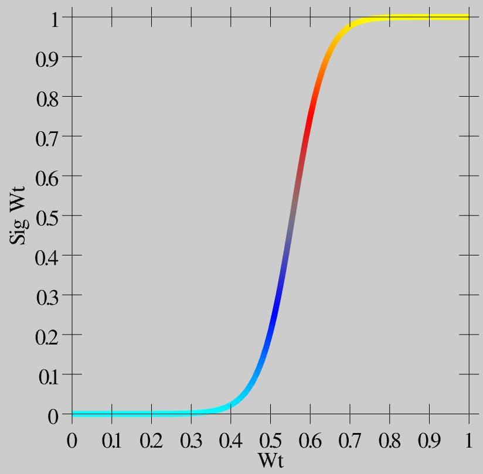
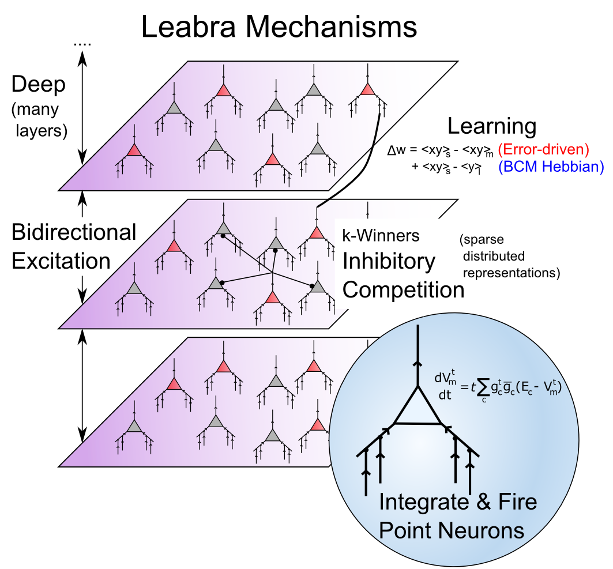
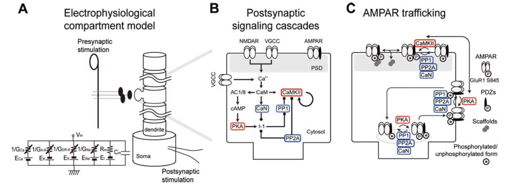

# Learning {#sec:ch-learn}

How do we learn to read, do math, and play sports? Learning in a neural network amounts to the **modification of synaptic weights**, in response to the local activity patterns of the sending and receiving neurons. As emphasized in previous chapters, these synaptic weights are what determine what an individual neuron detects, and thus are *the* critical parameters for determining neuron and network behavior.

In other words, *everything you know is encoded in the patterns of your synaptic weights*, and these have been shaped by every experience you've had (as long as those experiences got your neurons sufficiently active). Many of those experiences don't leave a very strong mark, and in much of the brain, traces of individual experiences are all blended together, so it is difficult to remember them distinctly (we'll see in the Memory Chapter that this blending can be quite beneficial for overall intelligence, actually). But each experience nevertheless drives some level of learning, and our big challenge in this chapter is to figure out how the mere influences of patterns of activity among individual neurons can add up to enable us to learn big things.

Biologically, **synaptic plasticity** (the modification of synaptic weights through learning) has been extensively studied, and we now know a tremendous amount about the detailed chemical processes that take place as a result of neural activity. We'll provide multiple levels of detail here (including a discussion of **spike timing dependent plasticity (STDP)**, which has captured the imaginations of many researchers in this area), but the high-level story is fairly straightforward: the overall level of neural activity on both ends of the synapse (sending and receiving neural firing) drives the influx of calcium ions ($Ca^{++}$) via NMDA channels, and synaptic weight changes are driven by the **level of postsynaptic $Ca^{++}$** in the *dendritic spine* associated with a given synapse. Low levels of $Ca^{++}$ cause synapses to get weaker, and higher levels cause them to get stronger.

Computationally, many different sets of equations have been developed that can drive synaptic weight changes to accomplish many different computational goals. Which of these correspond to what the biology is actually doing? That is the big question. While a definitive answer remains elusive, we nevertheless have a reasonable candidate that aligns well with the biological data, and also performs computationally very useful forms of learning, which can solve the most challenging of cognitive tasks (e.g., learning to read or recognize objects).

There are two primary types of learning:

* **Self-organizing** learning, which extracts longer time-scale statistics about the environment, and can thus be useful for developing an effective **internal model** of the outside world (i.e., what kinds of things tend to reliably happen in the world --- we call these **statistical regularities**).
    
* **Error-driven** learning, which uses more **rapid contrasts between expectations and outcomes** to correct these expectations, and thus form more detailed, specific knowledge about contingencies in the world. For example, young children seem endlessly fascinated learning about what happens when they push stuff off their high chair trays: will it still fall to the ground and make a huge mess *this* time? Once they develop a sufficiently accurate expectation about exactly what will happen, it starts to get a bit less interesting, and other more unpredictable things start to capture their interest. As we can see in this example, error-driven learning is likely intimately tied up with curiosity, surprise, and other such motivational factors. For this reason, we hypothesize that neuromodulators such as **dopamine**, **norepinephrine** and **acetylcholine** likely play an important role in modulating this form of learning, as they have been implicated in different versions of surprise, that is, when there is a discrepancy between expectations and outcomes.

Interestingly, the main computational difference between these two forms of learning has to do with the time scale over which one of the critical variables is updated --- self-organizing learning involves averaging over a long time scale, whereas error-driven learning is much quicker. This difference is emphasized in the above descriptions as well, and provides an important source of intuition about the differences between these types of learning. Self-organizing learning is what happens when you blur your eyes and just take stuff in over a period of time, whereas error-driven learning requires much more alert and rapid forms of neural activity. In the framework that we will use in the rest of the book, we combine these types of learning into a single set of learning equations, to explore how we come to perceive, remember, read, and plan.

## Biology of Synaptic Plasticity

![Critical steps in allowing calcium ions ($Ca^{++}$) to enter postsynaptic cell via NMDA channels, inducing synaptic plasticity. 1. The postsynaptic membrane potential ($V_m$) must be elevated (from excitatory inputs to AMPA receptors across synapses of the postsynaptic neuron, and backpropagating action potential that comes back down the dendrite when the postsynaptic neuron fires). 2. Elevated $V_m$ causes magnesium (Mg+) ions to be expelled from NMDA channel openings, thus unblocking them. 3. Presynaptic neuron fires an action potential, releasing glutamate. 4. Glutamate binds to NMDA receptors, causing them to open, allowing $Ca^{++}$ to enter (only when also unblocked, per step 2). 5. The concentration of $Ca^{++}$ in the postsynaptic spine drives second messenger systems (indicated by the X) that result in change in AMPA receptor efficacy, thereby changing the synaptic weight. $Ca^{++}$ can also enter from voltage-gated calcium channels (VGCCs), which depend only on postsynaptic $V_m$ levels, and not sending activity --- these are weaker contributors to $Ca^{++}$ levels.](figures/fig_ltpd_synapse.png){#fig:fig-ltpd-synapse width=50% }

Learning amounts to changing the overall synaptic efficacy of the synapse connecting two neurons. The synapse has a lot of moving parts (see the *Neuron* Chapter), any one of which could potentially be the critical factor in causing its overall efficacy to change. How many can you think of? The search for the critical factor(s) dominated the early phase of research on synaptic plasticity, and evidence for the involvement of a range of different factors has been found over the years, from the amount of presynaptic neurotransmitter released, to number and efficacy of postsynaptic AMPA receptors, and even more subtle things such as the alignment of pre and postsynaptic components, and more dramatic changes such as the cloning of multiple synapses. However, the dominant factor for long-lasting learning changes appears to be the number and efficacy of postsynaptic AMPA receptors.

[@fig:fig-ltpd-synapse] shows the five critical steps in the cascade of events that drives change in AMPA receptor efficacy. The **NMDA** receptors and the calcium ion (**$Ca^{++}$**) play a central role --- NMDA channels allow $Ca^{++}$ to enter the postsynaptic spine. Across all cells in the body, $Ca^{++}$ typically plays an important role in regulating cellular function, and in the neuron, it is capable of setting off a series of chemical reactions that ends up controlling how many AMPA receptors are functional in the synapse. For details on these reactions, see Chapter Appendix on *Detailed Biology of Learning*. Here's what it takes for the $Ca^{++}$ to get into the postsynaptic cell:

1. The postsynaptic membrane potential ($V_m$) must be elevated, as a result of all the excitatory synaptic inputs coming into the cell. The most important contributor to this $V_m$ level is actually the **backpropagating action potential** --- when a neuron fires an action potential, it not only goes forward out the axon, but also backward down the dendrites (via active voltage-sensitive $Na^+$ channels along the dendrites). Thus, the entire neuron gets to know when it fires --- we'll see that this is incredibly useful computationally.

2. The elevated $V_m$ causes magnesium ions ($Mg^+$) to be repelled (positive charges repel each other) out of the openings of NMDA channels, unblocking them.

3. The presynaptic neuron fires an action potential, releasing glutamate neurotransmitter into the synaptic cleft.

4. Glutamate binds to the NMDA receptor, opening it to allow $Ca^{++}$ ions to flow into the postsynaptic cell. This only occurs if the NMDA is also unblocked. This dependence of NMDA on both pre and postsynaptic activity was one of the early important clues to the nature of learning, as we see later.

5. The concentration of $Ca^{++}$ in the postsynaptic spine drives those complex chemical reactions that end up changing the number and efficacy of AMPA receptors. Because these AMPA receptors provide the primary excitatory input drive on the neuron, changing them changes the net excitatory effect of a presynaptic action potential on the postsynaptic neuron. This is what is meant by changing the synaptic efficacy, or *weight*.

$Ca^{++}$ can also enter the postsynaptic cell via **voltage gated calcium channels (VGCCs)** which are calcium channels that only open when the membrane potential is elevated. Unlike NMDA, however, they are *not* sensitive to presynaptic neural activity --- they only depend on postsynaptic activity. This has important computational implications, as we discuss later. VGCCs contribute less to $Ca^{++}$ levels than NMDA, so NMDA is still the dominant player.

**Metabotropic glutamate receptors (mGlu)** also play an important role in synaptic plasticity. These receptors do not allow ions to flow across the membrane (i.e., they are not *ionotropic*), and instead they directly trigger chemical reactions when neurotransmitter binds to them. These chemical reactions can then modulate the changes in AMPA receptors triggered by $Ca^{++}$.

{#fig:fig-ltp-ltd-ca2 width=30% }

We have been talking about changes in AMPA receptor efficacy without specifying which direction they change. **Long Term Potentiation (LTP)** is the biological term for long-lasting *increases* in AMPA efficacy, and **Long Term Depression (LTD)** means long-lasting *decreases* in AMPA efficacy. For a long time, researchers focused mainly on LTP (which is generally easier to induce), but eventually they realized that both directions of synaptic plasticity are equally important for learning. [@fig:fig-ltp-ltd-ca2] shows how this direction of change depends on the overall level of $Ca^{++}$ in the postsynaptic spine (accumulated over a few hundreds of milliseconds at least --- the relevant time constants for effects of $Ca^{++}$ on synaptic plasticity are fairly slow) --- low levels drive LTD, while high levels produce LTP. This property will be critical for our computational model. Note that the delay in synaptic plasticity effects based on $Ca^{++}$ levels means that the synapse doesn't always have to do LTD on its way up to LTP --- there is time for the $Ca^{++}$ to reach a high level to drive LTP before the weights start to change.

### Hebbian Learning and NMDA Channels

The famous Canadian psychologist Donald O. Hebb predicted the nature of the NMDA channel many years in advance of its discovery, just by thinking about how learning should work at a functional level. Here is a key quote:

> *Let us assume that the persistence or repetition of a reverberatory activity (or "trace") tends to induce lasting cellular changes that add to its stability.… When an axon of cell A is near enough to excite a cell B and repeatedly or persistently takes part in firing it, some growth process or metabolic change takes place in one or both cells such that A's efficiency, as one of the cells firing B, is increased.*

This can be more concisely summarized as *cells that fire together, wire together.* The NMDA channel is essential for this process, because it requires both pre and postsynaptic activity to allow $Ca^{++}$ to enter and drive learning. It can detect the *coincidence* of neural firing. Interestingly, Hebb is reputed to have said something to the effect of "big deal, I knew it had to be that way already" when someone told him that his learning principle had been discovered in the form of the NMDA receptor.

Mathematically, we can summarize Hebbian learning as:
$$ \Delta w = x y $$
where $\Delta w$ is the change in synaptic weight *w*, as a function of sending activity *x* and receiving activity *y*.

Anytime you see this kind of pre-post product in a learning rule, it tends to be described as a form of Hebbian learning. For a more detailed treatment of Hebbian learning and various popular variants of it, see the *Hebbian Learning* Appendix.

As we'll elaborate below, this most basic form of Hebbian learning is very limited, because weights will only go up (given that neural activities are rates of spiking and thus only positive quantities), and will do so without bound. Interestingly, Hebb himself only seemed to have contemplated LTP, not LTD, so perhaps this is fitting. But it won't do anything useful in a computational model. Before we get to the computational side of things, we cover one more important result in the biology.

### Spike Timing Dependent Plasticity

{#fig:fig-stdp-bipoo98 width=60% }

[@fig:fig-stdp-bipoo98] shows the results from an experiment [@BiPoo98] that captured the imagination of many a scientist, and has resulted in extensive computational modeling work. This experiment showed that the precise order of firing between a pre and postsynaptic neuron determined the sign of synaptic plasticity, with LTP resulting when the presynaptic neuron fired before the postsynaptic one, while LTD resulted otherwise. This **spike timing dependent plasticity (STDP)** was so exciting because it fits with the *causal* role of the presynaptic neuron in driving the postsynaptic one. If a given pre neuron actually played a role in driving the post neuron to fire, then it will necessarily have to have fired in advance of it, and according to the STDP results, its weights will increase in strength. Meanwhile, pre neurons that have no causal role in firing the postsynaptic cell will have their weights decreased. However, this STDP pattern does not generalize well to realistic spike trains, where neurons are constantly firing and interacting with each other over 100's of milliseconds [@ShouvalWangWittenberg10]. Nevertheless, the STDP data does provide a useful stringent test for computational models of synaptic plasticity. We base our learning equations on a detailed model using more basic, biologically-grounded synaptic plasticity mechanisms that does capture these STDP findings [@UrakuboHondaFroemkeEtAl08], but which nevertheless result in quite simple learning equations when considered at the level of firing rate.

## The eXtended Contrastive Attractor Learning (XCAL) Model

The learning function we adopt for the models in the rest of this text is called the **eXtended Contrastive Attractor Learning (XCAL)** rule. (The basis for this naming will become clear later). This learning function was derived through a convergence of bottom-up (motivated by detailed biological considerations) and top-down (motivated by computational desiderata) approaches. In the bottom-up derivation, we extracted an empirical learning function (called the **XCAL dWt function**) from a highly biologically detailed computational model of the known synaptic plasticity mechanisms, by [@UrakuboHondaFroemkeEtAl08] (see Chapter Appendix on *Detailed Biology of Learning* for more details). Their model builds in detailed chemical rate parameters and diffusion constants, etc, based on empirical measurements, for all of the major biological processes involved in synaptic plasticity. We capture much of the incredible complexity of the model (and by extension, hopefully, the complexity of the actual synaptic plasticity mechanisms in the brain) using a simple piecewise-linear function, shown below, that emerges from it. This XCAL dWt function closely resembles the function shown in [@fig:fig-ltp-ltd-ca2], plotting the dependence of synaptic plasticity on $Ca^{++}$ levels. It also closely resembles the **BCM** learning function (detailed in the *Self-Organizing Learning* section).

The top-down approach leverages the key idea behind the BCM learning function, which is the use of a **floating threshold** for determining the amount of activity needed to elicit LTP vs LTD. Specifically, the threshold is not fixed at a particular value, but instead adjusts as a function of average activity levels of the postsynaptic neuron in question over a long time frame, resulting in a **homeostatic** dynamic. Neurons that have been relatively inactive can more easily increase their synaptic weights at lower activity levels, and can thus "get back in the game". Conversely, neurons that have been relatively overactive are more likely to decrease their synaptic weights, and "stop hogging everything".

As we'll see below, this function contributes to useful **self-organizing** learning, where different neurons come to extract distinct aspects of statistical structure in a given environment. But purely self-organizing mechanisms are strongly limited in what they can learn --- they are driven by statistical generalities (e.g., animals tend to have four legs), and are incapable of adapting more pragmatically to the functional demands that the organism faces. For example, some objects are more important to recognize than others (e.g., friends and foes are important, random plants or pieces of trash or debris, not so much).

To achieve these more pragmatic goals, we need **error-driven** learning, where learning is focused specifically on correcting errors, not just categorizing statistical patterns. Fortunately, we can use the same floating threshold mechanism to achieve error-driven learning within the same overall mathematical framework, by adapting the threshold on a faster time scale. In this case, weights are increased if activity states are greater than their very recent levels, and conversely, weights decrease if the activity levels go down relative to prior states. Thus, we can think of the recent activity levels (the threshold) as reflecting **expectations** which are subsequently compared to actual **outcomes**, with the difference (or "error") driving learning. Because both forms of learning (self-organizing and error-driven) are quite useful, and use the exact same mathematical framework, we integrate them both into a single set of equations with two thresholds reflecting integrated activity levels across different time scales (recent and long-term average).

Next, we describe the XCAL dWt function (dWt = change in weight), before describing how it captures both forms of learning, followed by their integration into a single unified framework (including the promised explanation for its name!).

### The XCAL dWt Function

![The XCAL dWt function, showing direction and magnitude of synaptic weight changes (dWt) as a function of the short-term average activity of the sending neuron (x) times the receiving neuron (y). This quantity is a simple mathematical approximation to the level of postsynaptic $Ca^{++}$, reflecting the dependence of the NMDA channel on both sending and receiving neural activity. This function was extracted directly from the detailed biophysical Urakubo, Honda, Froemke, & Kuroda (2008) model, by fitting a piecewise linear function to the synaptic weight change behavior that emerges from it as a function of a wide range of sending and receiving spiking patterns.](figures/fig_xcal_dwt_fun.png){#fig:fig-xcal-dwt-fun width=30% }

The XCAL dWt function extracted from the [@UrakuboHondaFroemkeEtAl08] model is shown in [@fig:fig-xcal-dwt-fun]. First, the main input into this function is the **total synaptic activity** reflecting the firing rate and duration of activity of the sending and receiving neurons. In mathematical terms for a rate-code model with sending activity rate x and receiving activity rate y, this would just be the "Hebbian" product we described above:
$$ \Delta w = f_{xcal} \left( x y, \theta_p\right) $$
where $f_{xcal}$ is the piecewise linear function shown in [@fig:fig-xcal-dwt-fun]. The weight change also depends on an additional dynamic threshold parameter $\theta_p$, which determines the point at which it crosses over from negative to positive weight changes --- i.e., the point at which weight changes reverse sign. For completeness, here is the mathematical expression of this function, but you only need to understand its shape as shown in the figure:
$$
f_{xcal}(xy, \theta_p) = 
\begin{aligned}
(xy - \theta_p) & \mbox{if} \; xy > \theta_p \theta_d \\
-xy (1 - \theta_d) / \theta_d & \mbox{otherwise}
\end{aligned}
$$
where $\theta_d = .1$ is a constant that determines the point where the function reverses direction (i.e., back toward zero within the weight decrease regime) --- this reversal point occurs at $\theta_p \theta_d$, so that it adapts according to the dynamic $\theta_p$ value.

As noted in the previous section, the dependence of the NMDA channel on activity of both sending and receiving neurons can be summarized with this simple Hebbian product, and the level of intracellular $Ca^{++}$ is likely to reflect this value. Thus, the XCAL dWt function makes very good sense in these terms: it reflects the qualitative nature of weight changes as a function of $Ca^{++}$ that has been established from empirical studies and postulated by other theoretical models for a long time. The Urakubo model simulates detailed effects of pre/postsynaptic spike timing on $Ca^{++}$ levels and associated LTP/LTD, but what emerges from these effects at the level of firing rates is this much simpler fundamental function.

As a learning function, this basic XCAL dWt function has some advantages over a plain Hebbian function, while sharing its basic nature due to the "pre * post" term at its core. For example, because of the shape of the dWt function, weights will go down as well as up, whereas the Hebbian function only causes weights to increase. But it still has the problem that weights will increase without bound (as long as activity levels are often greater than the threshold). We'll see in the next section that some other top-down computationally-motivated modifications can result in a more powerful form of learning while maintaining this basic form.

## Self-Organizing Learning: Long Time Scales and the BCM Model

![The shape of the BCM learning function. Note the similarity in qualitative shape to both the XCAL dWt function ([@fig:fig-xcal-dwt-fun]) and synaptic plasticity as function of $Ca^{++}$ ([@fig:fig-ltp-ltd-ca2]).](figures/fig_bcm_function.png){#fig:fig-bcm-function width=40% }

The major computational motivation comes from a line of learning functions that began with [@BienenstockCooperMunro82], with these initials giving rise to the name of the function: **BCM**. (Interestingly Leon Cooper, a Nobel Laurate in Physics, was also "central" in the BCS theory of superconductivity). The BCM function is a modified form of Hebbian learning, which includes an interesting **homeostatic** mechanism that keeps individual neurons from firing too much or too little over time:
$$ \Delta w = x y \left(y-\theta\right) $$
where again *x* = sending activity, *y* = receiving activity, and $\theta$ is a **floating threshold** reflecting a **long time average** of the receiving neuron's activity:
$$ \theta = \langle y^2 \rangle $$
where $\langle \rangle$ indicates the expected value or average, in this case of the square of the receiving neuron's activation.

[@fig:fig-bcm-function] shows what this function looks like --- a shape that should be becoming rather familiar. Indeed, the fact that the BCM learning function anticipated the qualitative nature of synaptic plasticity as a function of $Ca^{++}$ ([@fig:fig-ltp-ltd-ca2]) is an amazing instance of theoretical prescience. Furthermore, BCM researchers have shown that it does a good job of accounting for various behavioral learning phenomena, providing a better fit than a comparable Hebbian learning mechanism [@CooperIntratorBlaisEtAl04; @KirkwoodRioultBear96] ([@fig:fig-kirkwood-et-al-96-bcm-thresh]).

{#fig:fig-kirkwood-et-al-96-bcm-thresh width=50% }

BCM has typically been applied in simple feedforward networks in which, given an input pattern, there is only one activation value for each neuron. But how should weights be updated in a more realistic bidirectionally connected system with attractor dynamics in which activity states continuously evolve through time? We confront this issue in the XCAL version of the BCM equations:
$$ \Delta w = f_{xcal}( xy, \langle y \rangle_l) = f_{xcal}( xy, y_l) $$
where *xy* is understood to be the **short-term average synaptic activity** (on a time scale of a few hundred milliseconds --- the time scale of $Ca^{++}$ accumulation that drives synaptic plasticity), which could be more formally expressed as: $\langle xy \rangle_s$, and $y_l = \langle y \rangle_l$ is the **long-term average activity of the postsynaptic neuron** (i.e., essentially the same as in BCM, but without the squaring), which plays the role of the $\theta_p$ floating threshold value in the XCAL function.

After considerable experimentation, we have found the following way of computing the $y_l$ floating threshold to provide the best ability to control the threshold and achieve the best overall learning dynamics:
$$
\begin{aligned}
\mbox{if} \; y > .2 \; \mbox{then} \;  y_l & = y_l + \frac{1}{\tau_l} \left( \mbox{max} - y_l \right) \\
\mbox{else} \; y_l & = y_l + \frac{1}{\tau_l} \left( \mbox{min} - y_l \right)
\end{aligned}
$$

This produces a well-controlled exponential approach to either the *max* or *min* extremes depending on whether the receiving unit activity exceeds the basic activity threshold of .2. The time constant for integration $\tau_l$ is 10 by default --- integrating over around 10 trials. See Chapter Appendix *Leabra Details* for more discussion.

{#fig:fig-xcal-bcm-selforg-learn width=75% }

[@fig:fig-xcal-bcm-selforg-learn] shows the main qualitative behavior of this learning mechanism: when the long term average activity of the receiver is low, the threshold moves down, and thus it is more likely that the short term synaptic activity value will fall into the positive weight change territory. This will tend to increase synaptic weights overall, and thus make the neuron more likely to get active in the future, achieving the homeostatic objective. Conversely, when the long term average activity of the receiver is high, the threshold is also high, and thus the short term synaptic activity is more likely to drive weight decreases than increases. This will take these over-active neurons down a notch or two, so they don't end up dominating the activity of the network.

### Self-organizing Learning Dynamics

This ability to spread the neural activity around in a more equitable fashion turns out to be critical for self-organizing learning, because it enables neurons to more efficiently and effectively cover the space of things to represent. To see why, here are the critical elements of the self-organizing learning dynamic (see subsequent simulation exploration to really get a feel for how this all works in practice):

* **Inhibitory competition** --- only the most strongly driven neurons get over the inhibitory threshold, and can get active. These are the ones whose current synaptic weights best fit ("detect") the current input pattern.
    
* **Rich get richer** positive feedback loop --- due to the nature of the learning function, only those neurons that actually get active are capable of learning (when receiver activity y = 0, then xy = 0 too, and the XCAL dWt function is 0 at 0). Thus, the neurons that already detect the current input the best are the ones that get to further strengthen their ability to detect these inputs. This is the essential insight that Hebb had with why the Hebbian learning function should strengthen an "engram".
    
* **Homeostasis** to balance the positive feedback loop --- if left unchecked, the rich-get-richer dynamic ends up with a few units dominating everything, and as a result, all the inputs get categorized into one useless, overly-broad category ("everything"). The homeostatic mechanism in BCM helps fight against this by raising the floating threshold for highly active neurons, causing their weights to decrease for all but their most preferred input patterns, and thus restoring a balance. Similarly, under-active neurons experience net weight increases that get them participating and competing more effectively, and hence they come to represent distinct features.

The net result is the development of a set of neural detectors that relatively evenly cover the space of different inputs patterns, with systematic categories that encompass the statistical regularities. For example, cats like milk, and dogs like bones, and we can learn this just by observing the reliable co-occurrence of cats with milk and dogs with bones. This kind of reliable co-occurrence is what we mean by "statistical regularity". See Chapter Appendix on *Hebbian Learning* for a very simple illustration of why Hebbian-style learning mechanisms capture patterns of co-occurrence. It is really just a variant on the basic maxim that "things that fire together, wire together".

### The Learning Rate

There is an important factor missing from the above equations, which is the **learning rate** --- we typically use the greek epsilon $\epsilon$ to represent this parameter, which simply multiplies the rate with which the weights change:
$$ \Delta w = \epsilon f_{xcal}( xy, y_l) $$

Thus, a bigger epsilon means larger weight changes, and thus quicker learning, and vice-versa for a smaller value. A typical starting value for the learning rate is .04, and we often have it decrease over time (which is true of the brain as well --- younger brains are much more plastic than older ones) --- this typically results in the fastest overall learning and best final performance.

Many researchers (and drug companies) have the potentially dangerous belief that a faster learning rate is better, and various drugs have been developed that effectively increase the learning rate, causing rats to learn some kind of standard task faster than normal, for example. However, we will see in the Memory Chapter that actually a slow learning rate has some very important advantages. Specifically, a slower learning rate enables the system to incorporate *more statistics* into learning --- the learning rate determines the effective time window over which experiences are averaged together, and a slower learning rate gives a longer time window, which enables more information to be integrated. Thus, learning can be much smarter with a slower learning rate. But the tradeoff of course is that the results of this smarter learning take that much longer to impact actual behavior. Many have argued that humans are distinctive in our extremely protracted period of developmental learning, so we can learn a lot before we need to start earning a paycheck. This allows us to have a pretty slow learning rate, without too many negative consequences.

### Exploration of Self-Organizing Learning

The best way to see this dynamic is via the computational exploration. Open the `self_org` simulation from [CCN Sims](https://compcogneuro.org/simulations) and follow the directions from there.

## Error-Driven Learning

Although self-organizing learning is very useful, we'll see that it is significantly limited in the kinds of things that it can learn. It is great for extracting generalities, but not so great when it comes to learning specific, complicated patterns. To learn these more challenging types of problems, we need error-driven learning.  Intuitively, error-driven learning is much more powerful because it drives learning based on *differences*, not *raw signals*. Differences (errors) tell you much more precisely what you need to do to fix a problem. Raw signals (overall patterns of neural activity) are not nearly as informative --- it is easy to become overwhelmed by the forest and lose sight of the trees. We'll see more specific examples later, after first figuring out how we can get error-driven learning to work in the first place.

We begin with the simplest form of error-driven learning, the **delta rule**, which was developed by [@WidrowHoff60]:
$$ \Delta w = x (t - y) $$
which can be directly compared to the simple Hebbian learning rule showed earlier:
$$ \Delta w = x y $$
This shows how we're just replacing the $y$ receiver activation with a *difference* (delta) or **error** term $(t-y)$, where $t$ is the *target* activation that *should have been produced* and $y$ is the activation that was *actually* produced.  This error value $(t-y)$ is zero if the actual activation equals the target, and furthermore tells you exactly how to adjust the synaptic weights to *fix the error* when it is not equal to the target.  If the actual activation $y$ was too low relative to $t$, then the weights will be increased, and vice-versa if it was too high.

By contrast, the Hebbian learning rule just increases the weights regardless of any particular target state --- it simply does not take into account any kind of target, desired behavior (activation).  You could replace the $y$ value in the Hebbian rule with the target value $t$, and that *might* work, but we'll see in a bit that it actually does not in general --- you really need to learn as a function of errors, not raw activations.

Interestingly, the delta rule does include the sending unit activation $x$, much like the Hebbian equation, and this turns out to be essential for allocating the **credit** (or **blame**) for the error on those sending units that are actually active --- those are the ones for which a change in synaptic weights will actually result in a different outcome next time, and adjusting weights in proportion to the activity level provides a graded form of this logic (the most active get the most credit or blame).  Another more "Hebbian" way of thinking about this is that you're *associating* the sending activation with the error, instead of associating it with the raw output activation.  The technical term for this property is **credit assignment** and it is an important feature of learning algorithms more generally.

### A Biological Basis for Error-driven Learning: Faster Time-Scale Floating Threshold

![How the floating threshold as a function of medium-term average synaptic activity $\langle x y \rangle_m$ can produce error-driven learning. This medium time frame reflects the development of a pattern of neural activity that encodes an expectation about what will happen next. The most recent short term synaptic activity (which drives learning) represents the actual outcome of what did happen next. Because of the (nearly) linear nature of the dWt function, it effectively computes the difference between outcome and expectation. Qualitatively, if the outcome produces greater activation of a population of neurons than did expectation, corresponding weights go up, while neurons that decreased their activity states as a result of the outcome will have their weights go down. This is illustrated above in the case of low vs. high expectations.](figures/fig_xcal_bcm_err_learn.png){#fig:fig-xcal-bcm-err-learn width=75% }

Although a seemingly simple step from the Hebbian learning rule, error-driven learning introduces a number of important challenges from a biological perspective, such as: where does the target value come from in the first place, and how can biological synapses compute something like the delta rule?  We'll go into greater depth on the nature of the target signal later, but for now, we can think in terms of the neural activation $y$ representing something like a **prediction** or **expectation**, and the target being a actual **outcome** --- what actually happens. 

In this case, there is a natural time-flow from expectation to outcome, which helps us think more specifically about the second question, by taking advantage of the floating threshold property of BCM-like self-organizing aspect of XCAL learning ([@fig:fig-xcal-bcm-err-learn]).  Specifically, we speed up the time scale for computing the floating threshold (and also have it reflect synaptic activity, not just receiver activity):
$$ \Theta_p = \langle xy \rangle_m $$
$$
\begin{aligned}
\Delta w & = f_{xcal}( \langle xy \rangle_s, \langle xy \rangle_m) \\
 & = f_{xcal}( x_s y_s, x_m y_m)
\end{aligned}
$$
where $\langle xy \rangle_m$ is the **medium-time scale average synaptic activity**, which we think of as reflecting an emerging expectation about the current situation, which develops over approximately 75 msec of neural activity. The most recent, short-term (last 25 msec) neural activity ($\langle xy \rangle_s$) reflects the actual outcome, and it is the same calcium-based signal that drives learning in the Hebbian case.

In the simulator, the period of time during which this expectation is represented by the network, before it gets to see the outcome, is referred to as the **minus phase**, based on the *Boltzmann machine* terminology [@AckleyHintonSejnowski85]. The subsequent period in which the outcome is observed (and the activations evolve to reflect the influence of that outcome) is referred to as the **plus phase**. It is the difference between this expectation and outcome that represents the error signal in error-driven learning (hence the terms minus and plus --- the minus phase activations are subtracted from those in the plus phase to drive weight changes).

Although this expectation-outcome comparison is the fundamental requirement for error-driven learning, a weight change based on this difference by itself begs the question of how the neurons would ever 'know' which phase they are in. We have explored many possible answers to this question, and the most recent involves an internally-generated alpha-frequency (10 Hz, 100 msec periods) cycle of expectation followed by outcome, supported by neocortical circuitry in the deep layers and the thalamus [@OReillyWyatteRohrlich17; @KachergisWyatteOReillyEtAl14]. The main implications of this framework are to organize the timing of processing and learning as follows:

* A **Trial** lasts 100 msec (10 Hz, alpha frequency), and comprises one sequence of expectation --- outcome learning, organized into 4 quarters.
    + Biologically, the deep neocortical layers (layers 5, 6) and the thalamus have a natural oscillatory rhythm at the alpha frequency [@BuffaloFriesLandmanEtAl11; @LorinczKekesiJuhaszEtAl09; @FranceschettiGuatteoPanzicaEtAl95; @LuczakBarthoHarris13]. Specific dynamics in these layers organize the cycle of expectation vs. outcome within the alpha cycle.
        
* A **Quarter** lasts 25 msec (40 Hz, gamma frequency) --- the first 3 quarters (75 msec) form the expectation / minus phase, and the final quarter are the outcome / plus phase.

    + Biologically, the superficial neocortical layers (layers 2, 3) have a gamma frequency oscillation [@BuffaloFriesLandmanEtAl11], supporting the quarter-level organization.

*  A **Cycle** represents 1 msec of processing, where each neuron updates its membrane potential according to the equations covered in the Neuron Chapter.

The XCAL learning mechanism coordinates with this timing by comparing the most recent synaptic activity (predominantly driven by plus phase / outcome states) to that integrated over the medium-time scale, which effectively includes both minus and plus phases. Because the XCAL learning function is (mostly) linear, the association of the floating threshold with this synaptic activity over the medium time frame (including expectation states), to which the short-term outcome is compared, directly computes their difference:
$$ \Delta w \approx x_s y_s - x_m y_m $$
which is very similar to the delta rule shown above, when the sending activation has been multiplied through (and separated into the two different time averages), and $y_s$ represents the outcome target signal $t$, and $y_m$ represents the actual activation $y$:
$$ \Delta w \approx x (y_s - y_m) $$

Intuitively, this rule behaves like the delta rule, and we can elaborate the error-driven dynamic by considering three different cases. The easiest case is when the expectation is equivalent to the outcome (i.e., a correct expectation) --- the two terms above will be the same, and thus their subtraction is zero, and the weights remain the same. So once you obtain perfection, you stop learning. What if your expectation was higher than your outcome? The difference will be a negative number, and the weights will thus decrease, so that you will lower your expectations next time around. Intuitively, this makes perfect sense --- if you have an expectation that all movies by M. Night Shyamalan are going to be as cool as *The Sixth Sense*, you might end up having to reduce your weights to better align with actual outcomes.  Conversely, if the expectation is lower than the outcome, the weight change will be positive, and thus increase the expectation.

You might have thought this class was going to be deadly boring, but maybe you were amused by the above mention of M. Night Shyamalan, and now you'll have to increase your weights just a bit. It should hopefully be intuitively clear that this form of learning will work to minimize the differences between expectations and outcomes over time. Note that while the example given here was cast in terms of deviations from expectations having value (i.e., things turned out better or worse than expected, as we cover in more detail in the Motor control and Reinforcement Learning Chapter), the same principle applies when outcomes deviate from other sorts of expectations.

Because of its explicitly temporal nature, there are a few other interesting ways of thinking about what this learning rule does, in addition to the explicit timing defined above. To reiterate, the rule says that the outcome comes *immediately after* a preceding expectation --- this is a direct consequence of making it learn toward the short-term (most immediate) average synaptic activity, compared to a slightly longer medium-term average that includes the time just before the immediate present.

![Illustration of Contrastive Attractor Learning (CAL) principle, which is core idea behind XCAL error-driven learning mechanism. The network learns on the contrast between the early phase of settling (the minus phase, or medium time frame activation average $\langle x y \rangle_m$ ) versus the late phase of settling (the plus phase or short time frame activation average $\langle x y \rangle_s$ ). The late phase has integrated more of the overall constraints in the network and thus represents a "better" overall interpretation or representation of the current situation than the early phase, so it makes sense for the late phase to serve as the "training signal" relative to the earlier phase.](figures/fig_attractor_cal.png){#fig:fig-attractor-cal width=30% }

We can think of this learning in terms of the attractor dynamics discussed in the Networks Chapter. Specifically, the name **Contrastive Attractor Learning (CAL)** reflects the idea that the network is settling into an attractor state, and it is the contrast between the final attractor state that the network settles into (i.e., the "outcome" in this case), versus the network's activation trajectory as it approaches the attractor, that drives learning ([@fig:fig-attractor-cal]). The short-time scale average reflects the final attractor state (the 'target'), and the medium time-scale average reflects the entire trajectory during settling. When the pattern of activity associated with the expectation is far from the actual outcome, the difference between these two attractor states will be large, and learning will drive weight changes so that in future encounters, the expectation will more closely reflect the outcome (assuming the environment is reliable). The **X** part of XCAL simply reflects the fact that the same objective is achieved without having to explicitly compare two attractors at discrete points in time, but instead by using a time-averaged activity state eXtended across the entire settling trajectory as the baseline comparison, which is more biologically realistic because such variables are readily accessible by local neuronal activity.

Mathematically, this CAL learning rule represents a simpler version of the oscillating learning function developed in [@NormanNewmanDetreEtAl06; @RitvoTurk-BrowneNorman19].

There are also more general reasons for **later information** (short time scale average) to train **earlier information** (medium time scale average). Typically, the longer one waits, the better quality the information is --- at the start of a sentence, you might have some idea about what is coming next, but as it unfolds, the meaning becomes clearer and clearer. This later information can serve to train up the earlier expectations, so that you can more efficiently understand things next time around. Overall, these alternative ways of thinking about XCAL learning represent more self-organizing forms of learning without requiring an explicit outcome training signal, while using the more rapid contrast (short vs. medium time) for the error-driven learning mechanism.

Before continuing, you might be wondering about the biological basis of this error-driven form of the floating threshold. Unlike the BCM-style floating threshold, which has solid empirical data consistent with it, the idea that the threshold changes on this quicker time scale to reflect the medium time-scale average synaptic activity has not yet been tested empirically. Thus, it stands as an important prediction of this computational model. Because it is so easily computed, and results in such a powerful form of learning, it seems plausible that the brain would take advantage of just such a mechanism, but we'll have to see how it stands up to empirical testing. One initial suggestion of such a dynamic comes from [@LimMcKeeWoloszynEtAl15], which showed a BCM-like learning dynamic with rapid changes in the threshold depending on recent activity. Also, there *is* substantial evidence that transient changes in neuromodulation that occur during salient, unexpected events are important for modifying synaptic plasticity --- and may functionally contribute to this type of error-driven learning mechanism. Also, we discuss a little bit later another larger concern about the nature and origin of the expectation vs. outcome distinction, which is central to this form of error-driven learning.

### Advantages of Error-Driven Learning

As noted above, error-driven learning is much more computationally powerful than self-organizing learning. For example, all computational models that perform well at the difficult challenge of learning to recognize objects based on their visual appearance (see the Perception Chapter) utilize a form of error-driven learning. Some also use various forms of self-organizing learning, but this tends to play more of a supporting role, whereas the models would be entirely non-functional without error-driven learning. Error-driven learning ensures that the model makes the kinds of categorical discriminations that are relevant, while avoiding those that are irrelevant. For example, whether a side view of a car is facing left or right is not relevant for determining that this is a car. But the presence of wheels is very important for discriminating a car from a fish. A purely self-organizing model has no way of knowing that these differences, which may be quite statistically reliable and strong signals in the input, differ in their utility for the categories that people care about.

Mathematically, the history of error-driven learning functions provides a fascinating window into the sociology of science, and how seemingly simple ideas can take a while to develop. In the Chapter Appendix on *Backpropagation*, we trace this history through the derivation of error-driven learning rules, from the delta rule [@WidrowHoff60], to the very widely used **backpropagation** learning rule [@RumelhartHintonWilliams86]. At the start of that subsection, we show how the XCAL form of error-driven learning (specifically the CAL version of it) can be derived directly from backpropagation, thus providing a mathematically satisfying account as to why it is capable of solving so many difficult problems.

The key idea behind the backpropagation learning function is that error signals arising in an output layer can *propagate backward* down to earlier hidden layers to drive learning in these earlier layers so that it will solve the overall problem facing the network (i.e., it will ensure that the network can produce the correct expectations or answers on the output layer). This is essential for enabling the system as a whole to solve difficult problems --- as we discussed in the Networks Chapter, a lot of intelligence arises from multiple layers of cascading steps of categorization --- to get all of these intervening steps to focus on the relevant categories, error signals need to propagate across these layers and shape learning in all of them.

![Intuition for how bidirectional connections enable the backpropagation of learning signals from other parts of the network --- when there is a difference between an expectation and an outcome in any part of the network, neurons in other parts of the network "feel" that difference via the bidirectional connection. All neurons experience an impact on their own activation of both the expectation and the outcome, and thus when they learn on the difference between these two points in time (later training earlier), they are learning about their own impact on the outcome - expectation error, and weight changes based on this difference will end up minimizing the overall error in the network as a whole. Neurons closer to the source of the error learn the most, with error decreasing with distance from this source.](figures/fig_bidir_backprop_intuition.png){#fig:fig-bidir-backprop-intuition width=50% }

Biologically, the bidirectional connectivity in our models enables these error signals to propagate in this manner ([@fig:fig-bidir-backprop-intuition]). Thus, changes in any given location in the network radiate backward (and every which way the connections go) to affect activation states in all other layers, via bidirectional connectivity, and this then influences the learning in these other layers. In other words, XCAL uses bidirectional activation dynamics to communicate error signals throughout the network, whereas backpropagation uses a biologically implausible procedure that propagates error signals backward across synaptic connections, in the opposite direction of the way that activation typically flows. Furthermore, the XCAL network experiences a sequence of activation states, going from an expectation to experiencing a subsequent outcome, and learns on the difference between these two states. In contrast, backpropagation computes a single error *delta* value that is effectively the difference between the outcome and the expectation, and then sends this single value backwards across the connections. See the *Backpropagation* Appendix for how these two different things can be mathematically equivalent.

### Exploration of Error-Driven Learning

The `pat_assoc` simulation from [CCN Sims](https://compcogneuro.org/simulations) provides a nice demonstration of the limitations of self-organizing Hebbian-style learning, and how error-driven learning overcomes these limitations, in the context of a simple two-layer pattern associator that learns basic input/output mappings. Follow the directions in that simulation link to run the exploration.

You should have seen that one of the input/output mapping tasks was *impossible* for even error-driven learning to solve, in the two-layer network. The next exploration, `err_driven_hidden` shows that the addition of a hidden layer, combined with the powerful error-driven learning mechanism, enables even this "impossible" problem to now be solved. This demonstrates the computational power of the Backpropagation algorithm.

### Combined Self-Organizing and Error-Driven Learning

Although scientists have a tendency to want to choose sides strongly and declare that either self-organizing learning or error-driven learning is the best way to go, there are actually many advantages to combining both forms of learning together. Each form of learning has complementary strengths and weaknesses:

* Self-organizing is more *robust*, because it only depends on local statistics of firing, whereas error-driven learning implicitly depends on error signals coming from potentially distant areas. Self-organizing can achieve something useful even when the error signals are remote or not yet very coherent.
    
* But self-organizing learning is also very *myopic* --- it does not coordinate with learning in other layers, and thus tends to be "greedy". In contrast, error-driven learning achieves this coordination, and can learn to solve problems that require collective action of multiple units across multiple layers.

One analogy that may prove useful is that error-driven learning is like socialist economics --- it requires all the different layers and units to be working together to achieve common goals, whereas self-organizing learning is like free market economics, emphasizing local, greedy actions that somehow also benefit society as a whole, without explicitly coordinating with others. The tradeoffs of these economic approaches are similar to those of the respective forms of learning. Socialist approaches can leave individual people feeling not very motivated, as they are just a little cog in a huge faceless machine. Similarly, neurons that depend strictly on error-driven learning can end up not learning very much, as they only need to make a very small and somewhat "anonymous" contribution to solving the overall problem. Once the error signals have been eliminated (i.e., expectations match outcomes), learning stops. We will see that networks that rely on pure error-driven learning often have very random-looking weights, reflecting this minimum of effort expended toward solving the overall problem. On the other side, more strongly free market approaches can end up with excessive positive feedback loops (rich get ever richer), and are typically not good at dealing with longer-term, larger-scale problems that require coordination and planning. Similarly, purely self-organizing models tend to end up with more uneven distributions of "representational wealth" and almost never end up solving challenging problems, preferring instead to just greedily encode whatever interesting statistics come their way. Interestingly, our models suggest that a balance of both approaches --- a *centrist* approach --- seems to work best! Perhaps this lesson can be generalized back to the political arena.

Colorful analogies aside, the actual mechanics of combining both forms of learning within the XCAL framework amounts to merging the two different definitions of the floating threshold value. Biologically, we think that there is a combined weighted average of the two thresholds, using a "lambda" parameter $\lambda$ to weight the long-term receiver average (self-organizing) relative to the medium-term synaptic co-product:
$$ \theta_p = \lambda y_l + (1-\lambda) x_m y_m $$

However, computationally, it is clearer and simpler to just combine separate XCAL functions, each with their own weighting function --- due to the linearity of the function, this is mathematically equivalent:
$$ \Delta w = \lambda_l f_{xcal} ( x_s y_s, y_l) + \lambda_m f_{xcal} (x_s y_s, x_m y_m) $$

It is reasonable that these lambda parameters may differ according to brain area (i.e., some brain systems learn more about statistical regularities, whereas others are more focused on minimizing error), and even that it may be dynamically regulated (i.e. transient changes in neuromodulators like dopamine and acetylcholine can influence the degree to which error signals are emphasized).  To see a concrete example of how Hebbian learning in early perceptual areas can complement error-driven learning to allow networks to generalize to novel situations, see the `hebberr_combo` simulation in [CCN Sims](https://compcogneuro.org/simulations).

There are small but reliable computational advantages to automating this balancing of self-organizing vs. error-driven learning (i.e., a dynamically-computed $\lambda_l$ value, while keeping $\lambda_m = 1$), based on two factors: the magnitude of the $y_l$ receiving-unit running average activation, and the average magnitude of the error signals present in a layer (see *Leabra Details* Chapter Appendix).

### Weight Bounding and Contrast Enhancement

The one last issue we need to address computationally is the problem of synaptic weights growing without bound. In LTP experiments, it is clear that there is a maximum synaptic weight value --- you cannot continue to get LTP on the same synapse by driving it again and again. The weight value **saturates**. There is a natural bound on the lower end, for LTD, of zero. Mathematically, the simplest way to achieve this kind of weight bounding is through an **exponential approach** function, where weight changes become exponentially smaller as the bounds are approached. This function is most directly expressed in a programming language format, as it involves a conditional:

```
if   dWt > 0 then Wt = Wt + (1 - Wt) * dWt
else              Wt = Wt + Wt * dWt
```

In words: if weights are supposed to increase (dWt is positive), then multiply the rate of increase by 1-Wt, where 1 is the upper bound, and otherwise, multiply by the weight value itself. As the weight approaches 1, the weight increases get smaller and smaller, and similarly as the weight value approaches 0.

The exponential approach function works well at keeping weights bounded in a graded way (much better than simply clipping weight values at the bounds, which loses all the signal for saturated weights), but it also creates a strong tendency for weights to hang out in the middle of the range, around .5. This creates problems because then neurons don't have sufficiently distinct responses to different input patterns, and then the inhibitory competition breaks down (many neurons become weakly activated), which then interferes with the positive feedback loop that is essential for learning, etc. To counteract these problems, while maintaining the exponential bounding, we introduce a **contrast enhancement** function on the weights:
$$ \hat{w} = \frac{1}{1 + \left(\frac{w}{\theta (1-w)}\right)^{-\gamma}} $$

{#fig:fig-wt-contrast-sigmoid-fun width=50% }

As you can see in [@fig:fig-wt-contrast-sigmoid-fun], this function creates greater contrast for weight values around this .5 central value --- they get pushed up or down to the extremes. This contrast-enhanced weight value is then used for communication among the neurons, and is what shows up as the wt value in the simulator.

Biologically, we think of the plain weight value w, which is involved in the learning functions, as an *internal* variable that accurately tracks the statistics of the learning functions, while the contrast-enhanced weight value is the actual synaptic efficacy value that you measure and observe as the strength of interaction among neurons. Thus, the plain w value may correspond to the phosphorylation state of CAMKII or some other appropriate internal value that mediates synaptic plasticity.

Finally, see the *Leabra Details* Appendix for a few implementational details about the way that the time averages are computed, which don't affect anything conceptually, but if you really want to know *exactly* what is going on..

### When, Exactly, is there an Outcome that should Drive Learning?

![Different situations that give rise to a contrast between expectations and outcomes. a) The simplest case of explicit teacher / parent input --- a visual input (e.g., an object) at time t drives a verbal output (e.g., the name of the object), and the teacher then corrects (or confirms) the output. b) The same scenario can go through without actually producing a verbal output --- instead just an expectation of what someone else might say, and this can be compared with what is actually said to derive useful error signals. c) Is a specific instance of when many expectations are likely to be generated, when a motor action (e.g., pushing food off of a high chair) drives an expectation about the visual outcomes associated with the action, which then occur (to the seemingly endless delight of the mischievous infant). d) Involves making an "expectation" about what you actually just saw --- reconstructing or generating the input (otherwise known as generative model or an auto-encoder) --- the input itself serves as its own training signal in this case.](figures/fig_expect_outcome_errs.png){#fig:fig-expect-outcome-errs width=75% }

This is the biggest remaining question for error-driven learning. You may not have even noticed this issue, but once you start to think about implementing the XCAL equations on a computer, it quickly becomes a major problem. We have talked about how the error-driven learning reflects the difference between an outcome and an expectation, but it really matters that the short-term average activation representing the outcome state reflects some kind of actual outcome that is worth learning about. [@fig:fig-expect-outcome-errs] illustrates four primary categories of situations in which an outcome state can arise, which can play out in myriad ways in different real-world situations.

In our most recent framework described briefly above [@OReillyWyatteRohrlich17], the expectation-outcome timing is specified in terms of the 100 msec alpha trial. And within this trial, the combined circuitry between the deep neocortical layers and the thalamus end up producing an outcome state that drives *predictive auto-encoder* learning, which is basically the last case (d) in [@fig:fig-expect-outcome-errs], with an extra twist that during every 100 msec alpha trial, the network attempts to predict what will happen in the next 100 msec --- the predictive aspect of the auto-encoder idea. Specifically, the deep layers attempt to predict what the bottom-up driven activity pattern over the thalamus will look like in the final plus-phase quarter of the alpha trial, based on activations present during the prior alpha trial. Because of the extensive bidirectional connectivity between brain areas, the cross-modal expectation / output sequence shown in panel (b) of [@fig:fig-expect-outcome-errs] is also supported by this mechanism. A later revision of this text will cover these ideas in more detail. Preliminary versions are available: [@OReillyWyatteRohrlich17; @KachergisWyatteOReillyEtAl14].

Another hypothesis for something that "marks" the presence of an important outcome is a phasic burst of a neuromodulator like **dopamine**. It is well established that dopamine bursts occur when an unexpected outcome arises, at least in the context of expectations of reward or punishment (we'll discuss this in detail in the Motor Control and Reinforcement Learning Chapter. Furthermore, we know from a number of studies that dopamine plays a strong role in modulating synaptic plasticity. Under this hypothesis, the cortical network is always humming along doing standard BCM-like self-organizing learning at a relatively low learning rate (due to a small lambda parameter in the combined XCAL equation, which presumably corresponds to the rate of synaptic plasticity associated with the baseline tonic levels of dopamine), and then, when something unexpected occurs, a dopamine burst drives stronger error-driven learning, with the immediate short-term average "marked" by the dopamine burst as being associated with this important (salient) outcome. The XCAL learning will automatically contrast this immediate short-term average with the immediately available medium-term average, which presumably reflects an important contribution from the prior expectation state that was just violated by the outcome.

There are many other possible ideas for how the time for error-driven learning is marked, some of which involve local emergent dynamics in the network itself, and others that involve other neuromodulators, or networks with broad connectivity to broadcast an appropriate "learn now" signal. From everything we know about the brain, there are likely several such learning signals, each of which being useful in some particular subset of situations. This is an active area of ongoing research.

## The Leabra Framework

{#fig:fig-leabra-mechs-xcal width=50% }

[@fig:fig-leabra-mechs-xcal] provides a summary of the **Leabra** framework, which is the name given to the combination of all the neural mechanisms that have been developed to this point in the text. Leabra stands for *Learning in an Error-driven and Associative, Biologically Realistic Algorithm* --- the name is intended to evoke the "Libra" balance scale, where in this case the balance is reflected in the combination of error-driven and self-organizing learning ("associative" is another name for Hebbian learning). It also represents a balance between low-level, biologically-detailed models, and more abstract computationally-motivated models. The biologically-based way of doing error-driven learning requires bidirectional connectivity, and the Leabra framework is relatively unique in its ability to learn complex computational tasks in the context of this pervasive bidirectional connectivity. Also, the FFFB inhibitory function producing k-Winners-Take-All dynamics is unique to the Leabra framework, and is also very important for its overall behavior, especially in managing the dynamics that arise with the bidirectional connectivity.

The different elements of the Leabra framework are therefore synergistic with each other, and as we have discussed, highly compatible with the known biological features of the neocortex. Thus, the Leabra framework provides a solid foundation for the cognitive neuroscience models that we explore in Part II.

### Exploration of Leabra

Open the `family_trees` simulation in [CCN Sims](https://compcogneuro.org/simulations) to explore Leabra learning in a deep multi-layered network running a more complex task with some real-world relevance. This simulation is very interesting for showing how networks can create their own similarity structure based on functional relationships, refuting the common misconception that networks are driven purely by input similarity structure.

## Appendix

Here are all the sub-topics within the Learning chapter, collected in one place for easy browsing. These may or may not be optional for a given course, depending on the instructor's specifications of what to read:

* **Detailed Biology of Learning:** more in-depth treatment of postsynaptic signaling cascades that mediate LTP and LTD, described in context of the [@UrakuboHondaFroemkeEtAl08] model of synaptic plasticity.
    
* **Hebbian Learning:** extensive treatment of computational properties of Hebbian learning --- starts with a simple manual simulation of Hebbian learning showing exactly how and why it captures patterns of co-occurrence.
    
* **Backpropagation:** history and mathematical derivation of error-driven learning functions --- strongly recommended to obtain greater insight into the computational nature of error-driven learning (starts with some important conceptual points before getting into the math).
    
* **Leabra Details:** contains misc implementational details about the learning mechanisms, including how time averaged activations are computed.
    
* Full set of Leabra equations on *emergent* [leabra](https://github.com/emer/leabra) site.

### Detailed Biology of Learning

{#fig:fig-urakubo-et-al-model width=100% }

[@fig:fig-urakubo-et-al-model] shows a full set of chemical processes that are triggered by $Ca^{++}$ influx, and result in changes in AMPA receptor expression in the synapse.  This figure is from the very detailed computational model by [@UrakuboHondaFroemkeEtAl08], which is highly recommended reading for those interested in the time course and dynamics of these chemical processes.

The Urakubo et al. (2008) model was constructed in a very "bottom up" fashion, by building in detailed chemical rate parameters and diffusion constants, etc, based on empirical measurements, for all of the major biological processes involved in synaptic plasticity.  Having built this model, they found that it did *not* capture the classic spike timing dependent plasticity (STDP) curve, when driven by the exact STDP pairwise induction protocol (see figure of this in the main chapter text).  However, by changing one aspect of the way the NMDA receptors function (adding what is known as an *allosteric* mechanism, where the NMDA receptor functions differently depending on binding by a substance called calmodulin), they were able to capture not only pairwise STDP, but also the weight changes that result from more complex patterns of spiking, in triplet and quadruplet experiments. 
Furthermore, they accurately capture the effects of changing the timing parameters on pairwise STDP experiments (e.g., interval between pairwise spikes, and number of repetitions thereof).

Thus, this model represents a remarkable bridge between detailed biological mechanisms, and the overall synaptic plasticity that results in actual experiments.  Either this is a fantastic coincidence, or this model has managed to capture a reasonable chunk of the critical mechanisms of synaptic plasticity.  We adopt the later view, and therefore leverage this model as a basis for our computational models described in the main chapter.

![Fit of the Urakubo et al. (2008) model with a simple learning function driven by the product of the total sending and receiving neural activity (frequency of firing in Hertz (Hz) times duration of firing in milliseconds).  This simple linear function (called the ''XCAL dWt function'') can capture a considerable amount of the regularity present in the behavior of the Urakubo et al. (2008) model, with a correlation value of ''r=0.894''.  The top portion of the figure shows graphs of three different sending Hz, with the X (horizontal) axis being the receiving unit Hz, Z (depth) is the duration of activity in fractions of a second (.1 to 1), and Y (vertical) is net change in synaptic weight.  The black lines are the measured results from Urakubo et al. (2008), and the red are the values computed from the simple piecewise-linear function shown at the bottom of the figure.](figures/fig_xcal_dwt_fun_urakubo_fit_full.png){#fig:fig-xcal-dwt-fun-urakubo-fit-full width=50% }

For the bottom-up derivation of XCAL, we systematically subjected the biologically detailed Urakubo et al. (2008) model to a range of different *pre* and *post* spike trains, with durations from 100 msec to a second, and spike rates from 10 to 100 Hz (Hertz or spikes per second).  We then tried to fit the pattern of weight changes that resulted using a  piecewise linear function of some form.  [@fig:fig-xcal-dwt-fun-urakubo-fit-full] shows the results. The resulting function is shown at the bottom of the figure --- if you compare with [@fig:fig-xcal-dwt-fun], you should see that this is essentially the qualitative shape of the function relating weight change to level of $Ca^{++}$.  The top part of the figure is probably too complex to parse very well, but you should get the general impression that the red lines (generated by the piecewise linear function) fit the black lines (data from the Urakubo et al. (2008) model) pretty well.  The correlation value of .894 represents a very good fit of the function to the data.

Thus, we are able to capture much of the incredible complexity of the Urakubo et al. (2008) model (and by extension, hopefully, the complexity of the actual synaptic plasticity mechanisms in the brain) using an extremely simple function.  This is a very powerful simplification.  But what does it mean?

First, the main input into this function is the *total synaptic activity* reflecting the firing rate and duration of activity of the sending and receiving neurons.  In mathematical terms for a rate-code model with sending activity rate x and receiving activity rate y, this would just be the "Hebbian" product we described above:
$$ \Delta w = f_{xcal} \left( x y, \theta_p\right) $$
Where $f_{xcal}$ is the piecewise linear function shown in [@fig:fig-xcal-dwt-fun-urakubo-fit-full] or 4.4, which we can call the *XCAL dWt function*.  It also takes an additional dynamic parameter $\theta_p$, which determines the point at which it crosses over from negative to positive weight changes --- we'll discuss this at length in a moment.  Just for kicks, here is the mathematical expression of this function:
$$
f_{xcal}(xy, \theta_p) = \left\{ \begin{array}{ll}
 (xy - \theta_p) & \mbox{if} \; xy > \theta_p \theta_d \\
 -xy (1 - \theta_d) / \theta_d & \mbox{otherwise} \end{array} \right.
$$
where $\theta_d = .1$ is a constant that determines the point where the function reverses back toward zero within the weight decrease regime --- this reversal point occurs at $\theta_p \theta_d$, so that it adapts according to the dynamic $\theta_p$ value.

As noted in the main chapter, the dependence of the NMDA channel on activity of both sending and receiving neurons can be summarized with this simple Hebbian product, and the level of $Ca^{++}$ is likely to reflect this value.  Thus, the XCAL dWt function makes very good sense in these terms: it reflects the qualitative nature of weight changes as a function of $Ca^{++}$ that has been established from empirical studies and postulated by other theoretical models for a long time.  When realistic spike trains with many spikes drive the complex synaptic plasticity mechanisms, this fundamental function emerges.

As a learning function, this basic XCAL dWt function has some advantages over a plain Hebbian function, while sharing its basic nature due to the "pre * post" term at its core.  For example, because of the shape of the dWt function, weights will go down as well as up, whereas the Hebbian function only causes weights to increase.  But it still has the problem that weights will increase without bound, and we'll see in the next section that some other top-down computationally-motivated modifications can result in a much more powerful form of learning.
    
### Hebbian Learning

This subsection provides a detailed treatment of Hebbian learning and popular variants thereof.

![Simple Hebbian learning demonstration across 4 time steps (t=0 thru 3).  Bottom row of network has 3 input units, the last of which fires in an ''uncorrelated'' fashion with the other two.  They all start out with weights w = .1.  Receiving activity is just a linear sum of the sending activations times weights: $y = \sum x w = .1$ for the first time step.  Learning is simple Hebbian: $\Delta w = xy$.  As you fill in the remainder of the activations, weights, and weight changes, you will find that the two correlated input units dominate the receiving unit activation, and thus they end up being correlated in their activity, causing their weights to always increase.  The third unit sometimes goes up and sometimes down, with no net increase over time.  Thus, Hebbian learning discovers correlations in the inputs.](figures/fig_hebb_demo_blank.png){#fig:fig-hebb-demo-blank width=75% }

[@fig:fig-hebb-demo-blank] shows a simple demonstration of how Hebbian learning causes the receiving network to discover correlations in the patterns of input unit activation.  The input units that are correlated end up dominating the receiving unit activity, and thus the receiving unit ends up being correlated with this subset of correlated inputs, and their weights always increase under the Hebbian learning function.  Uncorrelated inputs bounce around without a systematic trend.  If you keep going, you'll see that the weights grow quickly without bound, so this is not a practical learning function, but it illustrates the essence of Hebbian learning.

Next, we do some math to show that the simplest version of Hebbian correlational learning, in the case of a single linear receiving unit that receives input from a set of input units, result in the unit extracting the first **principle component** of correlation in the patterns of activity over
the input units.

Because it is linear, the receiving unit's activation function is just the weighted sum of its inputs
$$ y_j = \sum_k x_k w_{kj} $$
where $k$ (rather than the usual $i$) indexes over input units, for reasons that will become clear (and all of the variables are a function of the current time step $t$ reflecting different inputs). The weight change is:
$$ \Delta_t w_{ij} = \epsilon x_i y_j $$
where $\epsilon$ is the *learning rate* and $i$ is the index of a particular input unit, and weights just increment these changes over time:
$$ w_{ij}(t+1) = w_{ij}(t) + \Delta_t w_{ij} $$

To understand the aggregate effects of learning over many patterns, we can just sum the changes over time:
$$ \Delta w_{ij} = \epsilon \sum_t x_i y_j $$
and we assume that $\epsilon = 1 / N$, where $N$ is the total number of patterns in the input. This turns the sum into an *average*:
$$ \Delta w_{ij} = \langle x_i y_j \rangle_t $$

Next, substitute into this equation the formula for $y_j$, showing that the weight changes are a function of the *correlations* between the input units:
$$ \Delta w_{ij}  = \langle x_i \sum_k x_k w_{kj} \rangle_t $$
$$ = \sum_k \langle x_i x_k \rangle_t \langle w_{kj} \rangle_t $$
$$ = \sum_k \mathbf{C}_{ik} \langle w_{kj} \rangle_t $$

This new variable $\mathbf{C}_{ik}$ is an element of the *correlation matrix* between the two input units $i$ and $k$, where correlation is defined here as the expected value (average) of the product of their activity values over time ($\mathbf{C}_{ik} = \langle x_i x_k \rangle_t$).  You might be familiar with the more standard correlation measure:
$$ \mathbf{C}_{ik} = \frac{\langle (x_i - \mu_i)(x_k - \mu_k) \rangle_t} {\sqrt{\sigma^2_i \sigma^2_k}} $$
which subtracts away the mean values ($\mu$) of the variables before taking their product, and normalizes the result by their variances ($\sigma^2$).  Thus, an important simplification in this form of Hebbian correlational learning is that it assumes that the activation variables have zero mean and unit variance.

The implication of all this is that where strong correlations exist across input units, the weights for those units will increase because this average correlation value will be relatively large. Interestingly, if we run this learning rule long enough, the weights will become dominated by the strongest set of correlations present in the input, with the gap between the strongest set and the next strongest becoming increasingly large.  Thus, this simple Hebbian rule learns the *first* (strongest) principal component of the input data.

One problem with the simple Hebbian learning rule is that the weights become infinitely large as learning continues.  One solution to this problem was proposed by [@Oja82], known as *subtractive normalization*:
$$ \Delta w_{ij} = \epsilon (x_i y_j - y^2_j w_{ij}) $$
As we did in Chapter 2, you just set the equation equal to zero and solve for the *equilibrium* or *asymptotic* weight values:
$$ 0 = \epsilon(x_i y_j - y^2_j w_{ij}) $$
$$ w_{ij} = \frac{ x_i}{y_j} $$
$$ w_{ij} = \frac{ x_i}{\sum_k x_k w_{kj}} $$

Thus, the weight from a given input unit will end up representing the proportion of that input's activation relative to the total weighted activation over all the other inputs.  This will keep the weights from growing without bound.  Finally, because it is primarily based on the same correlation terms $\mathbf{C}_{ik}$ as the previous simple Hebbian learning rule, this Oja rule still computes the first principal component of the input data (though the proof of this is somewhat more involved, see [@HertzKroghPalmer91] for a nice treatment).

Moving beyond a single hidden unit, there are ways of configuring inhibition so that the units end up learning the sequence of PCA values of the correlation matrix in eigenvalue order [@Sanger89; @Oja89]. In [@OReillyMunakata00], we developed a different alternative known as **conditional principal components analysis** or CPCA, which assumes that we want the weights for a given input unit to represent the conditional probability that the input unit ($x_i$) was active given that the receiving unit ($y_j$) was also active:
$$ w_{ij} = P(x_i = 1 | y_j = 1) $$
$$ w_{ij} = P(x_i | y_j) $$
where the second form uses simplified notation that will continue to be used below. 

The important characteristic of CPCA is that the weights will reflect the extent to which a given input unit is active across the subset of input patterns represented by the receiving unit (i.e., conditioned on this receiving unit).  If an input pattern is a very typical aspect of such inputs, then the weights from it will be large (near 1), and if it is not so typical, they will be small (near 0).

Following the analysis of [@RumelhartZipser85], the CPCA learning rule can be derived as:
$$ \Delta w_{ij} = \epsilon [y_j x_i - y_j w_{ij}] $$
$$ = \epsilon y_j (x_i - w_{ij}) $$
The two equivalent forms of this equation are shown to emphasize the similarity of this learning rule to Oja's normalized PCA learning rule, while also showing its simpler form, which emphasizes that the weights are adjusted to match the value of the sending unit activation $x_i$ (i.e., minimizing the difference between $x_i$ and $w_{ij}$), weighted in proportion to the activation of the receiving unit ($y_j$).  

We use the expression $P(y_j | t)$ to represent the probability that the receiving unit $y_j$ is active given that some particular input pattern $t$ was presented.  $P(x_i | t)$ represents the corresponding thing for the sending unit $x_i$. Substituting these into the learning rule, the total weight update computed over all the possible patterns $t$ (and multiplying by the probability that each pattern occurs, $P(t)$) is:
$$ \Delta w_{ij} = \epsilon \sum_t [P(y_j | t) P(x_i | t) - P(y_j | t) w_{ij}] P(t) $$
$$ = \epsilon \left( \sum_t P(y_j | t) P(x_i | t) P(t) - \sum_t P(y_j | t) P(t) w_{ij} \right) $$

As usual, we set $\Delta w_{ij}$ to zero and solve:
$$ w_{ij} = \frac{\sum_t P(y_j | t) P(x_i | t) P(t)} {\sum_t P(y_j | t) P(t)} $$
Interestingly, the numerator is the definition of the joint probability of the sending and receiving units both being active together across all the patterns $t$, which is just $P(y_j, x_i)$. Similarly, the denominator gives the probability of the receiving unit being active over all the patterns, or $P(y_j)$.  Thus, we can rewrite the preceding equation as:
$$ w_{ij} = \frac{P(y_j, x_i)}{P(y_j)} $$
$$ w_{ij} = P(x_i | y_j) $$
at which point it becomes clear that this fraction of the joint probability over the probability of the receiver is just the definition of the conditional probability of the sender given the receiver.

Although CPCA is effective and well-defined mathematically, it suffers one major problem relative to the BCM formulation that we now use: it drives significant LTD (weight decrease) when a sending neuron is *not* active, and the receiving unit is active.  This results in a significant amount of interference of learning across time.  By contrast, the XCAL dWt function specifically returns to zero when either sending or receiving neuron has zero activity, and that significantly reduces interference, preserving existing weight values for inactive neurons.
    
### Backpropagation

In this subtopic, we trace the mathematical progression of error-driven learning from a simple two-layer network, which was developed in 1960, to a network with three or more layers, which took 26 years to be invented for the last time (several others invented it earlier, but it didn't really catch on).  In the process, we develop a much more rigorous understanding of what error-driven learning is, which can also be applied directly to understanding what the XCAL learning function in its error-driven mode is doing.  We start off with a high-level conceptual summary, working backward from XCAL, that should be accessible to those with a basic mathematical background (requiring only basic algebra), and then get progressively more into the math, where we take advantage of concepts from calculus (namely, the notion of a partial derivative).

The highest-level summary is that XCAL provides a very good approximation to an optimal form of error-driven learning, called **error backpropagation**, which works by directly minimizing a computed error statistic through steepest gradient descent.  In other words, backpropagation is mathematically designed to learn whatever you throw at it in the most direct way possible, and XCAL basically does the same thing.  If you want to first understand the principled math behind backpropagation, skip down to read the *Gradient Descent on Error and the Delta Rule* section below, and then return here to see how XCAL approximates this function.

The critical difference is that XCAL uses bidirectional activation dynamics to communicate error signals throughout the network, whereas backpropagation uses a biologically implausible procedure that propagates error signals backward across weight values, in the opposite direction of the way that activation typically flows (hence the name).  As discussed in the main chapter, the XCAL network experiences a sequence of activation states, going from an expectation to experiencing a subsequent outcome, and learns on the difference between these two states.  In contrast, backpropagation computes a single error *delta* value that is effectively the difference between the outcome and the expectation, and then sends this single value backwards across the weights.  In the following math, we show how these two ways of doing error-driven learning are approximately equivalent.

The primary value of this exercise is to first establish that XCAL can perform a powerful, effective form of error-driven learning, and also to obtain further insights into the essential character of this error-driven learning by understanding how it is derived from first principles.  One of the most important intuitive ideas that emerges from this analysis is the notion of **credit assignment** --- you are encouraged to read up through that section.

To begin, the error-driven aspect of XCAL is effectively:
$$ \Delta w \approx \langle xy \rangle_s - \langle xy \rangle_m $$
which reflects a contrast between the average firing rate during the outcome, represented by the first term, and that over the expectation, represented by the second term.

We will see how this XCAL rule is related to the backpropagation error-minimizing rule, but achieves this function in a more biologically constrained way. This was the same goal of previous attempts including the *GeneRec (generalized recirculation)* algorithm [@OReilly96], which is equivalent to the *Contrastive Hebbian Learning (CHL)* equation [@MovellanMcClelland93]:
$$ \Delta w = \left(x^+ y^+\right) - \left(x^- y^-\right) $$
Here, the first term is the activity of the sending and receiving units during the outcome (in the *plus phase*), while the second term is the activity during the expectation (in the *minus phase*). CHL is so-named because it involves the contrast or difference between two Hebbian-like terms.  As you can see, XCAL is essentially equivalent to CHL, despite a few differences:

* XCAL actually uses the XCAL dWt function instead of a direct subtraction, which causes weight changes to go to 0 when short term activity is 0 (as dictated by the biology).

* XCAL is based on average activations across the entire evolution of attractors (reflected by accumulated $Ca^{++}$ levels), instead of based on single points of activation (i.e., the final attractor state in each of two phases, as used somewhat unrealistically in CHL  --- how would the plasticity rules 'know' exactly what counts as the final state of each phase?).

For the present purposes, we can safely ignore these factors, which allows us to leverage all of the analysis that went into understanding GeneRec --- itself a large step towards biological plausibility relative to backpropagation. 

The core of this analysis revolves around the following simpler version of the GeneRec equation, which we call the *GeneRec delta equation*:
$$ \Delta w = x^- \left(y^+ - y^- \right) $$
where the weight change is driven only by the *delta* in activity on the receiving unit *y* between the plus (outcome) and minus (expectation) phases, multiplied by the sending unit activation *x*.  One can derive the full CHL equation from this simpler GeneRec delta equation by adding a constraint that the weight changes computed by the sending unit to the receiving unit be the same as those of the receiving unit to the sending unit (i.e., a *symmetry constraint* based on bidirectional connectivity), and by replacing the minus phase activation for the sending unit with the average of the minus and plus phase activations (which ends up being equivalent to the *midpoint method* for integrating a differential equation).  You can find the actual derivation later in the section *GeneRec and Activation Differences*, but you can take our word for it for the time being.

This equation has the desired property of credit assignment: the weight change is proportional to $ x^- $, which reflects how much this sender contributed to the error being learned from.

Interestingly, the GeneRec delta equation is equivalent in form to the *delta rule*, which we derive below as the optimal way to reduce error in a two layer network (input units sending to output units, with no hidden units in between).  The delta rule was originally derived by [@WidrowHoff60], and it is also basically equivalent to a gradient descent solution to linear regression.

But two-layer networks are very limited in what they can compute. As we discussed in the *Networks*  Chapter, you really need those hidden layers to form higher-level ways of re-categorizing the input, to solve challenging problems (you will also see this directly in the simulation explorations in this chapter).  As we discuss more below, the limitations of the delta rule and two-layer networks were highlighted in a very critical paper by [@MinskyPapert69], which brought research in the field of neural network models nearly to a standstill for nearly 20 years.

{#fig:fig-bp-compute-delta width=70% }

![Illustration of GeneRec/XCAL computation in three-layer network, for comparison with previous figure showing backpropagation.  Activations settle in the expectation/minus phase, in response to input activations presented to the input layer.  Activation flows bidirectionally, so that the hidden units are driven both by inputs and activations that arise on the output units.  In the outcome/plus phase, "target" values drive the output unit activations, and due to the bidirectional connectivity, these also influence the hidden units in the plus phase.  Mathematically, changing the weights based on the difference in hidden layer activation states between the plus and minus phases results in a close approximation to the delta value computed by backpropagation.  This same rule is then used to change the weights into the hidden units from the input units (delta times sending activation), which is the same form used in backpropagation, and identical in form to the delta rule.](figures/fig_generec_compute_delta.png){#fig:fig-generec-compute-delta width=70% }

In 1986, David Rumelhart and colleagues [@RumelhartHintonWilliams86] published a landmark paper on the *backpropagation* learning algorithm, which essentially extended the delta rule to networks with three or more layers ([@fig:fig-generec-compute-delta]).  These models have no limitations on what they can learn, and they opened up a huge revival in neural network research, with backpropagation neural networks providing practical and theoretically interesting solutions to a very wide range of problems.

The essence of the backpropagation (also called "backprop") algorithm is captured in this *delta backpropagation equation*:
$$ \Delta w = x \left( \sum_k \delta_k w_k \right) y' $$
where *x* is again the sending activity value, $\delta$ is the error derivative for the units in the next layer *above* the layer containing the current receiving unit *y* (with each such unit indexed by the subscript *k*), and $w_k$ is the weight *from* the receiving unit y to the k'th such unit in the next layer above (see [@fig:fig-bp-compute-delta]).  Ignore the $y'$ term for the time being  --- it is the derivative of the receiving unit's activation function, and it will come in handy in a bit.

So we're propagating this "delta" (error) value *backward* across the weights, in the opposite direction that the activation typically flows in the "feedforward" direction, which is from the input to the hidden to the output (backprop networks are typically feedforward, though bidirectional versions have been developed as discussed below).  This is the origin of the "backpropagation" name.

Before we unpack this equation a bit more, let's consider what happens at the *output* layer in a standard three-layer backprop network like that pictured in the Figure.  In these networks, there is no outcome/plus phase, but instead we just compare the output activity of units in the output layer (effectively the expectation) and compute externally the difference between these activities and the *target* activity values *t*. The difference is the *delta* value:
$$ \delta = t - z $$
and is used to drive learning by changing the weight from sending unit y in the hidden layer to a given output unit z is:
$$ \Delta w = y \delta = y (t - z) $$
You should recognize that this is exactly the *delta rule* as described above (where we keep in mind that y is now a sending activation to the output units).  The delta rule is really the essence of all error-driven learning methods.

Now let's get back to the delta backpropagation equation, and see how we can get from it to GeneRec (and thus to XCAL).  We just need to replace the $\delta_k$ term with the value for the output units, and then do some basic rearranging of terms, and we get very close to the GeneRec delta equation:
$$ \Delta w = x \left( \sum_k (t_k - z_k) w_k \right) y' $$
$$ \Delta w = x \left( \sum_k t_k w_k - \sum_k z_k w_k \right) y' $$
If you compare this last equation with the GeneRec delta equation, they would be equivalent (except for the *y'* term that we're still ignoring) if we made the following definitions:
$$ y^+ = \left. \sum_k t_k w_k \right. $$
$$ y^- = \left. \sum_k z_k w_k \right. $$
$$ x^- = x $$
Interestingly, these sum terms are identical to the *net input* that unit *y* would receive from unit *z* if the weight went the other way, or, critically, if *y* also received a *symmetric, bidirectional connection* from *z*, in addition to sending activity to *z*.  Thus, we arrive at the critical insight behind the GeneRec algorithm relative to the backpropagation algorithm:

> *Symmetric bidirectional connectivity can convey error signals as the difference between two activity states (plus/outcome vs. minus/expectation), instead of sending a single "delta" error value backward down a single weight in the opposite (backpropagation) direction.*

The only wrinkle in this argument at this point is that we had to assign the activation states of the receiving unit to be equal to those net-input like terms (even though we use non-linear thresholded activation functions), and also those net input terms ignore the other inputs that the receiving unit should also receive from the sending units in the input layer.  The second problem is easily dispensed with, because those inputs from the input layer would be common to both "phases" of activation, and thus they cancel out when we subtract $y^+ - y^-$.  The first problem can be solved by finally no longer ignoring the *y'* term --- it turns out that the difference between a function evaluated at two different points can be approximated as the difference between the two points, times the derivative of the function:
$$ f(a) - f(b) \approx f'(a) (a-b) $$
So we can now say that the activations states of y are a function of these net input terms: 
$$ y^+ =  f \left( \sum_k t_k w_k \right) $$
$$ y^- =  f \left( \sum_k z_k w_k \right) $$
and thus their difference can be approximated by the difference in net inputs times the activation function derivative:
$$ y^+ - y^- \approx y' \left( \sum_k t_k w_k - \sum_k z_k w_k \right) $$
Which gets us right back to the GeneRec delta equation as being a good approximation to the delta backpropagation equation:
$$ \Delta w = x^- \left(y^+ - y^- \right)  \approx x \left( \sum_k \delta_k w_k \right) y' $$

So if you've followed along to this point, you can now rest easy by knowing that the GeneRec (and thus XCAL) learning functions are actually very good approximations to error backpropagation. As we noted at the outset, XCAL uses bidirectional activation dynamics to communicate error signals throughout the network, in terms of averaged activity over two distinct states of activation (expectation followed by outcome), whereas backpropagation uses a biologically implausible procedure that propagates a single error value (outcome - expectation) backward across weight values, in the opposite direction of the way that activation typically flows.

#### Gradient Descent on Error and the Delta Rule

Now, we'll back up a bit and trace more of a historical trajectory through error-driven learning, starting by deriving the delta rule through the principle of *steepest gradient descent* on an error function.  To really understand the mathematics here, you'll need to understand calculus and the notion of a *derivative*.  Interestingly, we only need the most basic forms of derivatives to do this math --- it really isn't very fancy. The basic strategy is to define an *error function* which tells you how poorly your network is doing at a task, and then take the negative of the derivative of this error function relative to the synaptic weights in the network, which then tells you how to *adjust the synaptic weights so as to minimize error*.  This is what error-driven learning does, and mathematically, we take the simplest, most direct approach.

A very standard error function, commonly used in statistics, is the *sum squared error (SSE)*:
$$ SSE = \sum_k \left( t_k - z_k \right)^2 $$
which is the sum over output units (indexed by k) of the *target* activation *t* minus the actual output activation that the network produced (*z*), squared.  There is typically an extra sum here too, over all the different input/output patterns that the network is being trained on, but it cancels out for all of the following math, so we can safely ignore it.

In the context of the expectation and outcome framework of the main chapter, the outcomes are the targets, and the expectations are the output activity of the network.

For the time being, we assume a linear activation function of activations from sending units *y*, and that we just have a simple two-layer network with these sending units projecting directly to the output units:
$$ z_k = \left. \sum_j y_j w_{jk} \right. $$

Taking the negative of the derivative of SSE with respect to the weight *w*, which is more easily computed by breaking it down into two parts using the *chain rule* to first get the derivative of SSE with respect to the output activation *z*, and multiplying that by the derivative of *z* with respect to the weight:
$$ \Delta w_{jk} = -\frac{\partial SSE}{\partial w_{jk}} = -\frac{\partial SSE}{\partial z_k} \frac{\partial z_k}{\partial w_{jk}}$$
$$ = 2 (t_k - z_k) y_j $$
 
When you break down each step separately, it is all very straightforward:
$$ \frac{\partial SSE}{\partial z_k}  = -2 (t_k - z_k) $$
$$ \frac{\partial z_k}{\partial w_{jk}} = y_j $$
(the other elements of the sums drop out because the first partial derivative is with respect to $z_k$ so derivative for all other $z$'s is zero, and similarly the second partial derivative is with respect to $y_j$ so the derivative for the other $y$'s is zero.)

Thus, the negative of $\partial SSE / \partial w_{jk}$ is $2 (t_k -z_k)$ and since 2 is a constant, we can just absorb it into the learning rate parameter. 

Breaking down the error-minimization in this way, it becomes apparent that the weight change should be adjusted in proportion to both the error (difference between the target and the output) *and* the extent to which the sending unit *y* was active. This modulation of weight change by activity of the sending unit achieves a critical **credit assignment** function (or rather blame assignment in this case), so that when an error is made at the output, weights should only change for the sending units that contributed to that error. Sending units that were not active did not cause the error, and their weights are not adjusted.

As noted above, the original delta rule was published by [@WidrowHoff60], followed by the critique by [@MinskyPapert69], showing that such models could not learn a large class of basic but nonlinear logical functions, for example the XOR function.   XOR states that the output should be true (active) if *either* one of two inputs are true, *but not both*.  This requires a strong form of nonlinearity that simply could not be represented by such models.  In retrospect, it should have been obvious that the problem was the use of a two-layer network, but as often happens, this critique left a bad "odor" over the field, and people simply pursued other approaches (mainly symbolic AI, which Minsky was an advocate for).

Then, roughly 26 years later, David Rumelhart and colleagues published a paper on the backpropagation learning algorithm, which extended the delta-rule style error-driven learning to networks with three or more layers. The addition of the extra layer(s) now allows such networks to solve XOR and any other kind of problem (there are [proofs](https://en.wikipedia.org/wiki/Universal_approximation_theorem) about the universality of the learning procedure). The problem is that above, we only considered how to change weights from a sending unit *y* to an output unit *z*, based on the error between the target *t* and actual output activity. But for multiple stages of hidden layers, how do we adjust the weights from the inputs to the hidden units?  Interestingly, the mathematics of this involves simply adding a few more steps to the chain rule. 

First, we define the _activation function_ in terms of $\eta_j$ as the _net input_ to unit $j$, i.e., the product of sending activity $x_i$ and weights:
$$ \eta_j = \sum x_i w_{ij} $$

and then the unit activity is a function of this net input:
$$ y_j = f(\eta_j) $$

The goal is to again minimize the error (SSE) as a function of the weights, 
$$ \Delta w_{ij} = -\frac{\partial SSE}{\partial w_{ij}} $$.

The chain rule expansion of the basic activation function through hidden units $j$ and output units $k$ is thus:

$$ = -\frac{\partial SSE}{\partial z_k} \frac{\partial z_k}{\partial \eta_k} \frac{\partial \eta_k}{\partial y_j} \frac{\partial y_j}{\partial \eta_j} \frac{\partial \eta_j}{\partial w_{ij}} $$

Although this looks like a lot, it is really just applying the same chain rule as above repeatedly. To know how to change the weights from input unit $x_i$ to hidden unit $y_j$, we have to know how changes in this weight $w_{ij}$ are related to changes in the SSE. This involves computing how the SSE changes with output activity, how output activity changes with its net input, how this net input changes with hidden unit activity $y_j$, how in turn this activity changes with its net input $\eta_j$, and finally, how this net input changes with the weights from sending unit $x_i$ to hidden unit $y_j$. Once all of these factors are computed, they can be multiplied together to determine how the weight $w_{ij}$ should be adjusted to minimize error, and this can be done for all sending units to all hidden units (and also as derived earlier, for all hidden units to all output units). 

We again assume a linear activation function at the output for simplicity, so that $\partial z_k / \partial \eta_k = 1$. We allow for non-linear activation functions in the hidden units *y*, and simply refer to the derivative of this activation function as $y'$ (which for the common sigmoidal activation functions turns out to be $y (1-y)$ but we leave it in generic form here so that it can be applied to any differentiable activation function.  The solution to the above equation is then, applying each step in order,
$$ -\frac{\partial SSE}{\partial w_{ij}} = \sum_k (t_k - z_k) * 1 * w_{jk} * y' * x_i $$
$$ = x \left( \sum_k \delta_k w_{jk} \right) y' $$
as specified earlier.

You can see that this weight change occurs not only in proportion to the error at the output, and the 'backpropagated' error at the hidden unit activity y, but also to the activity of the sending unit $x_i$. So, once again, the learning rule assigns credit/blame to change weights based on active input units that contributed to the error, weighted by the degree to the error at the level of hidden unit activities contribute to errors at the output (which is the weight $w_{jk}$). At all steps along the process, the appropriate units and weights are factored in to minimize errors. This procedure can be repeated for any arbitrary number of layers, with repeated application of the chain rule.

#### GeneRec and Activation Differences

Finally, we can derive GeneRec in full (see [@OReilly96] for more details).  First reconsider the equation for the $\delta_j$ variable on the hidden unit in backpropagation:
$$ \delta_j = - \sum_k (t_k - o_k) w_{jk} h_j(1-h_j) $$
The main biological implausibility in this equation comes from the passing of the error information on the outputs backward, and the multiplying of this information by the feedforward weights and by the derivative of the activation function.  There is simply no known biological way for such a signal to be transported backward like this [@Crick89].

We avoid the implausible error propagation procedure by converting the computation of error information multiplied by the weights into a computation of the net input to the hidden units.  For mathematical purposes, we assume for the moment that our bidirectional connections are symmetric, or $w_{jk}=w_{kj}$.  We will see later that the argument below holds even if we do not assume exact symmetry.  With $w_{jk}=w_{kj}$:
$$ \delta_j = - \sum_k (t_k - o_k) w_{jk} h_j(1-h_j) $$
$$ = - \sum_k (t_k - o_k) w_{kj} h_j(1-h_j) $$
$$ = - \left(\sum_k (t_k w_{kj}) - \sum_k (o_k w_{kj})\right) h_j(1-h_j) $$
$$ = - (\eta^+_j - \eta^-_j) h_j(1-h_j) $$

That is, $w_{kj}$ can be substituted for $w_{jk}$ and then this term can be multiplied through $(t_k - o_k)$ to get the difference between the net inputs to the hidden units (from the output units) in the two phases.  Bidirectional connectivity thus allows error information to be communicated in terms of net input to the hidden units, rather than in terms of $\delta$s propagated backward and multiplied by the strength of the feedforward synapse.

Next, we can deal with the remaining $h_j(1-h_j)$ by applying the difference-of-activation-states approximation.  $h_j(1-h_j)$ can be expressed as $\sigma'(\eta_j)$, the derivative of the activation function, so:
$$ \delta_j = - (\eta^+_j - \eta^-_j) \sigma'(\eta_j) $$
This product can be approximated by just the difference of the two sigmoidal activation values computed on these net inputs:
$$ \delta_j \approx -(h^+_j - h^-_j) $$
That is, the difference in a hidden unit's activation values is approximately equivalent to the difference in net inputs times the slope of the activation function.  This also has the benefit of *implicitly* computing the derivative of the activation function, so we can use more complex biologically-based ones without worrying about needing to compute their derivatives.

Once we have the $\delta$ terms for the hidden units computed as the difference in activation across the two phases, we end up with:
$$ \Delta w_{ij} = - \epsilon \delta_j s_i = \epsilon (h^+_j - h^-_j) s^-_i $$
Thus, through bidirectional connectivity and the approximation of the product of net input differences and the derivative of the activation function, hidden units implicitly compute the information needed to minimize error as in backpropagation, but using only locally available activity signals.

To get to CHL, we make two small but significant changes.  First, there is a more sophisticated way of updating weights, known as the *midpoint method*, that uses the average of both the minus and plus phase activation of the sending unit $x_i$, instead of just the minus phase alone:
$$ \Delta w_{ij} = \epsilon (y^+_j - y^-_j) \frac{x^-_i+x^+_i}{2} $$

Second, the mathematical derivation of the learning rule depends on the weights being symmetric, and yet the basic GeneRec equation is not symmetric (i.e., the weight changes computed by unit $j$ from unit $i$ are not the same as those computed by unit $i$ from unit $j$).  So, even if the weights started out symmetric, they would not likely remain that way under the basic GeneRec equation.  Making the weight changes symmetric (the same in both directions) both preserves any existing weight symmetry, and, when combined with a small amount of weight decay [@Hinton89] and/or soft weight bounding, actually works to symmetrize initially asymmetric weights.  A simple way of preserving symmetry is to take the average of the weight updates for the different weight directions:
$$ \Delta w_{ij} = \epsilon \frac{1}{2} \left[ (y^+_j - y^-_j) \frac{(x^+_i + x^-_i)}{2} + (x^+_i - x^-_i) \frac{(y^+_j + y^-_j)}{2} \right] $$
$$ = \epsilon \left[ x^+_i y^+_j -x^-_i y^-_j \right] $$
(where the $1/2$ for averaging the weight updates in the two different directions gets folded into the arbitrary learning rate constant $\epsilon$).  Because many terms end up canceling, the weight change rule that results is just the CHL equation as shown above.

### Leabra Details

The full set of Leabra equations on *emergent* [leabra](https://github.com/emer/leabra) site.

First, it turns out in practice that computing the average of the sending and receiving activations over the short time period:
$$ \langle xy \rangle_s $$
can be approximated by the computationally less expensive product of the averages:
$$ \langle xy \rangle_s \approx \langle x \rangle_s \langle y \rangle_s = x_s y_s $$
(the last expression is a convenient short-hand for expressing the short-term average of the relevant variables).

Thus, we separately compute these averages on each neuron, and then multiply the averages when it is time to compute synaptic weight changes --- in contrast, computing the average of the product requires integrating the average at every synapse --- there are typically many many more synapses than neurons, so this represents a significant computational savings.  Furthermore, the learning results (i.e., the ability of networks to learn efficiently) are typically somewhat better computing these averages separately, for reasons that are not entirely clear at this point.

The default time constant for the long-term running-average activation value used as a floating threshold in the BCM learning rule is tau = 10, which means that it integrates over roughly 10 trials --- this is fairly fast relative to some expectations of "long term", but that does tend to work better computationally when combined with error-driven learning, to keep the floating threshold more fluid and responsive to the current state of the neuron.  Better biological data is needed to pin down the appropriate constraints on this parameter, to see if this is biologically plausible or not.


