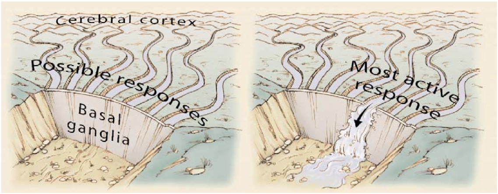
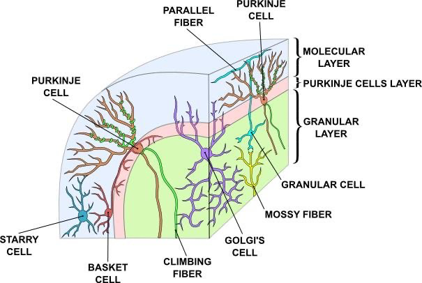

# Motor Control and Reinforcement Learning {#sec:ch-motor}

The foundations of cognition are built upon the sensory-motor loop --- processing sensory inputs to determine which motor action to perform next. This is the most basic function of any nervous system. The human brain has a huge number of such loops, spanning the evolutionary timescale from the most primitive reflexes in the peripheral nervous system, up to the most abstract and inscrutable plans, such as the decision to apply to, and attend, graduate school, which probably involves the highest levels of processing in the prefrontal cortex (PFC) (or perhaps some basic level of insanity... who knows ;).

|               | *Learning Signal* |            |          | *Dynamics* |            |           |
|---------------|-------------------|------------|----------|-----------|------------|-----------|
| Area          | Reward            | Error      | Self Org | Separator | Integrator | Attractor |
|---------------|-------------------|------------|----------|-----------|------------|-----------|
| Basal Ganglia | +++               | ---        | ---      | ++        | -          | ---       |
| Cerebellum    | ---               | +++        | ---      | +++       | ---        | ---       |
| Hippocampus   | +                 | +          | +++      | +++       | ---        | +++       |
| Neocortex     | ++                | +++        | ++       | ---       | +++        | +++       |

Table: Comparison of learning mechanisms and activity/representational dynamics across four primary areas of the brain. `+++` means that the area definitely has given property, with fewer `+` indicating less confidence in and/or importance of this feature. `---` means that the area definitely does not have the given property, again with fewer `-` indicating lower confidence or importance. {#tbl:table-learning-8}

In this chapter, we complete the loop that started in the previous chapter on *Perception and Attention*, by covering a few of the most important motor output and control systems, and the learning mechanisms that govern their behavior. At the subcortical level, the **cerebellum** and **basal ganglia** are the two major motor control areas, each of which has specially adapted learning mechanisms that differ from the general-purpose cortical learning mechanisms described in the *Learning* Chapter [@tbl:table-learning-8]. The basal ganglia are specialized for learning from **reward/punishment** signals, in comparison to expectations for reward/punishment, and this learning then shapes the **action selection** that the organism will make under different circumstances (selecting the most rewarding actions and avoiding punishing ones; [@fig:fig-bg-action-sel-dam]). This form of learning is called **reinforcement learning**. The cerebellum is specialized for learning from **error**, specifically errors between the sensory outcomes associated with motor actions, relative to expectations for these sensory outcomes associated with those motor actions. Thus, the cerebellum can refine the implementation of a given motor plan, to make it more accurate, efficient, and well-coordinated.

{#fig:fig-bg-action-sel-dam width=50% }

There is a nice division of labor here, where the basal ganglia help to select one out of many possible actions to perform, and the cerebellum then makes sure that the selected action is performed well. Consistent with this rather clean division of labor, there are no direct connections between the basal ganglia and cerebellum --- instead, each operates in interaction with various areas in the cortex, where the action plans are formulated and coordinated. Both basal ganglia and cerebellum are densely interconnected with the **frontal cortex**, including motor control areas in posterior frontal cortex, and the **prefrontal cortex** anterior to those. Also, as discussed in the prior chapter, the **parietal cortex** is important for mapping sensory information to motor outputs (i.e., the "how" pathway), by way of computing things like spatial maps, and relative spatial relationships among objects in the environment. Thus, parietal representations drive motor action execution as coordinated by the cerebellum, and the cerebellum is also densely interconnected with the parietal cortex. In contrast, the basal ganglia are driven to a much greater extent by the ventral pathway "what" information, which indicates the kinds of rewarding objects that might be present in the environment (e.g., a particular type of food). They do also receive some input from the parietal, but just not to the great extent that the cerebellum does.

Both the cerebellum and basal ganglia have a complex **disinhibitory** output dynamic, which produces a gating-like effect on the brain areas they control. For example, the basal ganglia can disinhibit neurons in specific nuclei of the thalamus, which have bidirectional excitatory circuits through frontal and prefrontal cortical areas. The net effect of this disinhibition is to *enable* an action to proceed, without needing to specify any of the details for how to perform that action. This is what is meant by a *gate* --- something that broadly modulates the flow of other forms of activation. The cerebellum similarly disinhibits parietal and frontal neurons to effect its form of precise control over the shape of motor actions. It also projects directly to motor outputs in the brain stem, something that is not true of most basal ganglia areas.

We begin the chapter with the basal ganglia system, including the reinforcement learning mechanisms (which involve other brain areas as well). Then we introduce the cerebellar system, and its unique form of error-driven learning. Each section starts with a review of the relevant neurobiology of each system.

## Basal Ganglia, Action Selection and Reinforcement Learning

![Parallel circuits through the basal ganglia for different regions of the frontal cortex --- each region has a corresponding basal ganglia circuit, for controlling action selection/initiation in that region. Motor loop: SMA = supplementary motor area --- the associated striatum (putamen) also receives from premotor cortex (PM), and primary motor (M1) and somatosensory (S1) areas --- everything needed to properly contextualize motor actions. Oculomotor loop: FEF = frontal eye fields, also receives from dorsolateral PFC (DLPFC), and posterior parietal cortex (PPC) --- appropriate context for programming eye movements. Prefrontal loop: DLPFC also controlled by posterior parietal cortex, and premotor cortex. Orbitofrontal loop: OFC = orbitofrontal cortex, also receives from inferotemporal cortex (IT), and anterior cingulate cortex (ACC). Cingulate loop: ACC also modulated by hippocampus (HIP), entorhinal cortex (EC), and IT.](figures/fig_bg_loops_ads86.png){#fig:fig-bg_loops_ads86-8 width=75% }

The basal ganglia performs its action selection function over a wide range of frontal cortical areas, by virtue of several parallel loops of connectivity [@fig:fig-bg_loops_ads86-8]. These areas include motor (skeletal muscle control) and oculomotor (eye movement control), but also prefrontal cortex, orbitofrontal cortex, and anterior cingulate cortex, which are not directly motor control areas. Thus, we need to generalize our notion of action selection to include **cognitive action selection** --- more abstract forms of selection that operate in higher-level cognitive areas of prefrontal cortex. For example, the basal ganglia can control the selection of large-scale action plans and strategies in its connections to the prefrontal cortex. The orbitofrontal cortex is important for encoding the reward value associated with different possible stimulus outcomes, so the basal ganglia connection here is important for driving the updating of these representations as a function of contingencies in the environment. The anterior cingulate cortex is important for encoding the costs of motor actions (time, effort, uncertainty), and basal ganglia similarly can help control updating of these costs as different actions are considered. We can summarize the role of basal ganglia in these more abstract frontal areas as controlling **working memory updating**, as is discussed further in the *Executive Function* Chapter.

Interestingly, the additional inputs that converge into the basal ganglia for a given area all make good sense. Motor control needs to know about the current somatosensory state, as well as inputs from the slightly higher-level motor control area known as premotor cortex. Orbitofrontal cortex is all about encoding the reward value of stimuli, and thus needs to get input from IT cortex, which provides the identity of relevant objects in the environment.

![Biology of the basal ganglia system, with two cases shown: a) Dopamine burst activity that drives the direct "Go" pathway neurons in the striatum, which then inhibit the tonic activation in the globus pallidus internal segment (GPi), which releases specific nuclei in the thalamus from this inhibition, allowing them to complete a bidirectional excitatory circuit with the frontal cortex, resulting in the initiation of a motor action. The increased Go activity during dopamine bursts results in potentiation of corticostriatal synapses, and hence learning to select actions that tend to result in positive outcomes. b) Dopamine dip (pause in tonic dopamine neuron firing), leading to preferential activity of indirect "NoGo" pathway neurons in the striatum, which inhibit the external segment globus pallidus neurons (GPe), which are otherwise tonically active, and inhibiting the GPi. Increased NoGo activity thus results in disinhibition of GPi, making it more active and thus inhibiting the thalamus, preventing initiation of the corresponding motor action. The dopamine dip results in potentiation of corticostriatal NoGo synapses, and hence learning to avoid selection actions that tend to result in negative outcomes. From Frank, 2005](figures/fig_bg_frontal_da_burst_dip.png){#fig:fig-bg-frontal-da-burst-dip width=75% }

![Gating mechanisms of the direct pathway in the oculomotor circuit. An eye saccade movement is made when the superior colliculus (SC) neurons coding for the saccade direction exhibit burst firing. The SC receives excitatory input from elsewhere (e.g., frontal cortex) indicating planned eye movements. However, the SC is under tonic inhibitory regulation from the output of the basal ganglia (in this circuit, it is the substantia nigra pars reticulata (SNr), equivalent to the GPi for other movements). SNr neurons fire at high tonic rates in the absence of input, and prevent the SC from initiating a burst. Neurons in the caudate nucleus (part of the striatum), upstream of the SNr, are normally silent but fire when detecting the appropriate conditions under which to initiate the eye movement (e.g., when it is predictive of reward). Caudate neurons inhibit the SNr, causing a pause in tonic firing, and disinhibit the SC. This disinhibition acts as a gating mechanism because the Caudate does not directly elicit SC firing but instead allows SC to burst fire in particular SC neurons that also receive excitatory input about the planned movement. Not shown here are indirect pathway Caudate neurons which would have the opposite effect, increasing SNr activity and preventing gating of particular movements. From Hikosaka et al, 2000.](figures/fig_hikosaka_gating.png){#fig:fig-hikosaka-gating width=50% }

Zooming in on any one of these loops, the critical elements of the basal ganglia system are diagrammed in [@fig:fig-bg-frontal-da-burst-dip], with two important activation patterns shown. First, the basal ganglia system involves the following subregions:

* The **striatum**, which is the major input region, consisting of the **caudate** and **putamen** subdivisions (as shown in [@fig:fig-bg_loops_ads86-8]). The striatum is anatomically subdivided into many small clusters of neurons, with two major types of clusters: *patch/striosomes* and *matrix/matrisomes*. The matrix clusters contain **direct (Go)** and **indirect (NoGo)** pathway *medium spiny* neurons, which together make up 95% of striatal cells, both of which receive excitatory inputs from all over the cortex but are inhibitory on their downstream targets in the globus pallidus as described next. The patch cells project to the dopaminergic system, and thus appear to play a more indirect role in modulating learning signals. There are also a relatively few widely spaced cholinergic interneurons (CINs) that provide disinhibitory modulation by pausing their activity at times when salient outcomes or stimuli are present.

* The **globus pallidus, internal segment (GPi)**, which is a much smaller structure than the striatum, and contains neurons that are constantly (tonically) active even with no additional input. These neurons send inhibition to specific nuclei in the thalamus. When the direct/Go pathway striatum neurons fire, they inhibit these GPi neurons, and thus *disinhibit* the thalamus, resulting ultimately in the initiation of a specific motor or cognitive action (depending on which circuit is involved). Note that in other fronto-basal ganglia circuits, the role of the GPi is taken up by the substantia nigra pars reticulata (SNr), which is situated identically to the GPi anatomically, but receives from other areas of striatum and projects to outputs regulating other actions (e.g., eye movements in the superior colliculus).

* The **globus pallidus, external segment (GPe)**, which is also small, and contains tonically active neurons that send focused inhibitory projections to corresponding GPi neurons. When the indirect/NoGo pathway neurons in the striatum fire, they inhibit the GPe neurons, and thus disinhibit the GPi neurons, causing them to provide even greater inhibition onto the thalamus. This blocks the initiation of specific actions coded by the population of active NoGo neurons.

* The **thalamus**, specifically the medial dorsal (MD), ventral anterior (VA), and ventrolateral (VL) nuclei (as shown in [@fig:fig-hikosaka-gating] from [@HikosakaTakikawaKawagoe00]). When the thalamic neurons get disinhibited by Go pathway firing, they can fire, but only when driven by top-down excitatory input from the frontal cortex. In this way, the basal ganglia serve as a **gate** on the thalamocortical circuit --- Go firing opens the gate, while NoGo firing closes it, but the contents of the information that go through the gate (e.g., the specifics of the motor action plan) depend on the thalamocortical system. In the oculomotor circuit (as shown in [@fig:fig-hikosaka-gating], the role of the thalamus is taken up by the superior colliculus, the burst firing of which initiates eye saccades).

* The **substantia nigra pars compacta (SNc)** has neurons that release the neuromodulator dopamine, and specifically innervate the striatum. Interestingly, there are two different kinds of dopamine receptors in the striatum. D1 receptors are prevalent in Go pathway neurons, and dopamine has an excitatory effect on neurons with D1 receptors (particularly those neurons that are receiving convergent glutamatergic excitatory input from cortex). In contrast, D2 receptors are prevalent in NoGo pathway neurons, and dopamine has an inhibitory effect via the D2 receptors. Thus, when a burst of dopamine hits the striatum, it further excites active Go units and inhibits NoGo units. This change in activity results in activity-dependent plasticity, and thus leads to an increased propensity for initiating motor and cognitive actions. In contrast, when a dip in dopamine firing occurs, Go neurons are less excited, while NoGo neurons are disinhibited, and thus those NoGo neurons receiving excitatory input from cortex (representing the current state and action) will become more excited due to the dopamine dip. Again, this change in activity results in potentiation of synapses, such that this specific population of NoGo neurons will be more likely to become active in future encounters of this sensory state and candidate motor action. Both of these effects of dopamine bursts and dips make perfect sense: dopamine bursts are associated with positive reward prediction errors (when rewards are better than expected), and thus reinforce selection of actions that lead to good results. Conversely, dopamine dips are associated with negative reward prediction errors (worse than expected) and thus lead to avoidance (NoGo) of those actions that tend to result in these bad results. Also, tonic levels of dopamine can influence the relative balance of activity of these pathways, so that even if learning has already occurred, changes in dopamine can affect whether action selection is influenced primarily by learned Go vs learned NoGo values --- roughly speaking, the higher the dopamine, the more risky the choices (insensitivity to negative outcomes).

* The **subthalamic nucleus** is also a major component of the basal ganglia (not pictured in the figure), which acts as the third *hyperdirect pathway*, so named because it receives input directly from frontal cortex and sends excitatory projections directly to BG output (GPi), bypassing the striatum altogether. These STN-GPi projections are diffuse, meaning that a single STN neuron projects broadly to many GPi neurons, and as such the STN is thought to provide a *global NoGo* function that prevents gating of any motor or cognitive action (technically, it raises the threshold for gating). This area has been shown in models and empirical data to become more active with increasing demands for response inhibition or when there is conflict between alternative cortical action plans, so that the STN buys more time for striatal gating to settle on the best action [@Frank06].

This is a fairly complex circuit, and it probably takes a few iterations through it to really understand how all the parts fit together. The bottom line should nevertheless be easier to understand: the basal ganglia learn to select rewarding actions (including more abstract cognitive actions), via a disinhibitory gating relationship with different areas of frontal cortex. Moreover, the general depiction above, motivated by computational considerations and a lot of detailed anatomical, physiological, and pharmacological data, has been overwhelmingly been supported by empirical data across species. For example, in mice, selective stimulation of D1 striatal neurons resulted in inhibition of BG output nuclei and disinhibition of motor actions, whereas selective stimulation of D2 striatal neurons resulted in excitation of output nuclei and suppression of motor actions [@KravitzFreezeParkerEtAl10]. Transient stimulations of these pathways after movements causes the mouse to be more likely (go unit stimulation) or less likely (nogo unit stimulation) to repeat that same movement in the future, consistent with a learning effect [@KravitzTyeKreitzer12].

Other research showed that when a mouse experiences a negative reward prediction error (i.e. they expect a reward but don't get one), the D2 neurons respond by increasing their activity levels, and the extent of this is related to their subsequent avoidance of the action in favor of a safer option leading to certain reward [@ZalocuskyRamakrishnanLernerEtAl16]. There is also evidence for the model prediction that D1 and D2 receptors oppositely modulate synaptic plasticity in the two pathways [@ShenFlajoletGreengardEtAl08]. Furthermore, selective blockade of neurotransmission along the Go pathway resulted in impairments in learning to select rewarding actions but no deficits in avoiding punishing actions, and exactly the opposite pattern of impairments was observed after blockade of the NoGo pathway [@HikidaKimuraWadaEtAl10]. In humans, striatal dopamine depletions associated with Parkinson's disease result in impaired "Go learning" in probabilistic reinforcement learning tasks, but enhanced "NoGo learning", with the opposite pattern of findings elicited by medications that increase striatal dopamine [@FrankSeebergerOReilly04]. Even individual differences in young healthy human performance in Go vs NoGo learning are associated with genetic variants that affect striatal D1 and D2 receptor function and D1 vs D2 receptor expression in PET studies [@CoxFrankLarcherEtAl15; @FrankFossella11].

The division of labor between frontal cortex and basal ganglia is such that the frontal cortex entertains many different possible actions, by virtue of rich patterns of connectivity from other cortical areas providing high-level summaries of the current environment, which then activate a range of different possible actions, and the basal ganglia then selects the best (most likely to be rewarding) of these actions to actually execute. In more anthropomorphic terms, the frontal cortex is the fuzzy creative type, with a million ideas, but no ability to focus on the real world, and it has a hard time narrowing things down to the point of actually doing anything: kind of a dreamer. Meanwhile, the basal ganglia is a real take-charge type who always has the bottom line in mind, and can make the tough decisions and get things done. We need both of these personalities in our heads (although people clearly differ in how much of each they have), and the neural systems that support these different modes of behavior are clearly different. This is presumably why there are two separable systems (frontal cortex and basal ganglia) that nevertheless work very closely together to solve the overall action selection problem.

### Exploration of the Basal Ganglia

Open the `bg` simulation from [CCN Sims](https://compcogneuro.org/simulations) for an exploration of a basic model of go vs. nogo action selection and learning dynamics in the basal ganglia. This model also allows you to investigate the effects of Parkinson's disease and dopaminergic medications.

## Dopamine and Temporal Difference Reinforcement Learning

![Characteristic patterns of neural firing of the dopaminergic neurons in the ventral tegmental area (VTA) and substantia nigra pars compacta (SNc), in a simple conditioning task (Schultz et al, 1997). Prior to conditioning, when a reward is delivered, the dopamine neurons fire a burst of activity (top panel --- histogram on top shows sum of neural spikes across the repeated recording traces shown below, with each row being a different recording trial). After the animal has learned to associate a conditioned stimulus (CS) (e.g., a tone) with the reward, the dopamine neurons now fire to the onset of the CS, and not to the reward itself. If a reward is withheld after the CS, there is a dip or pause in dopamine firing, indicating that there was some kind of prediction of the reward, and when it failed to arrive, there was a negative prediction error. This overall pattern of firing across conditions is highly consistent with reinforcement learning models based on reward prediction error.  Reproduced from Schultz et al, 1997](figures/fig_schultz97_vta_td.png){#fig:fig-schultz97-vta-td width=30% }

Although we considered above how phasic (meaning bursty, as opposed to tonic) changes in dopamine can drive Go and NoGo learning to select the most rewarding actions and to avoid less rewarding ones, we have not addressed above how dopamine neurons come to represent these phasic signals for driving learning. One of the most exciting discoveries in recent years was the finding that dopamine neurons in the ventral tegmental area (VTA) and substantia nigra pars compacta (SNc) behave in accord with reinforcement learning models based on reward prediction error. Unlike some popular misconceptions, these dopamine neurons do not encode raw reward value directly. Instead, they encode the *difference* between reward received versus an expectation of reward. This is shown in [@fig:fig-schultz97-vta-td] [@SchultzDayanMontague97]: if there is no expectation of reward, then dopamine neurons fire to the reward, reflecting a positive reward prediction error (zero expectation, positive reward). If a conditioned stimulus (CS, e.g., a tone or light) reliably predicts a subsequent reward, then the neurons no longer fire to the reward itself, reflecting the lack of reward prediction error (expectation = reward). Instead, the dopamine neurons fire to the onset of the CS. If the reward is omitted following the CS, then the dopamine neurons actually go the other way (a "dip" or "pause" in the otherwise low tonic level of dopamine neuron firing), reflecting a negative reward prediction error (positive reward prediction, zero reward).

Computationally, the simplest model of reward prediction error is the **Rescorla-Wagner** conditioning model [@RescorlaWagner72], which is mathematically identical to the **delta rule** as discussed in the *Learning* Chapter, and is simply the difference between the actual reward and the expected reward:
$$ \delta = r - \hat{r} $$
$$ \delta = r - \sum x w $$
where $\delta$ ("delta") is the reward prediction error, *r* is the amount of reward actually received, and $\hat{r}=\sum x w$ is the amount of reward *expected*, which is computed as a weighted sum over input stimuli *x* with weights *w*. The weights adapt to try to accurately predict the actual reward values, and in fact this delta value specifies the direction in which the weights should change:
$$ \Delta w = \delta x $$

This is identical to the delta learning rule, including the important dependence on the stimulus activity x --- you only want to change the weights for stimuli that are actually present (i.e., non-zero x's).

When the reward prediction is correct, then the actual reward value is *canceled out* by the prediction, as shown in the second panel in [@fig:fig-schultz97-vta-td]. This rule also accurately predicts the other cases shown in the figure too (positive and negative reward prediction errors).

What the Rescorla-Wagner model fails to capture is the firing of dopamine to the onset of the CS in the second panel in [@fig:fig-schultz97-vta-td]. However, a slightly more complex model known as the **temporal differences (TD)** learning rule does capture this CS-onset firing, by introducing time into the equation (as the name suggests) [@SuttonBarto81; @SuttonBarto98]. Relative to Rescorla-Wagner, TD just adds one additional term to the delta equation, representing the *future* reward values that might come later in time:
$$ \delta = (r + f) - \hat{r} $$
where *f* represents the future rewards, and now the reward expectation $\hat{r}=\sum x w$ has to try to anticipate both the current reward *r* and this future reward *f*. In a simple conditioning task, where the CS reliably predicts a subsequent reward, the onset of the CS results in an increase in this *f* value, because once the CS arrives, there is a high probability of reward in the near future. Furthermore, this *f* itself is not predictable, because the onset of the CS is not predicted by any earlier cue (and if it was, then that earlier cue would be the real CS, and drive the dopamine burst). Therefore, the r-hat expectation cannot cancel out the f value, and a dopamine burst ensues.

Although this *f* value explains CS-onset dopamine firing, it raises the question of how can the system know what kind of rewards are coming in the future? Like anything having to do with the future, you fundamentally just have to guess, using the past as your guide as best as possible. TD does this by trying to *enforce consistency in reward estimates over time*. In effect, the estimate at time *t* is used to train the estimate at time *t+1*, and so on, to keep everything as consistent as possible across time, and consistent with the actual rewards that are received over time.

This can all be derived in a very satisfying way by specifying something known as a **value function, V(t)** that is a sum of all present and future rewards, with the future rewards **discounted** by a "gamma" factor, which captures the intuitive notion that rewards further in the future are worth less than those that will occur sooner. As the Wimpy character says in Popeye, "I'll gladly pay you Tuesday for a hamburger today." Here is that value function, which is an infinite sum going into the future:
$$ V(t) = \left. r(t) + \gamma^1 r(t+1) + \gamma^2 r(t+2) ... \right. $$
We can get rid of the infinity by writing this equation *recursively*:
$$ V(t) = \left. r(t) + \gamma V(t+1) \right. $$
And because we don't know anything for certain, all of these value terms are really estimates, denoted by the little "hats" above them:
$$ \hat{V}(t) = r(t) + \gamma \hat{V}(t+1) $$

So this equation tells us what our estimate at the current time *t* should be, in terms of the future estimate at time t+1. Next, we subtract V-hat from both sides, which gives us an expression that is another way of expressing the above equality --- that the difference between these terms should be equal to zero:
$$ 0 = \left( r(t) + \gamma \hat{V}(t+1) \right) - \hat{V}(t) $$

This is mathematically stating the point that TD tries to keep the estimates consistent over time --- their difference should be zero. But as we are learning our V-hat estimates, this difference will *not* be zero, and in fact, the extent to which it is not zero is the extent to which there is a reward prediction error:
$$ \delta = \left( r(t) + \gamma \hat{V}(t+1) \right) - \hat{V}(t) $$
If you compare this to the equation with *f* in it above, you can see that:
$$ f = \gamma \hat{V}(t+1) $$
and otherwise everything else is the same, except we've clarified the time dependence of all the variables, and our reward expectation is now a "value expectation" instead (replacing the r-hat with a V-hat). Also, as with Rescorla-Wagner, the delta value here drives learning of the value expectations.

The TD learning rule can be used to explain a large number of different conditioning phenomena, and its fit with the firing of dopamine neurons in the brain has led to a large amount of research progress. It represents a real triumph of the computational modeling approach for understanding (and predicting) brain function.

### Exploration of TD Learning

Open the `rl` simulation from [CCN Sims](https://compcogneuro.org/simulations) for an exploration of TD-based reinforcement learning in simple conditioning paradigms. This exploration should help solidify your understanding of reinforcement learning, reward prediction error, and simple classical conditioning.

## The Actor-Critic Architecture for Motor Learning

![Basic structure of the actor critic architecture for motor control. The critic is responsible for processing reward inputs (r), turning them into reward prediction errors (delta), which are suitable for driving learning in both the critic and the actor. The actor is responsible for producing motor output given relevant sensory input, and doesn't process reward or reward expectations directly. This is an efficient division of labor, and it is essential for learning to transform rewards into reward prediction errors, otherwise the system would overlearn on simple tasks that it mastered long ago.](figures/fig_actor_critic_basic.png){#fig:fig-actor-critic-basic width=30% }

Now that you have a better idea about how dopamine works, we can revisit its role in modulating learning in the basal ganglia (as shown in [@fig:fig-bg-frontal-da-burst-dip]). From a computational perspective, the key idea is the distinction between an **actor** and a **critic** ([@fig:fig-actor-critic-basic]), where it is assumed that rewards result at least in part from correct performance by the actor. The basal ganglia is the actor in this case, and the dopamine signal is the output of the critic, which then serves as a training signal for the actor (and the critic too as we saw earlier). The reward prediction error signal produced by the dopamine system is a good training signal because it drives stronger learning early in a skill acquisition process, when rewards are more unpredictable, and reduces learning as the skill is perfected, and rewards are thus more predictable. If the system instead learned directly on the basis of external rewards, it would continue to learn about skills that have long been mastered, and this would likely lead to a number of bad consequences (synaptic weights growing ever stronger, interference with other newer learning, etc).

![The Opponent Actor Learning (OpAL) scheme. This is a modified actor critic whereby the actor contains separate G and N weights representing the Go and NoGo pathways. The activities of the pathways are scaled by dopamine levels during choice, and the relative activation differences for each action are compared to make a choice. The figure depicts selection among three actions that have different learned costs and benefits. (Think about coffee, tea, and water in terms of caffeine levels: coffee has a better benefit than tea, but it also has higher costs (jitters etc).) When dopamine levels are low (left), the costs are amplified, and the benefits diminished, and the system chooses to avoid the highest cost and selects action 3 (water). When dopamine levels are high, the benefits are amplified and the costs diminished, and it chooses action 1 (coffee). Moderate dopamine levels are associated with action 2 (tea; not shown). This accounts for differential effects of dopamine on learning and choice among actions with different costs and benefits. From Collins & Frank, 2014.](figures/fig_bg_opal_hilow.png){#fig:fig-bg-opal-hilow width=60% }

Furthermore, the sign of the reward prediction error is appropriate for the effects of dopamine on the Go and NoGo pathways in the striatum, as we saw in the BG model project above. Positive reward prediction errors, when unexpected rewards are received, indicate that the selected action was better than expected, and thus Go firing for that action should be increased in the future. The increased activation produced by dopamine on these Go neurons will have this effect, assuming learning is driven by these activation levels. Conversely, negative reward prediction errors will facilitate NoGo firing, causing the system to avoid that action in the future. Indeed, the complex neural network model of BG Go/NoGo circuitry can be simplified with more formal analysis in a modified actor-critic architecture called Opponent Actor Learning (OpAL; [@fig:fig-bg-opal-hilow]), where the actor is divided into independent G and N opponent weights, and where their relative contribution is itself affected by dopamine levels during both learning and choice [@CollinsFrank14].

Finally, the ability of the dopamine signal to propagate backward in time is critical for spanning the inevitable delays between motor actions and subsequent rewards. Specifically, the dopamine response should move from the time of the reward to the time of the action that reliably predicts reward, in the same way that it moves in time to the onset of the CS in a classical conditioning paradigm.

## The PVLV Model of Dopamine Biology

![Biological mapping of the PVLV algorithm, which has two separate subsystems: Learned Value (LV), which drives dopamine firing at the time of the CS (Conditioned Stimulus), and Primary Value (PV) which learns to predict US onset and decrease DA firing, and drive dips if the expected US does not occur.  The BLA (basolateral amygdala) learns to associate CSs with US outcomes, driving DA bursting via the CEA (central amygdala) to the VTA / SNc midbrain areas that actually release DA.  The US signals arise from  lateral hypothalamic nucleus (LH) among other areas.  On the PV side, the Ventral Striatum (VS) has two distinct pathways (VSpatch and VSmatrix), which drive inhibition to shunt DA bursting from US outcomes, and dips in DA firing via the lateral habenula (LHb). From Mollick et al., (2020).](figures/fig_bvpvlv_functional_org_simpler.png){#fig:fig-pvlv width=40% }

You might have noticed that we haven't yet explained at a biological level how the dopamine neurons in the VTA and SNc actually come to exhibit their reward prediction error firing. There is a growing body of data supporting the involvement of a relatively large number of different brain areas as shown in [@fig:fig-pvlv].  The PVLV model provides a computational framework that shows how these different brain areas each contribute to the phasic dopamine firing previously described at a more abstract level by the TD learning rule.

PVLV organizes these areas into two overall systems, PV (Primary Value) and LV (Learned Value), consistent with evidence that different brain systems are involved in driving phasic dopamine firing at the onset of CSs (the LV system), versus those involved in predicting subsequent USs (the PV system).

The **basolateral amygdala (BLA)** is a core element of the LV system.  It learns to associate CS sensory inputs with subsequent US outcomes, by virtue of receiving extensive sensory inputs from the cortex and other subcortical sensory pathways, and US-coding inputs from the **lateral hypothalamus (LH)**.  The LH is a major source of primary reward signals such as food, water etc.

Populations of neurons in the **ventral striatum (VS)** are central to the PV system, by virtue of their ability to directly inhibit dopamine (DA) neurons in the VTA and SNc, thereby shunting DA firing to predicted US outcomes.  In addition the VS projects to the **lateral habenula (LHb)** which is a critical midbrain nucleus that is the primary source of phasic dipping / pausing of DA firing, when expected rewards are not received (and when negative USs are received).

In more abstract mathematical terms, the PV component of PVLV is identical to Rescorla-Wagner, just using different labels for the variables:
$$ \delta_{pv} = r - \hat{r} $$
$$ \delta_{pv} = US - PV $$

The $PV$ values are learned in the same way as in the delta rule or Rescorla-Wagner, based on the dopamine signal reflecting this delta.  Critically, if these PV values get active prior to a US signal, they learn to not so in the future, which therefore prevents them from responding to earlier CSs.

The LV system also learns in a similar manner as the PV system:
$$ \delta_{lv} = US - LV $$

But unlike the PV system, the LV system is able to fire for CS onsets, and experiences its primary learning at the time of US onset.  

There are a number of interesting properties of the learning constraints in the PVLV system. For example, the CS must still be active at the time of the external reward in order for the $LV$ system to learn about it, to allow the BLA to form a direct CS -- US association.  Thus, if the CS itself goes off, then some memory of it must be sustained. This fits well with known constraints on CS learning in conditioning paradigms (known as *trace* conditioning).  There is a wealth of specific data on differences in conditioned stimulus vs. unconditioned stimulus associated learning that are consistent with the PVLV framework [@MollickHazyKruegerEtAl20; @HazyFrankOReilly10; @OReillyFrankHazyEtAl07].

In short, the PVLV system can explain how the different biological systems are involved in generating phasic dopamine responses as a function of reward associations, in a way that seems to fit with otherwise somewhat peculiar constraints on the system. Also, we will see in the *Executive Function* Chapter that PVLV provides a cleaner learning signal for controlling the basal ganglia's role in the prefrontal cortex working memory system.

### Exploration of PVLV

Open the `pvlv` simulation in [CCN Sims](https://compcogneuro.org/simulations), which runs the same conditioning paradigms as explored in the TD model.

## Cerebellum and Error-Driven Learning

{#fig:fig-cerebellum-cortex-inputs width=30% }

Now that we understand how the basal ganglia can select an action to perform based on reinforcement learning, we turn to the cerebellum, which takes over once the action has been initiated, and uses error-driven learning to shape the performance of the action so that it is accurate and well-coordinated. As shown in [@fig:fig-cerebellum-cortex-inputs], the cerebellum only receives from cortical areas directly involved in motor production, including the parietal cortex and the motor areas of frontal cortex. Unlike the basal ganglia, it does not receive from prefrontal cortex or temporal cortex, which makes sense according to their respective functions. Prefrontal cortex and temporal cortex are really important for high-level planning and action selection, but not for action execution. However, we do know from neuroimaging experiments that the cerebellum is engaged in many cognitive tasks --- this must reflect its extensive connectivity with the parietal cortex, which is also activated in many cognitive tasks. One idea is that the cerebellum can help shape learning and processing in parietal cortex by virtue of its powerful error-driven learning mechanisms --- this may help to explain how the parietal cortex can learn to do all the complex things it does. However, at this point both the parietal cortex and cerebellum are much better understood from a motor standpoint than a cognitive one.

{#fig:fig-cerebellum width=50% }

The cerebellum has a very well-defined anatomy ([@fig:fig-cerebellum]), with the same basic circuit replicated throughout. Thus, like the basal ganglia, it seems to be performing the same basic function replicated over a wide range of different content domains (e.g., for different motor effectors, and for different areas of parietal and frontal cortex). The basic circuit involves input signals coming from various sources, which are conveyed into the cerebellum via **mossy fiber** axons. These terminate onto **granule cells**, of which there are roughly 40 billion in the human brain! Each granule cell receives only 4-5 mossy fiber inputs, and there are roughly 200 million mossy fiber inputs, with each mossy fiber synapsing on roughly 500 granule cells. Thus, there is a great expansion of information coding in the granule cells relative to the input --- we'll revisit this important fact in a moment. To complete the circuit, the granule cells send out **parallel fiber** axons, that synapse into the very dense dendritic trees of **Purkinje cells**, which can receive as many as 200,000 inputs from granule cells. There are roughly 15 million Purkinje cells in the human brain, and these cells produce the output signal from the cerebellum. Thus, there is a massive convergence operation from the granule cells onto the Purkinje cells. The Purkinje cells are tonically active, and the granule cells are excitatory onto them, making it a bit puzzling to figure out how the granule cells convey a useful signal to the Purkinje cells. The other cell types in the cerebellum (stellate, basket, and golgi) are inhibitory interneurons that provide inhibitory control over both granule cell and Purkinje cell firing. It is possible that granule cells work in concert with these inhibitory cells to alter the balance of excitation and inhibition in the Purkinje cells, but this remains somewhat unclear.

The final piece of the cerebellar puzzle is the **climbing fiber** input from the inferior olivary nucleus --- there is exactly one such climbing fiber per Purkinje cell, and it has a very powerful effect on the neuron, producing a series of *complex spikes*. It is thought that climbing fiber inputs convey a training or error signal to the Purkinje's, which then drives synaptic plasticity in its associated granule cell inputs. One prominent idea is that this synaptic plasticity tends to produce LTD (weight decrease) for synaptic inputs where the granule cells are active, which then makes these neurons less likely to fire the Purkinje cell in the future. This would make sense given that the Purkinje cells are inhibitory on the **deep cerebellar nuclei** neurons, so to produce an output from them, the Purkinje cell needs to be turned off.

{#fig:fig-lookup-table-function-approximator width=40% }

Putting all these pieces together, David Marr [@Marr69] and James Albus [@Albus71] argued that the cerebellum is a system for error-driven learning, with the error signal coming from the climbing fibers. It is clear that it has the machinery to associate stimulus inputs with motor output commands, under the command of the climbing fiber inputs. One important principle of cerebellar function is the projection of inputs into a very high-dimensional space over the granule cells --- computationally this achieves the *separation* form of learning, where each combination of inputs activates a unique pattern of granule cell neurons. This unique pattern can then be associated with a different output signal from the cerebellum, producing something approximating a *lookup table* of input/output values ([@fig:fig-lookup-table-function-approximator]). A lookup table provides a robust solution to learning even very complex, arbitrary functions --- it will always be able to encode any kind of function. The drawback is that it does not generalize to novel input patterns very well. However, it may be better overall in motor control to avoid improper generalization, rather than eek out a bit more efficiency from some form of generalization. This high-dimensional expansion is also used successfully by the support vector machine (SVM), one of the most successful machine learning algorithms.

### Exploration of Cerebellum

Open the `cereb` model in [CCN Sims](https://compcogneuro.org/simulations) of motor learning.
